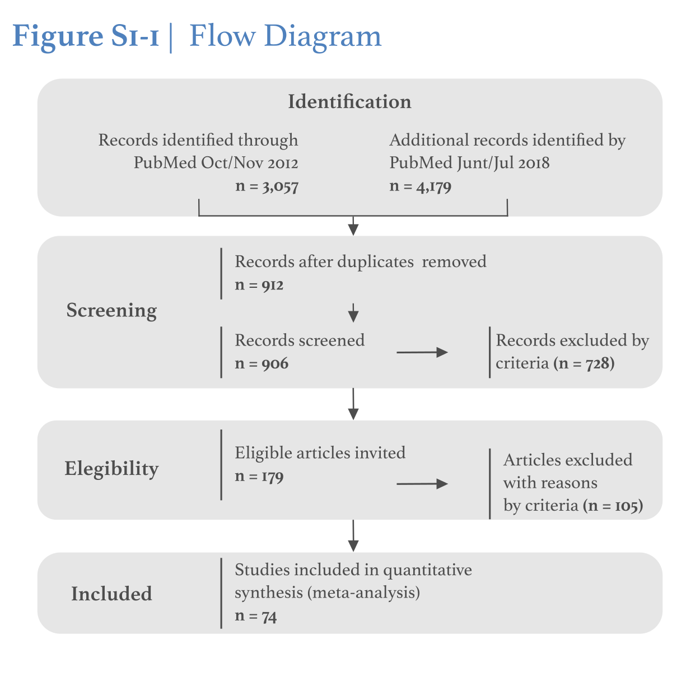

```{r setup, include=FALSE}
knitr::opts_chunk$set(echo = TRUE)
# https://bookdown.org/MathiasHarrer/Doing_Meta_Analysis_in_R/
```

```{r libs, echo=FALSE, message=FALSE, warnings=FALSE}
# Tables and Rmarkdown output
library(pander)
library(knitr)
library(kableExtra)
library(lubridate)
# General libraries
library(viridis)     # Colormaps
library(scales)      # Alpha function for color transparency
library(corrplot)    # Correlation plots
library(extrafont)   # Include extra fonts in plots
library(ggplot2)     # Ggplots functions for R
library(ggExtra)     # Marginal histogram/density/violin/boxplot in ggplots
library(gridExtra)   # Array for ggplots, equivalent of par(mfrow) 
library(esc)         # Effect size library, for Hedges'g calculation
# Libraries for meta-analysis
library(meta)
library(metafor)
library(rmeta)
library(forestplot)  # Forestplot for meta-regression visualization

```
  
Francis A. M. Manno$^{1}$\dag, Raul Rodríguez-Cruces$^{2*}$, Rachit Kumar$^{3,4*}$, J. Tilak Ratnanather$^5$, Condon Lau$^{1}$\dag  
  
\small
**1.** Department of Physics, City University of Hong Kong, Kowloon, Hong Kong SAR, China  
**2.** Montreal Neurological Institute, McGill University, Montreal, Canada  
**3.** Perelman School of Medicine, University of Pennsylvania, Philadelphia, USA  
**4.** Medical Scientist Training Program at the University of Pennsylvania, Philadelphia, USA  
**5.** Center for Imaging Science and Institute for Computational Medicine, Department of Biomedical Engineering, Johns Hopkins University, Baltimore, MD, USA  
\normalsize

**Corresponding Author:**  
\dag Francis A.M. Manno  
Department of Physics  
City University of Hong Kong  
HKSAR, China 
Email: <francis.Manno@gmail.com>  
\newline  
\dag Condon Lau  
Department of Physics  
City University of Hong Kong  
HKSAR, China  
Email: <condon.lau@cityu.edu.hk>  

**Data availability statement:** The entire dataset, analyses and code used in this work can be downloaded by contacting the corresponding author and from the Open Science Framework: Manno, et al., 2018. “Profound Hearing Loss.” OSF. https://osf.io/7y59j/.   

**Declaration of Interests:** The authors declare no competing financial interests and no non-financial competing interests.  

**Author Contributions:** Conceptualization, FAMM JTR, CL; Methodology, FAMM, RRC; Formal Analysis, FAMM, RRC, RK; Visualization FAMM, RRC, RK; Investigation, FAMM, JTR; Writing, Editing, FAMM, RRC, RK, JTR, CL; Funding CL  
*Equal contributions  

**Keywords:** Sensorineural hearing loss, Structural MRI, DTI, Bilateral hearing loss, Unilateral hearing loss.   
\newpage 

# Abstract  
**Importance.**  Hearing loss is a heterogeneous disorder thought to affect brain reorganization across the lifespan. The exact structural endophenotype of hearing loss is not known, although it is assumed to affect the auditory regions of the temporal lobe such as Heschl's gyrus.  

**Objective.**  Here we assessed the structural alterations of hearing loss by using a meta-analysis of effect size measures based on MNI coordinate mapping of MRI studies. Unique effect size metrics based on Cohen’s d and Hedges’ g were created to map coordinates of gray matter (GM) and white matter (WM) alterations from bilateral congenital and acquired hearing loss populations. Three coordinate mapping techniques were used and compared: coordinate-based anatomic likelihood estimation (ALE), multi-level kernel density analysis (mKDA), and seed-based d Mapping (SDM). Using a meta-regression, GM and WM trajectories were mapped to visualize the progression of congenital and acquired hearing loss throughout the lifespan. Heterogeneity in effect size metrics was determined using the forest, Baujat, Funnel, Galbraith and bubble plots to discern dispersion and spread of datapoints. Lastly, we displayed an endophenotype map of hearing loss alterations in GM and WM obtained from a multivariable meta-regression of the effect size.  

**Data Sources.** PubMed, Google Scholar and Scopus primary and secondary literature was searched from inception to May 2020, augmented by expert recommendations, grey searchers, and primary literature citation inclusions.  

**Study Selection.** Any peer-reviewed publication irrespective of language that involved the structural neuroimaging of the human brain in participants with hearing loss at any age.   

**Data Extraction and Synthesis.**  Data was collected on 1) October 10th, 2012 through November 1st, 2012, 2) June 6th through July 20th 2018, 3) directly prior to publication following the Preferred Reporting Items for Systematic Review and Meta-Analyses. Results were summarized across studies in a random-effects model.  

**Main Outcomes and Measures.** Effect sizes for GM and WM metrics associated with hearing loss in structural MNI coordinates were used for the outcome measure.   

**Results.** The systematic review and meta-analysis revealed n = 72 studies with structural alterations measured by MRI (bilateral=64, unilateral=8). The bilateral studies contained more than  66,545 variable datapoint metrics broadly categorizing hearing loss into congenital and acquired cases from mild to profound impact (n = 7445) and control cases (n = 2924) with ages of 34.92 ± 23.08 and 30.61 ± 19.45 years, respectively. We found hearing loss affects GM and underlying WM in nearly every region of the brain. In congenital hearing loss, GM decreased most in the frontal lobe. Acquired hearing loss similarly had a decrease in frontal lobe GM, albeit the insula was most decreased. Congenital white matter underlying the frontal lobe GM was most decreased. The temporal lobe had different GM alterations in congenital and acquired, decreasing in the former and increasing in the latter, possibly due to age-dependent compensation. The WM alterations most frequently underlined GM alterations in congenital hearing loss, while acquired hearing loss studies did not assess the WM metric frequently.  

**Limitations.** There were several limitations of neuroimaging studies in the hearing loss field with manuscripts many for example not reporting mean and SD for GM or WM metrics, lack of MNI coordinates, and some not reporting sufficient control populations. These factors could have contributed to heterogeneity as underlying explanatory variables.  

**Conclusions and Relevance.**  Although temporal lobe auditory regions are most commonly thought to be affected in hearing loss, the present analysis found the frontal lobe gray matter and underlying white matter most decreased in both congenital and acquired hearing loss. The present study demonstrates hearing loss across the lifespan and the compensatory adaptations which occur to the brain due to lack of auditory input. This meta-analysis review presents a novel ‘hit-enter’ repeatability format for assessing hearing loss, providing all data, scripts and analysis from data curation to visualization available for reproducibility. Future studies should use the endophenotype of hearing loss as a prognostic template for discerning impact and clinical outcomes. 
   
# Truncated Abstract  
Hearing loss is a heterogeneous disorder thought to affect brain reorganization across the lifespan. The exact structural endophenotype of hearing loss is not known, although it is assumed to affect the auditory regions of the temporal lobe such as Heschl's gyrus. Here we assessed the structural alterations of hearing loss by using a meta-analysis of effect size measures based on MNI coordinate mapping of MRI studies. Unique effect size metrics based on Cohen’s d and Hedges’ g were created to map coordinates of gray matter (GM) and white matter (WM) alterations from bilateral congenital and acquired hearing loss populations. Three mapping techniques were used and compared: coordinate-based anatomic likelihood estimation (ALE), multi-level kernel density analysis (mKDA), and seed-based d Mapping (SDM). Using a meta-regression, GM and WM trajectories were mapped to visualize the progression of hearing loss throughout the lifespan. Heterogeneity in effect size metrics was determined using the forest, Baujat, Funnel, Galbraith and bubble plots to discern dispersion and spread of datapoints. Lastly, we displayed an endophenotype map of hearing loss alterations in GM and WM obtained from a multivariable meta-regression of the effect size. The systematic review and meta-analysis revealed n = 72 studies with structural alterations measured with MRI (bilateral=64, unilateral=8). The bilateral studies contained more than 28000 variable datapoint metrics broadly categorizing hearing loss into congenital and acquired cases (n = 7445) and control cases (n = 2924) with ages of 34.92 ± 23.08 and 30.61 ± 19.45 years, respectively. We found hearing loss affects GM and underlying WM in nearly every region of the brain. In congenital hearing loss, GM decreased most in the frontal lobe. Acquired hearing loss similarly had a decrease in frontal lobe GM, albeit the insula was most decreased. Congenital white matter underlying the frontal lobe GM was most decreased. The temporal lobe had different GM alterations in congenital and acquired, decreasing in the former and increasing in the latter. The WM alterations most frequently underlined GM alterations in congenital hearing loss, while acquired hearing loss studies did not assess the WM metric frequently. There were several limitations of studies in the hearing loss field with manuscripts for example not reporting mean and SD for GM or WM metrics, lack of MNI coordinates, and some not reporting sufficient control populations. These factors could have contributed to heterogeneity as underlying explanatory variables. The present article presents a novel ‘hit-enter’ repeatability format for assessing hearing loss, providing all data, scripts and analysis from data curation to visualization available for reproducibility. Future studies should use the endophenotype of hearing loss as a prognostic template for discerning impact and clinical outcomes.  

\newpage 
\tableofcontents 

\newpage 
\listoftables

\newpage

#	1. Supplemental information  
An extensive amount of data associated with the MNI coordinate mapping is presented in the supplemental information to support our conclusions for ALE, mKDA, SDM. Tables and figures outline ROI of interest and significance. Additionally sub-analyses associated with the heterogeneity plots (Forest plot, Baujat plot, Funnel plot, Galbraith plot and bubble plot) in the meta-analysis are presented for all assessments. All supplemental information is additive in nature and bolsters our results.  
  
# 2. Methods  
We followed the Preferred Reporting Items for Systematic Reviews and Meta-Analyses of Individual Participant Data (PRISMA Guidelines).$^{22-25}$ The study was registered in 2018 and supplementary information, code, csv files, and extended analyses can be found at OSF (https://osf.io/7y59j/). Detailed, annotated, expanded, and updated code can be found at GitHub (https://github.com/FrancisManno/MetaHearingLoss or www.fmanno.com). The literature review had been initiated by two authors nearly 6 years prior to registration (FAMM, JTR). The review followed the checklist enumerations as outlined by the Organization for Human Brain Mapping (OHBM) *Committee on Best Practices* in Data Analysis and Sharing (COBIDAS; http://www.humanbrainmapping.org/cobidas).$^{11}$ All analyses for the present study used custom Matlab scripts (2017a: The Mathworks, Natick, USA) and R version 3.6.3$^{26}$ , specifically the packages meta$^{27,28}$ and metafor.$^{29,30}$ The manuscript is completely reproducible, replicable, and amendable for future iterations, with a ‘hit-enter’ repeatability, considered the gold-standard.$^{11}$ 
  
## 2.1.	Eligibility criteria and study search  
Criteria for study eligibility were peer-reviewed publications in any language of an original investigation involving human participants who underwent structural MRI neuroimaging of the brain due to hearing loss. The search was performed in English, Chinese, Spanish and French and had no language restriction. Bilateral hearing loss (BHL) and unilateral hearing loss (UHL) of any degree (mild, moderate, severe and profound) were included in the literature search. For the quantitative portions of the analysis UHL was excluded, due to the small number of studies ($n \approx 10$; See Supplementary Information) and not to bias the results due to side of hearing. Therefore, the final inclusion criteria were any MRI studies of BHL (**Figure 1a** and **Supplementary Figure SI.1 Flow Diagram**). We identified potentially eligible studies using PubMed, Google Scholar and Scopus. The literature search was performed at 3 timepoints: 1) Wednesday October 10th, 2012 through November 1st, 2012, 2) June 6th through July 20th 2018 and 3) directly prior to publication to ensure capture of all relevant articles. On all three instances, the search was first performed in PubMed to identify primary literature with follow-up searching using Google Scholar. Once primary literature was identified, a Scopus search of citing literature was performed (secondary and grey). These secondary literature sources were screened similarly as primary literature sources. Primary and secondary sources were then-cross-checked for citing sources and additional references. In the Supplementary Information, the Scopus citations are listed as of July 2019. The Medical Subject Headings (MeSH) search terms were: (deafness OR "hearing loss" OR "bilateral hearing loss" OR “unilateral hearing loss” OR “conductive hearing loss” OR “sensorineural hearing Loss”) AND ("magnetic resonance imaging" OR MRI OR "diffusion tensor imaging" OR DTI) NOT (Review[Filter] OR Editorial[Filter] OR Comment[Filter]). Additionally, the search was augmented by correspondence with a distributed network of scientists with hearing loss who are familiar with the field (JTR).$^{31}$ To our knowledge this is the first systematic, meta-analytic, or quantitative review of effect sizes of structural neuroimaging in hearing loss.$^{12}$ Two authors (FAMM and JTR) screened the titles and abstracts of all records retrieved. Of those articles retrieved, studies that provisionally met eligibility criteria were assessed for eligibility by examining the full text and following the data acquisition protocol (Details appear in the Methods and Table 1 in the Supplementary Information) All information was tabulated into ISA-tab formatted CSV data descriptors by manual data entry (meta_sideDeaf.csv; Checked by two authors FAMM and JTR). The ISA format http://isa-tools.org/) is built around the Investigation (I: the project context), Study (S: a unit of research) and Assay (A: analytical measurement) data model serializations (tabular). The unit of analysis for the present manuscript was the study in addition to region of interest and GM and WM metric information tabulated from the study as described in the Data Acquisition section.
  
# 2.2.	Data acquisition, metrics and outcome measures  
All eligible studies were included to contribute basic structural neuroimaging data (GM, WM, volume, etc), audiometric data (hearing loss degree in dB), demographic data (age, sex, etc), and MRI scanning characteristics (FOV, voxel size in $mm^3$, slices, etc) which were used as the sub-unit of analysis (see **Figure 1b**; `meta_sideDeaf.csv`). The variables extracted from the studies can be found in meta_sideDeaf.csv, as columns: 1) study, 2) etiology (i.e. congenital acquired), 3) side deaf (i.e. bilateral in the present review), 4) severity (i.e., mild, moderate, severe, profound), 5) number hearing loss (i.e. experiment group size), 6) HL and control male and female number (i.e. hearing loss males and females), 7) HL and control age (i.e. hearing loss cohort age with SD), 8) HL and control age range low and high categories, 9) average dB HL and SD, 10) left and right ear average dB HL and SD, 11) sign language (i.e. French, American), 12) MRI strength (1T, 1.5T, 3T), 13) acquisition matrix size in $mm^2$, 14) slices in scan sequence, 15) slice thickness (mm), 15) field of view (FOV in cm), 16) scan sequence (i.e. T1), 17) technique (i.e., DTI, VBM), 18) system of analysis (i.e. SPM, FMRIB, Freesurfer, etc), 19) for the region of interest, MNI coordinates in MNI-x, MNI-y, MNI-z, 20) Brodmann location, 21) lobar region of interest (general ROI, i.e. temporal lobe, frontal lobe), 22) specific ROI (i.e. Heschl’s gyrus), 23) hemispheric side (i.e. left or right or bilateral), 24) measure (i.e. cortical thickness, volume, asymmetry, fractional anisotropy, etc), 25) matter (i.e. gray matter or white matter), 26) effect (i.e. increase, decrease, same), 27) Cohen's d, and 28) effect correlation r. Cohen's d and effect correlation r were derived measures.$^{32-37}$ Cohen’s d was used to derive Hedges’ g as described. Several studies did not contribute this information (see Limitations in Discussion) because they lacked quantitative metrics to derive Cohen’s d and Hedges’ g (see **Supplementary Figure PRISMA Flow Diagram**).
  
## 2.3.	Creating the standardized metric Cohen's d and Hedges’g  
Effect size Cohen’s d was used to compare values between studies.$^{32}$ Cohen's d uses the means and standard deviations of two groups (HL and control), where $M = mean$, $SD – standard deviation$, $n = sample size$, $df = degrees freedom$:  
$$Cohen's d = (M1 - M2) / SDpooled where SDpooled =\sqrt{(SD12+ SD22) / 2}$$.   
Hedges’ g uses the means and standard deviations of two groups (HL and control), and the sample size weighted pooled standard deviation for correction. $Hedges’ g = (M1 - M2) / SD* pooled$, where $SD*pooled =/sqrt{(n1-1) SD12+ (n2-1) SD22) / (n1+ n2 -2)}$. Cohen’s d and Hedges’ g of 0.2 is considered small, 0.5 is medium and above 0.8 is a large effect size.34 Hedges’ g was used for most analyses to avoid scaling issues.$^{33}$ Cohen's d and Hedges’ g were used for assessing the ROI meta-regression (**Figure 1a** and **1d**). When available, experimental group (i.e. HL) and control group sample size, degrees of freedom, raw values for the measure (i.e. volume $mm^3$ and sd), Z score, F test, t-value, or P-value were used for creating the effect size metrics$^{35}$, as not all studies reported identical variables of input for effect size measure calculations. Converting between values given by a study was done with standard formula.$^{36-37}$ As an example, a study might report sample size, t value and a p-value for a measure of Heschl’s gyrus volume between hearing loss and control, but not the actual group volume in $mm^3$. Cohen's d, outcome measures and variables of the studies are reported in the `meta_sideDeaf.csv`, as columns as described above. A variability score was estimated for those studies that did not provide standard deviation or error of the mean distribution. The variability was calculated based on the effect size and under the assumption of a normal distribution (see SI variance estimation formula).
  
## 2.4.	Regions of interest in hearing loss  
A central interest in neuroscience is determining how different brain regions are modified due to changes in sensory experience over developmental periods.$^{20}$ More specifically, sensory deprivation due to hearing loss is known to elicit cross-modal plasticity, were the primary auditory cortex is more than likely to be recruited by visual inputs.$^{21}$ The longitudinal processes associated with structural cortical reorganization in the brain due to hearing loss in humans is currently unknown. Here we map specific ROI from MNI coordinates in hearing loss throughout the human lifespan to ascertain the longitudinal progression of changes in GM and WM. Because hearing loss affects the brain in a widespread nature$^{12,20,21}$, we are interested in the general and specific areas and thus performed unthresholded and thresholded analyses. The MNI coordinate mapping is divided into general coordinate-based anatomic likelihood estimation (ALE), multi-level kernel density analysis (mKDA), and Seed-based Differential Mapping (SDM). ALE investigates where location probabilities reflect spatial uncertainty associated with the foci of each experiment overlap and mKDA tests how many foci are reported close to any individual voxel. These theoretical differences, that ALE evaluates probabilities of activity localization, where mKDA uses experimental foci counts, allow two different and precise interpretations of the resultant MNI coordinate maps. The SDM analysis is a combination of the methodology and assumptions of ALE and mKDA, using effect sizes and a representation of both positive and negative differences in the same structural brain map.$^{39,40}$ Two levels of structure were assessed: 1) ROIs grouped under a cortical region (i.e. Lobar region: temporal (Heschl's' gyrus and superior temporal gyrus) and 2) areas spatially distant Heschl's' gyrus and occipital pole.
  
### 2.4.1.	Coordinate-based anatomic likelihood estimation  
The specific question for this procedure is: where is foci convergence across experiments higher than would be expected by chance if their results were independently distributed? GingerALE version `2.3.6`. from BrainMap was used which performs coordinate-based anatomic likelihood estimation (ALE) meta-analytic random effects analyses on MNI coordinates (performed in C+).$^{41-44}$ For the present study, MNI coordinates were used and all figures are presented in MNI space. Structural data from the studies was registered with and entered into Scribe (http://www.brainmap.org/scribe/) for ease of future replication (meta_sideDeaf.csv; https://osf.io/7y59j/).41 The ALE plots estimate the clustering between foci in hearing loss (Figure 1c).$^{42-44}$ The convergence of foci reported from different experiments is modelled as probability distributions (blobs in **Figure 1c**) whose width is based on empirical estimates of the spatial uncertainty due to the between-subject and between template variability of neuroimaging data.$^{44}$ The ALE was assessed against a null-distribution of random special association between experiments using a false discovery rate (FDR) for correcting the family-wise error rate (FWER) and cluster-level inference.$^{44}$ Input variables were sample size = N and MNI in x/y/z. The settings were cluster-level $FWER = 0.01$, FDR corrected threshold of $P < 0.05$ for cluster-level inference, threshold permutations = 10,000, and cluster forming threshold level of $P < 0.001$, chosen $minimum\ cluster\ size\ = 50 mm^3$ for analysis and reported only $cluster\ size > 200mm^3$. The output was the ALE modelled activation map (MA map) in MNI space, a significant peaks list which detailed up to 10 ROI, based on cluster statistics including volume ($mm^3$), bounds, weighted center (x/y/z), and the locations and values at peaks within the region.$^{42-44}$ The final ALE output (after union of voxel-wise Gaussians of all foci from ALE MA maps) is a ALE image map at a given $\alpha$ value.$^{42-44}$ The ALE image map is a construction of reported MNI foci spatial probability distributions at the coordinates associated with hearing loss. The conclusion and interpretation of the ALE image map based on the body of literature in hearing loss is the generalization of ROI peaks in the brain most affected by hearing loss. The mKDA precedes in a similar manner, assessing MNI coordinate localization significance, and creating clustering of MNI coordinates (**Figure 1c**).
  
### 2.4.2.	Multi-Level Kernel Density Analysis  
The specific question for this procedure is: how many foci are reported close to any individual voxel among experiments? The mKDA procedure evaluates consistency and specificity of regional structural alterations based on previous studies reported MNI coordinates (performed in Matlab 2017a). The mKDA represents activation focus as a sphere given arbitrary weights based on sample size = N.$^{45,46}$ Peaks from each comparison study map are separately convolved with the kernel to generate comparison indicator maps (CIMs).Subsequently, the summary density map resulting in the proportion of activated comparisons is subjected to statistical thresholding by a Monte Carlo iteration procedure where locations of the centers of each blob are selected at random and uniformly distributed.$^{45,46}$ Here, the null hypothesis is rejected in voxels where the number of nearby peaks is greater than expected by chance.$^{45,46}$ Lastly, the final mKDA montage map is created by FWER control utilizing extent thresholding.$^{45,46}$ Input variables were sample size = N and MNI in x/y/z, sphere size 10 mm (**Figure 1c** – MNI input).$^{45,46}$ The output was a series CIMs (blobs on **Figure 1c**). The CIMs were used for determining significance by: 1) height-based thresholding used the center of a 10 mm sphere (yellow in figures, representing P < 0.05) for identifying the number of contiguous voxels needed to say that a cluster was significant and 2) extent-based thresholding was used to estimate which individual voxels show greater activation at different $\alpha$ levels, $P < 0.001$ clusters (orange – stringent), $P < 0.01$ clusters (red – medium), and $P < 0.05$ clusters (purple – lenient).$^{45,46}$ The aforementioned coloring scheme is applicable to all mKDA maps. The final output was a mKDA montage union map based on height and extent thresholding.$^{45,46}$ Further output was significant region location (x/y/z), voxels, cluster sizes range, volume ($mm^3$), and maxstat (maximum of the z field) for extent-based thresholding at stringent, medium and lenient $\alpha$ levels.$^{45,46}$ The conclusion and interpretation of the mKDA montage map based on the body of literature in hearing loss is the generalizability of particular regions being structurally altered at a specific $\alpha$ level.$^{45,46}$
  
### 2.4.3.	Seed-based d Mapping (SDM)  
The specific question for this procedure is: how do increases and decreases in GM and WM relate among groups (congenital and acquired versus control) of experimental subjects. The SDM analysis examines regions of increased and decreased grey matter volume accounting for 'peaks' effect-size in experimental dataset and signing a positive and negative difference.$^{48,49}$ SDM calculates effect sizes from given p-values or t-values to determine lower and upper bounds of possible effect sizes for each voxel using an anisotropic unnormalized kernel, with the resultant effect size and error estimated using MetaNSUE.$^{49}$ A meta-analysis of the effect size metrics from the imputed datasets is then computed using Rubin’s rules to combine effect sizes in these datasets into a singular set of parameters that can be used for the final analysis (i.e. image derivation). Lastly, a permutation test is used to determine the distribution of possible maxima activations/deactivations found and this distribution is used to correct for multiple comparisons. Parameters were kept consistent with the above, with the exception of “modality,” which was changed to “other” to account for the heterogeneity of modalities employed in the studies selected. For example, in each group (GM, WM, adult, aged adult, and pediatric), SDM reported a specific set of MNI coordinates found to be statistically significant compared to the null hypothesis that there was no significant difference at that coordinate at various thresholds (including $p < 0.05$) and the direction of the difference (positive or negative).$^{48,49}$  Output was provided in the form of coordinates that contributed to a peak coordinate exhibiting significance, the size of the region found to be significant (in voxels), and a general description of the region based on a standard atlas (i.e., right superior temporal gyrus, BA 42).$^{48,49}$  The conclusion and interpretation of the SDM map are increases or decreases in GM or WM represented by p-values on brain coordinates.
  
## 2.5.	Meta-regression longitudinal progression of GM and WM trajectories in hearing loss  
To determine the longitudinal GM and WM trajectories associated with hearing loss, a random effects meta-regression was performed using Cohen’s d or Hedges’ g and the variability estimated with the standard deviation.$^{25}$ The specific question for this procedure is: how does GM and WM alterations change in hearing loss over the lifespan? The multivariate meta-regression covaried age, sample size = n with GM or WM metrics by ROI.
  
## 2.6.	Heterogeneity of gray matter and white matter  
To determine heterogeneity among measures (GM and WM metrics) between experiments,$^{22-25}$ heterogeneity plots (forest plot, Baujat plot, Funnel plot, Galbraith plot and bubble plot), were constructed using R$^{26}$ packages meta$^{27,28}$ and metafor.$^{29,30}$ Heterogeneity allows determining the dispersion of a particular measure due to variability or uncertainty. The question for these procedures is: how does heterogeneity in a particular GM or WM metric effect generalizability to the ROI in hearing loss. The forest plot used Hedges’ g to demonstrate effect size by measure (GM or WM) and included a summary estimate (centre of diamond) with 95\% confidence intervals.$^{50}$ The reported metrics were Test for Heterogeneity $\chi^2$, Cochran’s Q (computed by summing the squared deviations of each study’s estimate from the overall meta-analytic estimate, weighting the contribution of each study by its inverse variance),$^{51}$ and the value $I^{2}$ (the consistency of the results of studies in meta-analyses: $I^2 =100% × (Q−df)/Q$, where Q is Cochran’s heterogeneity statistic).$^{52,53}$ Cochran’s Q is distributed as a chi-square statistic $\chi^2$ with a P value.52 $I^{2}$ is scaled from 0\% to 100\% and interpreted as a value of 0\% indicating no heterogeneity, and larger values show increasing heterogeneity.$^{52,53}$ Effects were summarized across studies using the generic inverse-variance weighting method (DerSimonian and Laird random effects weighted by $1/SE^2 - standard error$). Heterogeneity in results was estimated using the $\tau^2$ statistic (standard deviation of effect sizes between studies).$^{24,25}$
The Baujat plot was used to identify studies contributing to heterogeneity.$^{54}$ The X‐axis represents the contribution of the measure (GM and WM) to the overall Cochran Q‐test for heterogeneity. The Y‐axis represents the influence of the measure (GM and WM), defined as the standardized squared difference between the treatment effects (acquired/congenital) estimated with and without the ith study.$^{54}$ The Baujat plot is interpreted as heterogeneous when influential measures (GM or WM) appear in the upper right quadrant of the graph. $^{54}$ The Funnel plot was used to illustrate ‘bias’, based on effect size estimates of GM and WM against sample size (plots have 95\% CI in light grey and bias exists on $P < 0.1$).$^{55-57}$ The Y‐axis represents standard error (of the GM or WM metric, normalized across values [0 since we have not added mean and SD]) and the X-axis the residual value of the effect size. The degree of funnel plot asymmetry was measured by the intercept from regression of the standard normal deviates (odds ratio divided by its standard error) against the estimates precision.$^{55-57}$ The funnel plot precision in estimating the underlying effect of the measure will increase as sample size increases and in the absence of bias the plotted effect size estimates will be scattered in the white region, resembling a symmetrical inverted funnel.$^{55-57}$ To interpret the Funnel plot, bias is represented as asymmetry where GM or WM measures skew the results and therefore, are found outside of funnel CI area. The Galbraith plot (radial plot) was used to estimate metric (GM or WM) error.$^{58-60}$ The Y-axis represents a transformed scale of standardized effect size estimates, centered at the reference value and having the unit standard error.$^{58-60}$ The Y-axis for effect size has $±$ 2 standard error (shaded in grey) for any point estimate.$^{58-60}$ The X-axis indicates precision (defined as reciprocal of standard error), where points with large error fall near the origin and points with small error are further away near the arc.$^{58-60}$ On the right-hand side of the plot, an arc is drawn corresponding to the individual observed effect sizes (Hedges’ g)$^{58-60}$ A line projected from the origin (0,0) through a particular point within the plot onto this arc indicates the value of the individual observed effect size for that point.$^{58-60}$ The interpretation of the Galbraith plot is made based on effect size scattering for GM and WM. If a set of effect size estimates agree with one another, in addition to having precision correctly assessed, they will scatter homoscedastically (with unit standard deviations on the y-scale) about a line through the origin.$^{58-60}$ If the effect size estimates disagree with one another, they will vary heteroscedastically, resulting in statistical dispersion.$^{58-60}$ Said another way, consistent effect size estimates are grouped closely together, while those that are uncertain are found as outliers. The bubble plot was used to display the results of the meta-regression of GM or WM with the bubble extent representing effect size and the regression dependent on the corresponding variable (ROI). The quantile-quantile (QQ) plot is used for testing normality of the data.$^{61}$ Interpretation of the QQ plot is made by datapoints circumscribing the diagonal line within the confidence boundaries whereas data not normally distributed lies outside the 95\% CI.$^{61}$ The graphical display of study heterogeneity (GOSH) plots$^{62}$ is a method to visualize the effect of study-level heterogeneity using a fixed-effects model between subset variable characteristics. The X-axis is the logs ratio of the GM or WM metric and the Y-Axis is Cochran Q-statistic. The interpretation of GOSH plots is based on the model estimates forming a symmetric, contiguous, and unimodal distribution whereas a multimodal distribution suggests heterogeneity in GM or WM metrics.$^{62}$ The bubble plot is interpreted by size of bubble having larger effect on the regression line for the metric (GM or WM). The heterogeneity plot analyses will allow the determination of metric (GM or WM) variability or uncertainty.
  
## 2.7.	Surface visualization of ROI mapping to create hearing loss endophenotype  
Acquired and congenital multivariate meta-regression models by brain area where calculated. Random effects models covariated by main brain area were fitted to obtain the weights of left and right ROIs with GM or WM metrics. The resultant effect size estimates were backprojected to the respective brain area to create a meta-analytic endophenotype of hearing loss of GM and WM.$^{63}$ Here the effect size is visualized on the cortical surface with the meta-regression estimate per ROI derived from the meta-analysis.$^{63}$ Interpretation of the surface visualization is done with a cold-hot color bar which represents negative to positive effect sizes, respectively. Brain surface visualization and surface projection was done using Freesurfer and SurfStat$^{64}$ merging lobe mapping with an annotation file. A mixed effects model was used to account for the variation in GM or WM effect size metrics for a particular ROI within the congenital or acquired hearing loss groups. The meta-analytic test of moderators in the model determines whether we can reject the null hypothesis of no effect of GM or WM by ROI for congenital or acquired hearing loss in the constructed endophenotype.  
  
## 2.8.	Research statistical strategy: Analysis overview, hypothesis, assumptions, and interpretation  
Our main research question was what are the structural manifestations of hearing loss? The research strategy followed a four-pronged approach. First, we assessed general and specific GM and WM alterations associated with where alterations occur in hearing loss. Second, we assessed general and specific ROI GM and WM longitudinal trends in hearing loss. Third, we wanted to understand the heterogeneity attributed to GM or WM by general and specific ROI. Lastly, we created a novel effect size meta-regression backploting of the alterations in hearing loss to a cortical surface, in order to visualize the endophenotype of hearing loss.
Studies were not excluded for any analysis, but discussed if considered biased (the Methods and SI Table 1 in the Supplemental Information). The overall null hypothesis for the analyses was no effect due to hearing loss for GM or WM. The effect size measure was used as the outcome variable. The alternative hypothesis was accepted if hearing loss effected GM or WM was $P < 0.05$, indicating the ROI was significantly altered. The assumptions underlying the statistics were normal distribution and datapoint effect size errors were independent and identically distributed. Nevertheless, a few studies contributed pseudoreplicated data by assessing the same patient population, albeit different GM and WM metrics. We did not note these metrics altering the results for any analysis. The unit of analysis was GM or WM metrics or effect size metrics such as Hedges’ g.  
  
# 3. References  
\begin{enumerate}
\small
\setlength{\itemsep}{0pt}
\setlength{\parskip}{0pt}
    \item Morton CC, Nance WE. Newborn hearing screening - A silent revolution. N Engl J Med. 2006 May 18;354(20):2151-64.
    \item GBD 2017 Disease and Injury Incidence and Prevalence Collaborators. Global, regional, and national incidence, prevalence, and years lived with disability for 354 diseases and injuries for 195 countries and territories, 1990-2017: a systematic analysis for the Global Burden of Disease Study 2017. Lancet. 2018 Nov 10;392(10159):1789-1858.
    \item Cunningham LL, Tucci DL. Hearing loss in adults. N Engl J Med. 2017 Dec 21;377(25):2465-2473.
    \item Thompson DC, McPhillips H, Davis RL, Lieu TL, Homer CJ, Helfand M. Universal newborn hearing screening: summary of evidence. JAMA. 2001 Oct 24-31;286(16):2000-10.
    \item Kral A, O'Donoghue GM. Profound deafness in childhood. N Engl J Med. 2010 Oct 7;363(15):1438-50.
    \item Kral A, Kronenberger WG, Pisoni DB, O'Donoghue GM. Neurocognitive factors in sensory restoration of early deafness: a connectome model. Lancet Neurol. 2016 May;15(6):610-21. 
    \item Reed NS, Altan A, Deal JA, Yeh C, Kravetz AD, Wallhagen M, Lin FR. Trends in health care costs and utilization associated with untreated hearing loss over 10 Years. JAMA Otolaryngol Head Neck Surg. 2019;145(1):27-34.
    \item Lin et al., Hearing loss and cognitive decline in older adults JAMA Intern Med. 2013 Feb 25;173(4):293-9.
    \item Huddle et al., The economic impact of adult hearing loss: A systematic review. JAMA Otolaryngol Head Neck Surg. 2017 Oct 1;143(10):1040-1048.
    \item Ferguson MA, Kitterick PT, Chong LY, Edmondson-Jones M, Barker F, Hoare DJ. Hearing aids for mild to moderate hearing loss in adults. Cochrane Database Syst Rev. 2017 Sep 25;9:CD012023.
    \item Nichols TE, et al. Best practices in data analysis and sharing in neuroimaging using MRI. Nat Neurosci. 2017 Feb 23;20(3):299-303.
    \item Tarabichi O, Kozin ED, Kanumuri VV, Barber S, Ghosh S, Sitek KR, Reinshagen K, Herrmann B, Remenschneider AK, Lee DJ. Diffusion tensor imaging of central auditory pathways in patients with sensorineural hearing loss: A systematic review. Otolaryngol Head Neck Surg. 2018;158(3):432-442.
    \item Simon M, Campbell E, Genest F, MacLean MW, Champoux F and Lepore F (2020) The Impact of Early Deafness on Brain Plasticity: A Systematic Review of the White and Gray Matter Changes. Front. Neurosci. 14:206. doi: 10.3389/fnins.2020.00206
    \item Ratnanather JT. Structural neuroimaging of the altered brain stemming from pediatric and adolescent hearing loss—Scientific and clinical challenges. Wiley Interdiscip Rev Syst Biol Med. 2020 Mar;12(2):e1469.
    \item Feng G, Ingvalson EM, Grieco-Calub TM, Roberts MY, Ryan ME, Birmingham P, Burrowes D, Young NM, Wong PCM. Neural preservation underlies speech improvement from auditory deprivation in young cochlear implant recipients. Proc Natl Acad Sci U S A. 2018 Jan 30;115(5):E1022-E1031. https://doi.org/10.1073/pnas.1717603115 
    \item Ropers FG, Pham ENB, Kant SG, Rotteveel LJC, Rings EHHM, Verbist BM, Dekkers OM. Assessment of the clinical benefit of imaging in children with unilateral sensorineural hearing loss: A systematic review and meta-analysis. JAMA Otolaryngol Head Neck Surg 2019 [doi:10.1001/jamaoto.2019.0121]
    \item Moore JK, Niparko JK, Miller MR, Linthicum FH. Effect of profound hearing loss on a central auditory nucleus. Am J Otol. 1994 Sep;15(5):588-95.
    \item Moore JK, Niparko JK, Perazzo LM, Miller MR, Linthicum FH. Effect of adult-onset deafness on the human central auditory system. Ann Otol Rhinol Laryngol. 1997 May;106(5):385-90.
    \item Kral A, Sharma A. Developmental neuroplasticity after cochlear implantation. Trends Neurosci. 2012 Feb;35(2):111-22.
    \item Sanes DH, Woolley SMN. A behavioral framework to guide research on central auditory development and plasticity. Neuron. 2011 Dec 22;72(6):912-29.
    \item Bavelier D, Neville HJ. Cross-modal plasticity: where and how? Nat Rev Neurosci. 2002 Jun;3(6):443-52.
    \item Liberati A, et al. The PRISMA statement for reporting systematic reviews and meta-analyses of studies that evaluate healthcare interventions: explanation and elaboration. BMJ 2009;339:b2700 https://doi.org/10.1136/bmj.b2700; http://prisma-statement.org/ 
    \item Moher D, Liberati A, Tetzlaff J, Altman DG, PRISMA Group. Preferred reporting items for systematic reviews and meta-analyses: the PRISMA statement. BMJ 2009;339:b2535 https://doi.org/10.1136/bmj.b2535
    \item Higgins JPT, Green S, eds. Cochrane handbook for systematic reviews of interventions. John Wiley, 2008.
    \item Borenstein M, Hedges LV, Higgins JPT, Rothstein H. Introduction to Meta‐Analysis. Wiley, 2009.
    \item R Core Team (2014). R: A language and environment for statistical computing. R Foundation for Statistical Computing, Vienna, Austria. URL http://www.R-project.org/.
    \item Schwarzer G, Carpenter J, and Rücker G. (2015). Meta-Analysis with R. Springer.
    \item Schwarzer G. (2015). meta: An R package for meta-analysis. R package version 4.9-2. https://cran.r-project.org/web/packages/meta/; https://github.com/guido-s/meta; http://meta-analysis-with-r.org;
    \item Viechtbauer W. (2010). Conducting meta-analyses in R with the metafor package. J Stat Softw. 36(3):1-48. https://wviechtb.github.io/metafor/ 
    \item Viechtbauer W. (2010). metafor: Meta-Analysis Package for R. R package version 2.0-0. https://cran.r-project.org/web/packages/metafor/ 
    \item Adler et al., Community network for deaf scientists. Science. 2017 Apr 28;356(6336):386-387.
    \item Cohen J. A power primer. Psychol Bull. 1992 Jul;112(1):155-9.
    \item Hedges LV. (1983) A random effects model for effect sizes. Psychol Bull. 93:388-395.
    \item Cohen J. (1988). Statistical power analysis for the behavioral sciences (2nd ed.). Hillsdale, NJ: Lawrence Earlbaum Associates.
    \item Rosnow RL, Rosenthal R. (1996). Computing contrasts, effect sizes, and counternulls on other people's published data: General procedures for research consumers. Psychol Methods. 1(4), 331-340.
    \item Rosnow RL, Rosentha R. (2003). Effect sizes for experimenting psychologists. Can J Exp Psychol. 57(3), 221-237.
    \item Zar JH. (1999) Biostatistical analysis. Fourth Edition. Prentice Hall, New Jersey.
    \item Jansen A, et al. Menke R, Sommer J, Förster AF, Bruchmann S, Hempleman J, Weber B, Knecht S. (2006). The assessment of hemispheric lateralization in functional MRI--robustness and reproducibility. Neuroimage. 33(1):204-17.
    \item Radua J, Mataix-Cols D. Voxel-wise meta-analysis of grey matter changes in obsessive-compulsive disorder. Br J Psychiatry. 2009; 195:393–402.
    \item Radua J, van den Heuvel OA, Surguladze S, Mataix-Cols D. Meta-analytical comparison of voxel based morphometry studies in obsessive-compulsive disorder vs other anxiety disorders. Arch Gen Psychiatry. 2010; 67:701–711.
    \item Fox PT, Lancaster JL. Mapping context and content: the BrainMap model. Nat Rev Neurosci. 2002 Apr;3(4):319-21. [http://www.brainmap.org/ale/] [Archived copy https://osf.io/7y59j/].
    \item Eickhoff SB, Laird AR, Grefkes C, Wang LE, Zilles K, Fox PT. Coordinate-based activation likelihood estimation meta-analysis of neuroimaging data: A random-effects approach based on empirical estimates of spatial uncertainty. Hum Brain Mapp. 2009 Sep;30(9):2907-26. 
    \item Turkeltaub PE, Eickhoff SB, Laird AR, Fox M, Wiener M, Fox P. Minimizing within-experiment and within-group effects in Activation Likelihood Estimation meta-analyses. Hum Brain Mapp. 2012 Jan;33(1):1-13.
    \item Eickhoff SB, Bzdok D, Laird AR, Kurth F, Fox PT. Activation likelihood estimation meta-analysis revisited. Neuroimage. 2012 Feb 1;59(3):2349-61.
    \item Wager TD, Lindquist M, Kaplan L. Meta-analysis of functional neuroimaging data: Current and future directions. Soc Cogn Affect Neurosci. 2007 Jun;2(2):150-8. 
    \item Wager TD, Lindquist MA, Nichols TE, Kober H, Van Snellenberg JX. Evaluating the consistency and specificity of neuroimaging data using meta-analysis. Neuroimage. 2009 Mar;45(1 Suppl):S210-21.
    \item Radua J, Mataix-Cols D, Phillips ML, El-Hage W, Kronhaus DM, Cardoner N and Surguladze S. A new meta-analytic method for neuroimaging studies that combines reported peak coordinates and statistical parametric maps. Eur Psychiatry 2012; 27:605–611.
    \item Radua J, van den Heuvel OA, Surguladze S, Mataix-Cols D. Meta-analytical comparison of voxel based morphometry studies in obsessive-compulsive disorder vs other anxiety disorders. Arch Gen Psychiatry. 2010; 67:701–711.
    \item Albajes-Eizagirre A, Solanes A, Radua J. Meta-analysis of Non-statistically Significant Unreported Effects (MetaNSUE). Stat Methods Med Res. 2019 Dec;28(12):3741-3754.
    \item Riley RD, Higgins JP, Deeks JJ. Interpretation of random effects meta-analyses. BMJ. 2011 Feb 10;342:d549.
    \item Cochran WG. The combination of estimates from different experiments. Biometrics 1954;10:101-29.
    \item Higgins JP, Thompson SG. Quantifying heterogeneity in a meta-analysis. Stat Med. 2002 Jun 15;21(11):1539-58.
    \item Higgins JP, Thompson SG, Deeks JJ, Altman DG. Measuring inconsistency in meta-analyses. BMJ. 2003 Sep 6;327(7414):557-60.
    \item Baujat B, Mahé C, Pignon JP, Hill C. (2002). A graphical method for exploring heterogeneity in meta-analyses: Application to a meta-analysis of 65 trials. Stat Med 21(18):2641–2652.
    \item Egger M, Davey Smith G, Schneider M, Minder C. Bias in meta-analysis detected by a simple, graphical test. BMJ. 1997 Sep 13;315(7109):629-34.
    \item Sterne JA, Egger M. Funnel plots for detecting bias in meta-analysis: guidelines on choice of axis. J Clin Epidemiol. 2001 Oct;54(10):1046-55.
    \item Lau J, Ioannidis JP, Terrin N, Schmid CH, Olkin I. The case of the misleading funnel plot. BMJ. 2006 Sep 16;333(7568):597-600.
    \item Galbraith R (1988a). Graphical display of estimates having differing standard errors. Technometrics. 30 (3): 271–281.
    \item Galbraith RF. (1988b). A note on graphical presentation of estimated odds ratios from several clinical trials. Stat Med. 7(8): 889–894.
    \item Galbraith RF. (1994). Some applications of radial plots. J Am Stat Assoc. 89(428):1232–1242.
    \item Wang MC, Bushman BJ. (1998). Using the normal quantile plot to explore meta-analytic data sets. Psychol Methods. 3(1):46–54.
    \item Olkin I, Dahabreh IJ, Trikalinos TA. (2012). GOSH - a graphical display of study heterogeneity. Res Synth Methods. 3(3):214–223.
    \item Waskom M, Gramfort A, Burns S, Luessi M, Larson E. PySurfer: Python Neuroimaging Visualization. Python package version 0.9.0. https://pysurfer.github.io/; https://github.com/nipy/PySurfer 
    \item Worsley KJ, Taylor JE, Carbonell F, Chung MK, Duerden E, Bernhardt B, Lyttelton O, Boucher M, Evans AC SurfStat: A Matlab toolbox for the statistical analysis of univariate and multivariate surface and volumetric data using linear mixed effects models and random field theory. NeuroImage, 47 (Supplement 1) July 2009, S39-S41. https://doi.org/10.1016/S1053-8119(09)70882-1 
    \item Smith KM, Mecoli MD, Altaye M, Komlos M, Maitra R, Eaton KP, Egelhoff JC, Holland SK. Morphometric differences in the Heschl's gyrus of hearing impaired and normal hearing infants. Cereb Cortex. 2011;21(5):991-8. https://doi.org/10.1093/cercor/bhq164 
    \item Zheng W, Wu C, Huang L, Wu R. Diffusion kurtosis imaging of microstructural alterations in the brains of paediatric patients with congenital sensorineural hearing loss. Sci Rep 2017;7:1543. https://doi.org/10.1038/s41598-017-01263-9 
    \item Feng G, Ingvalson EM, Grieco-Calub TM, Roberts MY, Ryan ME, Birmingham P, Burrowes D, Young NM, Wong PCM. Neural preservation underlies speech improvement from auditory deprivation in young cochlear implant recipients. Proc Natl Acad Sci U S A. 2018;115(5):E1022-E1031. https://doi.org/10.1073/pnas.1717603115 
    \item Li J, Li W, Xian J, Li Y, Liu Z, Liu S, Wang X, Wang Z, He H. Cortical thickness analysis and optimized voxel-based morphometry in children and adolescents with prelingually profound sensorineural hearing loss. Brain Res. 2012;1430:35-42. https://doi.org/10.1016/j.brainres.2011.09.057
    \item Li W, Li J, Wang Z, Li Y, Liu Z, Yan F, Xian J, He H. Grey matter connectivity within and between auditory, language and visual systems in prelingually deaf adolescents. Restor Neurol Neurosci. 2015;33(3):279-90. https://doi.org/10.3233/rnn-140437
    \item Li W, Li J, Xian J, Lv B, Li M, Wang C, Li Y, Liu Z, Liu S, Wang Z, He H, Sabel BA. Alterations of grey matter asymmetries in adolescents with prelingual deafness: A combined VBM and cortical thickness analysis. Restor Neurol Neurosci. 2013;31(1):1-17. https://doi.org/10.3233/RNN-2012-120269
    \item Liu Z.-H, Li M, Xian J.-F, He H.-G, Z.-C, Li Y, Li J.-H, Wang X.-C, Liu S. Investigation of the white matter with tract-based spatial statistics in congenitally deaf patients. Chinese Journal of Medical Imaging Technology. 2010; 26(7):1226-1229. 
    \item Miao W, Li J, Tang M, Xian J, Li W, Liu Z, Liu S, Sabel BA, Wang Z, He H. Altered white matter integrity in adolescents with prelingual deafness: A high-resolution tract-based spatial statistics imaging study. AJNR Am J Neuroradiol. 2013;34(6):1264-70. https://doi.org/10.3174/ajnr.a3370
    \item Wenjing Li, Yong Li, Junxi X, Zhaohui L, Xiaocui W, Sha L, Zhenchang W, Huiguang H. A voxel-based morphometric analysis of brain in congenitally deaf patients. J Clin Rad. 2010; 29(2):166-169. https://doi.org/10.13437/j.cnki.jcr.2010.02.031 
    \item Xia S, Qi J, Li Q. High-resolution MR study of auditory cortex in prelingual sensorineural hearing loss. Chinese Journal of Medical Imaging Technology. 2008; 24(11):1705-1707. 
    \item Xia S, Qi J. The study of diffusion weighted imaging and MR spectroscopy in auditory cortex and related area of prelingual hearing-loss patients. Chinese Journal of Radiology. 2008; 42(7):702-705.
    \item Li J, Li W, Xian J, Li Y, Liu Z, Liu S, Wang X, Wang Z, He H. Cortical thickness analysis and optimized voxel-based morphometry in children and adolescents with prelingually profound sensorineural hearing loss. Brain Res. 2012;1430:35-42. https://doi.org/10.1016/j.brainres.2011.09.057
    \item Li W, Li J, Wang Z, Li Y, Liu Z, Yan F, Xian J, He H. Grey matter connectivity within and between auditory, language and visual systems in prelingually deaf adolescents. Restor Neurol Neurosci. 2015;33(3):279-90. https://doi.org/10.3233/rnn-140437 
    \item Li W, Li J, Xian J, Lv B, Li M, Wang C, Li Y, Liu Z, Liu S, Wang Z, He H, Sabel BA. Alterations of grey matter asymmetries in adolescents with prelingual deafness: A combined VBM and cortical thickness analysis. Restor Neurol Neurosci. 2013;31(1):1-17. https://doi.org/10.3233/RNN-2012-120269 
    \item Liu Z.-H, Li M, Xian J.-F, He H.-G, Z.-C, Li Y, Li J.-H, Wang X.-C, Liu S. Investigation of the white matter with tract-based spatial statistics in congenitally deaf patients. Chinese Journal of Medical Imaging Technology. 2010; 26(7):1226-1229. 
    \item Miao W, Li J, Tang M, Xian J, Li W, Liu Z, Liu S, Sabel BA, Wang Z, He H. Altered white matter integrity in adolescents with prelingual deafness: A high-resolution tract-based spatial statistics imaging study. AJNR Am J Neuroradiol. 2013;34(6):1264-70. https://doi.org/10.3174/ajnr.a3370 
    \item Tae, W.-S. 2015. Reduced gray matter volume of auditory cortical and subcortical areas in congenitally deaf adolescents: A voxel-based morphometric study. Investig Magn Reson Imaging 19, 1-9. https://doi.org/10.13104/imri.2015.19.1.1
    \item Chang Y, Lee SH, Lee YJ, Hwang MJ, Bae SJ, Kim MN, Lee J, Woo S, Lee H, Kang DS. Auditory neural pathway evaluation on sensorineural hearing loss using diffusion tensor imaging. Neuroreport. 2004;15(11):1699-703. https://doi.org/10.1097/01.wnr.0000134584.10207.1a 
    \item Huang L, Zheng W, Wu C, Wei X, Wu X, Wang Y, Zheng H. Diffusion tensor imaging of the auditory neural pathway for clinical outcome of cochlear implantation in pediatric congenital sensorineural hearing loss patients. PLoS One. 2015;10(10):e0140643. https://doi.org/10.1371/journal.pone.0140643 
    \item Shi B, Yang LZ, Liu Y, Zhao SL, Wang Y, Gu F, Yang Z, Zhou Y, Zhang P, Zhang X. Early-onset hearing loss reorganizes the visual and auditory network in children without cochlear implantation. Neuroreport. 2016;27(3):197-202. https://doi.org/10.1097/wnr.0000000000000524 
    \item Chinnadurai V, Sreedhar CM, Khushu S. Assessment of cochlear nerve deficiency and its effect on normal maturation of auditory tract by diffusion kurtosis imaging and diffusion tensor imaging: A correlational approach. Magn Reson Imaging. 2016;34(9):1305-1313. https://doi.org/10.1016/j.mri.2016.07.010 
    \item Wu C, Huang L, Tan H, Wang Y, Zheng H, Kong L, Zheng W. Diffusion tensor imaging and MR spectroscopy of microstructural alterations and metabolite concentration changes in the auditory neural pathway of pediatric congenital sensorineural hearing loss patients. Brain Res. 2016;1639:228-34. https://doi.org/10.1016/j.brainres.2014.12.025
    \item Emmorey K, Allen JS, Bruss J, Schenker N, Damasio H. A morphometric analysis of auditory brain regions in congenitally deaf adults. Proc Natl Acad Sci U S A. 2003;100(17):10049-54. https://doi.org/10.1073/pnas.1730169100 
    \item Penhune VB, Cismaru R, Dorsaint-Pierre R, Petitto LA, Zatorre RJ. The morphometry of auditory cortex in the congenitally deaf measured using MRI. Neuroimage. 2003;20(2):1215-25. https://doi.org/10.1016/s1053-8119(03)00373-2 
    \item Shibata DK. Differences in brain structure in deaf persons on MR imaging studied with voxel-based morphometry. AJNR Am J Neuroradiol. 2007;28(2):243-9.
    \item Meyer M, Toepel U, Keller J, Nussbaumer D, Zysset S, Friederici AD. Neuroplasticity of sign language: implications from structural and functional brain imaging. Restor Neurol Neurosci. 2007;25(3-4):335-51. 
    \item Meyer M, Toepel U, Keller J, Nussbaumer D, Zysset S, Friederici AD. Neuroplasticity of sign language: implications from structural and functional brain imaging. Restor Neurol Neurosci. 2007;25(3-4):335-51. 
    \item Leporé N, Vachon P, Lepore F, Chou YY, Voss P, Brun CC, Lee AD, Toga AW, Thompson PM. 3D mapping of brain differences in native signing congenitally and prelingually deaf subjects. Hum Brain Mapp. 2010;31(7):970-8. https://doi.org/10.1002/hbm.20910 
    \item Allen JS, Emmorey K, Bruss J, Damasio H. Morphology of the insula in relation to hearing status and sign language experience. J Neurosci. 2008;28(46):11900-5. https://doi.org/10.1523/jneurosci.3141-08.2008 
    \item Allen JS, Emmorey K, Bruss J, Damasio H. Neuroanatomical differences in visual, motor, and language cortices between congenitally deaf signers, hearing signers, and hearing non-signers. Front Neuroanat. 2013;7:26. https://doi.org/10.3389/fnana.2013.00026 
    \item Olulade OA, Koo DS, LaSasso CJ, Eden GF. Neuroanatomical profiles of deafness in the context of native language experience. J Neurosci. 2014;34(16):5613-20. https://doi.org/10.1523/jneurosci.3700-13.2014 
    \item Kim et al. J, Choi JY, Eo J, Park HJ. Comparative evaluation of the white matter fiber integrity in patients with prelingual and postlingual deafness. Neuroreport. 2017;28(16):1103-1107. https://doi.org/10.1097/wnr.0000000000000894 
    \item Geschwind N, Levitsky W. Human brain: left-right asymmetries in temporal speech region. Science. 1968;161(3837):186-7.  
    https://doi.org/10.1126/science.161.3837.186
    \item Geschwind N. The organization of language and the brain. Science. 1970;170(3961):940-4. https://doi.org/10.1126/science.170.3961.940
    \item Geschwind N, Galaburda AM. Cerebral lateralization. Biological mechanisms, associations, and pathology: I. A hypothesis and a program for research. Arch Neurol. 1985a May;42(5):428-59. https://doi.org/10.1001/archneur.1985.04060050026008
    \item Geschwind N, Galaburda AM. Cerebral lateralization. Biological mechanisms, associations, and pathology: II. A hypothesis and a program for research. Arch Neurol. 1985b Jun;42(6):521-52. https://doi.org/10.1001/archneur.1985.04060060019009
    \item Geschwind N, Galaburda AM. Cerebral lateralization. Biological mechanisms, associations, and pathology: III. A hypothesis and a program for research. Arch Neurol. 1985c Jul;42(7):634-54. https://doi.org/10.1001/archneur.1985.04060070024012
    \item Kral A, Hartmann R, Tillein J, Heid S, Klinke R. (2000). Congenital auditory deprivation reduces synaptic activity within the auditory cortex in a layer‐specific manner. Cereb Cortex. 2000 Jul;10(7):714-26.
    \item Crow TJ. The 'big bang' theory of the origin of psychosis and the faculty of language. Schizophr Res. 2008;102(1-3):31-52. https://doi.org/10.1016/j.schres.2008.03.010 
    \item Crow TJ. The XY gene hypothesis of psychosis: origins and current status. Am J Med Genet B Neuropsychiatr Genet. 2013;162B(8):800-24. https://doi.org/10.1002/ajmg.b.32202
    \item Van Essen DC. A tension-based theory of morphogenesis and compact wiring in the central nervous system. Nature. 1997;385(6614):313-8. https://doi.org/10.1038/385313a0 
    \item Amaral L, Ganho-Ávila A, Osório A, Soares MJ, He D, Chen Q, Mahon BZ, Gonçalves OF, Sampaio A, Fang F, Bi Y, Almeida J. Hemispheric asymmetries in subcortical visual and auditory relay structures in congenital deafness. Eur J Neurosci. 2016;44(6):2334-9. https://doi.org/10.1111/ejn.13340 
    \item Karns CM, Stevens C, Dow MW, Schorr EM, Neville HJ. Atypical white-matter microstructure in congenitally deaf adults: A region of interest and tractography study using diffusion-tensor imaging. Hear Res. 2017;343:72-82. https://doi.org/10.1016/j.heares.2016.07.008 
    \item Shiell MM, Zatorre RJ. White matter structure in the right planum temporale region correlates with visual motion detection thresholds in deaf people. Hear Res. 2017;343:64-71. https://doi.org/10.1016/j.heares.2016.06.011
    \item Shiell MM, Champoux F, Zatorre RJ. The right hemisphere planum temporale supports enhanced visual motion detection ability in deaf people the right hemisphere planum temporale supports enhanced visual motion detection ability in deaf people. Neural Plasticity 2016: 7217630. https://doi.org/10.1155/2016/7217630
    \item Boyen K, Langers DR, de Kleine E, van Dijk P. Gray matter in the brain: Differences associated with tinnitus and hearing loss. Hear Res. 2013 Jan;295:67-78. https://doi.org/10.1016/j.heares.2012.02.010
    \item Luan Y, Wang C, Jiao Y, Tang T, Zhang J, Teng GJ. Prefrontal-temporal pathway mediates the cross-modal and cognitive reorganization in sensorineural hearing loss with or without tinnitus: A multimodal MRI study. Front Neurosci. 2019 Mar 12;13:222. https://doi.org/10.3389/fnins.2019.00222 
    \item Husain FT, Medina RE, Davis CW, Szymko-Bennett Y, Simonyan K, Pajor NM, Horwitz B. Neuroanatomical changes due to hearing loss and chronic tinnitus: a combined VBM and DTI study. Brain Res. 2011 Jan 19;1369:74-88. https://doi.org/10.1016/j.brainres.2010.10.095
    \item Peelle JE, Troiani V, Grossman M, Wingfield A. Hearing loss in older adults affects neural systems supporting speech comprehension. J Neurosci. 2011 Aug 31;31(35):12638-43. https://doi.org/10.1523/jneurosci.2559-11.2011
    \item Lin FR, Ferrucci L, An Y, Goh JO, Doshi J, Metter EJ, Davatzikos C, Kraut MA, Resnick SM. Association of hearing impairment with brain volume changes in older adults. Neuroimage. 2014 Apr 15;90:84-92. https://doi.org/10.1016/j.neuroimage.2013.12.059
    \item Rigters SC, Bos D, Metselaar M, Roshchupkin GV, Baatenburg de Jong RJ, Ikram MA, Vernooij MW, Goedegebure A. Hearing impairment is associated with smaller brain volume in aging. Front Aging Neurosci. 2017 Jan 20;9:2 https://doi.org/10.3389/fnagi.2017.00002 
    \item Rigters SC, Cremers LGM, Ikram MA, van der Schroeff MP, de Groot M, Roshchupkin GV, Niessen WJN, Baatenburg de Jong RJ, Goedegebure A, Vernooij MW. White-matter microstructure and hearing acuity in older adults: a population-based cross-sectional DTI study. Neurobiol Aging. 2018 Jan;61:124-131
    \item Pereira-Jorge MR, Andrade KC, Palhano-Fontes FX, Diniz PRB, Sturzbecher M, Santos AC, Araujo DB. Anatomical and functional MRI changes after one year of auditory rehabilitation with hearing aids. Neural Plast. 2018 Sep 10;2018:9303674. https://doi.org/10.1155/2018/9303674
\end{enumerate}

# Literature research  
\normalsize
\begin{itemize}
\setlength{\itemsep}{0pt}
\setlength{\parskip}{0pt}
\item Literature Search Methodology (eFigure PRISMA)
  \begin{enumerate}
  \setlength{\itemsep}{0pt}
  \setlength{\parskip}{0pt}
  \item PubMed searches were performed to acquire the requisite background information for this review. The searches had the purpose of identifying all sources concerning structural MRI assessments of unilateral or bilateral hearing loss. All studies must have utilized MRI as a structural assessment for hearing loss.  
  \item Search Terminology: \textit{"Unilateral hearing loss OR single-sided deafness, "Bilateral hearing loss OR deafness", "AND MRI OR magnetic resonance imaging"}  
  \end{enumerate}
\item First Search Oct/Nov 2012
\begin{enumerate}
  \setlength{\itemsep}{0pt}
  \setlength{\parskip}{0pt}
    \item A literature search in PubMed using MeSH and truncated (wildcard) terms was performed for studies pertaining to “unilateral hearing loss” or “bilateral hearing loss on Wed October 10, 2012 through Thurs November 1, 2012. The literature search returned precisely 3,057 results. All abstracts returned were read for descriptions of congenital unilateral/bilateral hearing loss using MRI. Approximately, 905 studies meet the following inclusion criteria. These studies were surveyed to ascertain whether they were relevant for inclusion based on the ‘Review inclusion criteria.’
    \item The primary inclusion and exclusion criteria were predetermined by following recommendations on meta-analysis (Sutton, et al., 2000)
\end{enumerate}
\item Inclusion criteria
\begin{enumerate}
  \setlength{\itemsep}{0pt}
  \setlength{\parskip}{0pt}
    \item Structural MRI study of bilateral or unilateral hearing loss
    \item Study had at least one cohort of participants whom had congenital unilateral/bilateral hearing loss
    \item The study, with a cohort of hearing impaired participants, had an adequate hearing control
    \item The normal hearing controls were sufficiently matched to the hearing impaired cohort (i.e age, gender, education, etc.)
    \item An experiment comparing the two cohorts was performed consisting of, but not limited to, MRI structural assessment
\end{enumerate}
\item Exclusion criteria
\begin{enumerate}
  \setlength{\itemsep}{0pt}
  \setlength{\parskip}{0pt}
    \item All studies were first included in the review and then given an asterisk if deemed inappropriate for inclusion. 
    \item Case studies (i.e., reports with only one patient)
    \item Manuscripts with insufficient power of replication (i.e., manuscript with 2 patients)
    \item Manuscripts with an inadequate or absent normal hearing control cohort (i.e., no control cohort was reported) – indicated in table.
    \item Normal hearing control cohort lacked matching demographic characteristics (i.e. the study had a group of hearing loss pediatric children and the normal hearing control group was adults)
    \item Manuscripts without an experiment comparing the hearing loss and normal cohort (i.e., bilateral hearing loss was not compared to hearing controls).
\end{enumerate}
\item Second Search June/July 2018
  \begin{enumerate}
  \setlength{\itemsep}{0pt}
  \setlength{\parskip}{0pt}
  \item Searches from first search and second search were combined along with personal correspondences of articles from JTR.
  \item Pubmed; (deafness OR "hearing loss" OR "bilateral hearing loss" OR “unilateral hearing loss” OR “conductive hearing loss” OR “sensorineural hearing Loss”) AND ("magnetic resonance imaging" OR MRI OR DTI OR "diffusion tensor imaging") NOT (Review[Filter] OR Editorial[Filter] OR Comment[Filter])
  \item Returned 4,179 articles. Articles were checked again throughout June/July 2018. Final article list was checked through Scopus.
  \item All references we checked at date indicated in table.
  \item Approximately 911 studies meet inclusion criteria
  \item Approximately 178 studies were screened from both periods and invited 
  \item Approximately 118 were excluded based on exclusion criteria or not pertaining to inclusion criteria
  \item A total of 51 studies were analyzed 
  \end{enumerate}
\item Controls 
\item Our requirements for duplicated studies were studies which used the identical participants but had different methodology, participants age was identical, or it was stated participants were used by authors in two studies
\item Only included original statistics here from the studies. All derived effect sizes were from study information. Asymmetry statistics were created if a study included a left and a right side for an identical ROI. Statistics from our analysis could be derived from, example asymmetry as indicated above.
\item Asymmetry if included was converted to: only for asymmetry (check asymmetry) (L - R) /[(L+R)/2], where positive result = LEFT, negative result = RIGHT
\item If studies included acquired and congenital we only used congenital metrics.
\end{itemize}

# Figure SI.1 Flow diagram


## Eligibility Criteria for the meta-regression  
We included peer-review publications in English, involving patients with bilateral congenital and mixed hearing loss and controls with structural Magnetic Resonance Imaging. We included cross-sectional studies with control groups, that investigated the structural relation between MRI changes and the hearing loss. The most common MRI measures were **volume, FA, VBM and thickness.** Each measure was assignated to a specific ROI and to a big brain area. (eg. HG and superior temporal lobe belong to **temporal lobe**).
A total of 59 studies were included, 6 of them contained incomplete information. A total of 2778 patients and 4214 controls.  
Notes for inclusion:  
\begin{enumerate}
\item Xia et al. Chin J Rad, 2008 was excluded because it appears to be the same data as Xia et al. Chin J Med Img Tech, 2008.  
\item  Kim et al. Hear Res 2014 used two groups \textit{prelingual deaf} and \textit{post lingual deaf}, we used the average for the main table. 
\item  Xia et al. Chin J Med Img Tech, 2008 had 40 patients in total, in two groups 9-12 years and 19-22 years.  
\item  For some studies (eg. 2017, Ritgers et al. Front. Aging Neurosci) it was not possible to calculate the Hegdes'G variance and were not include in some specific meta-regressions.  
\item Studies with \textit{Mixed etiology} were excluded, due to a non representative low number (n=3).
\item  Zheng et al. Sci Rep, 2017 this variables change; Con rangeLow	Con rangeHigh.    
\end{enumerate}  


## Tables of included studies  
A total of **64** unique bilateral studies were included (19 acquires, 42 congenital and 3 mixed etiologies).
\scriptsize
```{r datos, echo=FALSE, size = 'scriptsize'}
# set working directory
setwd("~/git_here/MetaHearingLoss/")
# Upload  functions and libraries
source("meta_functions.R")

# table size \tiny, \scriptsize, \footnotesize, \small, \normalsize, \large, \Large, \LARGE, \huge, and \Huge
# Upload database
meta <- read.csv("databases/meta_sideDeaf_full.csv")

# Source of studies, "author + year"
meta$Source <- paste0(meta$year,", ",meta$study)
meta$yrAu <- paste0(meta$year,"-",sapply(strsplit(as.character(meta$study)," "), `[`, 1))

# Total N
meta$N.total <- meta$Number.Hearing.loss + meta$Number.Control

# Cohen's D with direction
meta$cohenD <- meta$Cohen.s.d*ifelse(meta$effect=="decrease",-1,1)

# Calculate Cohen's D
meta$cohen.cal <- cohen.d(meta$MeanControl, meta$MeanHL, meta$SDControl, meta$SDHL, meta$Number.Control, meta$Number.Hearing.loss)
  
# hedges_ggi tp
meta$hedgesG <- hedges_g(d = meta$cohenD, totaln = meta$N.total)

# Cohen's D Variance
meta$varDe <- varDe(meta$Number.Hearing.loss, meta$Number.Control, meta$cohenD)

# Cohen's D Variance
meta$varG <- varDe(meta$Number.Hearing.loss, meta$Number.Control, meta$hedgesG)

# odds ratio
#meta$or <- odds_ratio(d = meta$Cohen.s.d)
meta$Big.area <- as.character(meta$Big.area)
meta$Big.area <- ifelse(meta$Big.area=="frontal lobe", "frontal" , meta$Big.area)
meta$Big.area <- ifelse(meta$Big.area=="thalmus", "Thalamus" , meta$Big.area)
meta$Big.area <- ifelse(meta$Big.area=="temporal lobe", "temporal" , meta$Big.area)
meta$Big.area <- ifelse(meta$Big.area=="parietal lobe", "parietal" , meta$Big.area)
meta$Big.area <- ifelse(meta$Big.area=="cingulate cortex", "cingulate" , meta$Big.area)
meta$Big.area <- as.factor(meta$Big.area)

# Unique studies
studies <- meta[,c("study","year","Etiology","Side.deaf","Severeity","Number.Hearing.loss",
                   "HL.Male","HL.Female","HL.age","HL.Age.sd","SIGN","Number.Control","Con.Male",
                   "Con.Female","Con.Age","Con.Age.sd","MRI.Tesla", "Source","Avg.dB.HL.mean","hedgesG")]
studies <- studies[!duplicated(studies$Source),]

# I excluded Xia et al. Chin J Rad, 2008 because I don't understand chinese and it appears to be the same data as Xia et al. Chin J Med Img Tech, 2008
    studies <- studies[!studies$Source=="2008, Xia et al. Chin J Rad",]
    meta <- meta[!meta$Source=="2008, Xia et al. Chin J Rad",]
# Kim et al. Hear Res 2014 used two groups prelingual deaf and post lingual deaf, used the average for the main table.
    indx <- which(studies$Source=="2014, Kim et al. Hear Res")
# Number.Hearing.loss - HL.Male - HL.Female
    studies <- rbind(studies,c(studies[indx[1],1:5],colSums(studies[indx,6:8]), apply(studies[indx,9:10],2,mean), studies[indx[1],11:20]))
    studies <- studies[-indx,]
# Xia et al. Chin J Med Img Tech, 2008 had 40 patients in total two groups 9-12 years and 19-22 years
    indx <- which(studies$Source=="2008, Xia et al. Chin J Med Img Tech")
    studies <- rbind(studies,c(studies[indx[1],1:5],colSums(studies[indx,6:8]),studies[indx[1],9:20]))
    studies <- studies[-indx,]
# Zheng et al. Sci Rep, 2017 this variables change, why? Con rangeLow	Con rangeHigh, i didn't find them on the orignal paper

# Percentage of females
studies$Female.Patients <- studies$HL.Female*100/studies$Number.Hearing.loss
studies$Female.Control <- studies$Con.Female*100/studies$Number.Control

# Order by year and author
studies <- studies[order(studies$Source),]

# --------------------------------------------------- #
# TABLE 1. INCLUDED STUDIES TOTAL SUBJECTS
# Reorder columns for table
include.studies <- studies[,c("Source","Etiology","Severeity","Number.Hearing.loss","Female.Patients","HL.age","Number.Control","Female.Control","Con.Age", "MRI.Tesla") ]
colnames(include.studies) <- c("Source","Etiology","Severity","No.Patients","% Female Patients","Age.Patients","No.Control","% Female Control","Age.Control", "MRI Tesla") 

# Print table
print.data <- function(include.studies, Title) {
  Total <- matrix(c(sum(include.studies$No.Patients),sum(na.omit(include.studies$No.Control)),
                    mean(include.studies$No.Patients),mean(na.omit(include.studies$No.Control)),
                    sd(include.studies$No.Patients),sd(na.omit(include.studies$No.Control)),
                    mean(na.omit(include.studies$Age.Patients)),mean(na.omit(include.studies$Age.Control)),
                    sd(na.omit(include.studies$Age.Patients)),sd(na.omit(include.studies$Age.Control)), 
                    mean(na.omit(include.studies$`% Female Patients`)),mean(na.omit(include.studies$`% Female Control`)),
                    sd(na.omit(include.studies$`% Female Patients`)),sd(na.omit(include.studies$`% Female Control`))
  ), nrow = 7,ncol = 2,byrow = TRUE)
  rownames(Total) <- c("Total number of patients","Number mean","Number sd", "Age mean", "Age SD", "%Female mean", "%Female sd")
  colnames(Total) <- c("Hearing Loss", "Healthy")
  N.inc <- length(unique(include.studies$Source))
  obj <- pander(Total,caption = paste(Title, N.inc),split.table = Inf, graph.fontsize=3)
}

rownames(include.studies) <- c()
# All studies
pander(print.data(include.studies, 'Total unique studies'))
pander(print.data(include.studies[include.studies$Etiology=='acquired',], 'Acquired studies'))
pander(print.data(include.studies[include.studies$Etiology=='congenital',], 'Congenital studies'))
pander(print.data(include.studies[include.studies$Etiology=='mixed',], 'Mixed studies'))


# --------------------------------------------------- #
# TABLE 2. ALL INCLUDED STUDIES 
# Including Techniques and measurements per unique study
include.studies$all.techniques <- include.studies$all.measures <- c()
for (i in include.studies$Source) { 
  tech <- sort(unique(as.vector(meta$Technique[meta$Source==i])))
  measure <- sort(unique(as.vector(meta$measure[meta$Source==i])))
  include.studies$all.techniques[include.studies$Source==i] <- paste(tech, collapse = ", ")
  include.studies$all.measures[include.studies$Source==i] <- paste(measure, collapse = ", ")
  }

# Approximate number of data points
#sum(apply(meta[,c(12,14,15:20,23:24,32:36,42,55, 58:67, 70,71, 76)], 2, function(x) length(which(!is.na(x)))) )

# --------------------------------------------------- #
ref <- meta[!duplicated(meta$Source),c("authors", "title", "publication", "doi", "email")]
# EXCLUSIONS
# REMUVE NA values from Hedges'G
meta <- meta[!is.na(meta$hedgesG),]
# REMOVE mixed Etiology
meta <- meta[meta$Etiology!="mixed",]
```
  
\footnotesize

```{r lista, echo=FALSE, size = 'scriptsize'}
# Table 2.1
#panderOptions('table.alignment.default', c('left',rep('center',8)))
#pander(include.studies[,1:9],caption = "Included studies",split.table = Inf, graph.fontsize=3)

# Table: studies with incomplete cases
# pander(include.studies[!complete.cases(include.studies),c("Source", "MRI Tesla", "all.techniques", "all.measures")],caption = "Studies with incomplete cases (NA)",split.table = Inf, graph.fontsize=6)

# TABLE: Studies without Hedges'G
panderOptions('table.alignment.default', 'left')
noHedges <- studies[is.na(studies$hedgesG),c("Source", "Etiology", "Number.Control")]
rownames(noHedges) <- 1:7
pander(noHedges,caption = "Studies without Hedges'G (n=7). These studies do not have control population (NA)",split.table = Inf, graph.fontsize=6)

# Included studies: WITH Hedges'G
noHedges <- include.studies[!include.studies$Source %in% noHedges$Source, c("Source", "Etiology", "all.techniques","all.measures")]
noHedges <- noHedges[order(noHedges$all.techniques, noHedges$Source),]
rownames(noHedges) <- 1:dim(noHedges)[1]
pander(noHedges,caption = "Studies with Hedges'G (n=57, mixed etiology=3)",split.table = Inf, graph.fontsize=6)

```    
  
\normalsize  

## Unusual MRI measurements  
  
\footnotesize
  
```{r unusual, echo=FALSE, message=FALSE, warning=FALSE}
noms <- c("Source", "measure", "matter", "Big.area", "Side", "ROI")
# Slicing Cortical thickness of WM
meta.ctWM <- meta[meta$measure=="CT" | meta$measure=="Thickness", ]
meta.ctWM <- meta.ctWM[meta.ctWM$matter=="WM",]
meta.ctWM <- meta.ctWM[,noms]
# Slicing FA measure of Gray matter
meta.faGM <- meta[meta$measure=="FA" & meta$matter=="GM",]
meta.faGM <- meta.faGM[,noms]
colnames(meta.faGM) <- colnames(meta.ctWM) <- c("Source", "MRI measure", "Matter", "Brain area", "Side", "ROI")
rownames(meta.faGM) <- rownames(meta.ctWM) <- NULL

# print tables 
pander(meta.ctWM,caption = "Studies Measuring White Matter Thickness (n=4)",split.table = Inf, graph.fontsize=6)
pander(meta.faGM,caption = "Studies Measuring Gray Matter FA (n=2)",split.table = Inf, graph.fontsize=6)

rm(meta.ctWM, meta.faGM, noms)
```
  
\normalsize  
  
## Formulas
Effect size direction was directly include in the Cohen's D value by mutipliying by -1 if the effect was decrease and by 1 if it was none of increased.
The value of $Cohen's D$  $r_{Y1}$, was calculated using the means and standard deviations of two groups ($M_1$=treatment and $M_2$=control):  
$$Cohen's\ D = \frac{M_1 - M_2 }{S_{pooled}}$$ where $$S_{pooled}=\sqrt\frac{(n_1-1)\times s_1^2+ (n_2-1)\times s_2^2}{n_1+n_2-2}$$ 
and the effect-size correlation is:
$$r_{Y1}=\frac{d}{\sqrt{d^2+4}}$$

We calculate the value of Cohen's d and the effect size correlation, $r_{Y1}$, using the t test value for a between subjects $t-test$ and the degrees of freedom, the following formula was used:  
$$Cohen's\ D = \frac{2t}{\sqrt{df}}\ and\ r_{Y1} = \sqrt{\frac{t^2}{t^2 + df}}$$  
  
Effects were summarized across studies using the generic inverse-variance weighting method with DerSimonian and Laird random effects. Studies were weighted by $1/SE²$ (where SE is the standard error). For the effect size we used Hedges'G, wich takes into account the sample size.

$$Hedges'G=\frac{X_1 - X_2}{\sqrt{\frac{(n_1-1)s_1^2+(n_2-1)s_2^2}{n_1+n_2-2}}}$$

Finally, the variance was estimated using the cohen's D and sample size of each study. Our estimated variance was used for all meta-regressions, therefore we could have and additional bias in-between studies variance and heterogeneity calculations. We should have calculated the effect size from the mean and standard deviation from each study. Variance was estimated using the following formula:  
$$Variance=\frac{n1+n2}{n1\times n2}+\frac{Hedges'G^2}{2\times(n1+n2-2)}$$  
  
## Estimatimation of heterogeneity per model  
We estimated heterogeneity in results using the $\tau$ statistic, which represents the standard deviation in the meta-regression models, we used the heterogeneity test $x2$ and $I^2$.   
We performed a multi-level meta-analytic model, over our multiple effect size estimates nested withing variables: Etiology, side and Big brain area. We expected that the underlying true effects are more similar for the same level of the grouping variables than thrue effects arising from different levels.  
We can account for the correlation in the true effects by adding a random effect to the model at the level corresponding to the grouping variable.  
The dataset contains the result from 54 studies, each comparing different measurements between patients and controls. The diference of between groups was quantified in terms of Hedges'G and Cohen's D.
  
## References (64 bilateral studies)  

\footnotesize  

```{r ref, echo=FALSE, warning=FALSE, message=FALSE, results='asis'}
rownames(ref) <- NULL
ref <- paste0(apply(ref, 1 , paste , collapse = ", " ))
print(ref)
```  

## Unilateral hearing loss (total n=8)
\begin{itemize}
\setlength{\itemsep}{0pt}
\setlength{\parskip}{0pt}
\item	VBM studies
\begin{enumerate}
\setlength{\itemsep}{0pt}
\setlength{\parskip}{0pt}
\item	Fan et al. Otol Neurotol. 2015 Dec;36(10):1622-7. (Unilateral SNHL adult mixed cause) –VBM –SPM
\item	Yang et al. Hear Res. 2014 Oct;316:37-43. (Right unilateral SHNL adult) –SPM – VBM
\item	Wang et al. Sci Rep. 2016 May 13;6:25811.(Adult acquired unilateral) SPM -VBM
\end{enumerate}
\item	DTI
\begin{enumerate}
\setlength{\itemsep}{0pt}
\setlength{\parskip}{0pt}
\item	Wu et al. AJNR Am J Neuroradiol. 2009 Oct;30(9):1773-7. (Congenital Unilateral deaf children) - DTI-Studio
\item	Lin et al. J Magn Reson Imaging. 2008 Sep;28(3):598-603. (Bilateral and unilateral SNHL Adult) - DTI-Studio
\item	Rachakonda et al. Front Syst Neurosci. 2014 May 26;8:87. (Unilateral left and right, adolescent) – Not indicated
\item	Wu et al. Audiol Neurootol. 2009;14(4):248-53. (Unilateral mixed left/right SNHL mixed congenital/unknown adult)-DTI Studio
\item	Vos et al. Hear Res. 2015 May;323:1-8. (Unilateral mixed left and right SNHL adult) – DTI Tractography - ExploreDTI
\end{enumerate}
\end{itemize}

\normalsize 
## Signed differential mapping (SDM)  
Seed-based d Mapping (formerly "Signed Differential Mapping"):  
> https://www.sdmproject.com/  
  
1. Radua J, Mataix-Cols D. Voxel-wise meta-analysis of grey matter changes in obsessive-compulsive disorder. Br J Psychiatry. 2009; 195:393--402.  
1. Radua J, van den Heuvel OA, Surguladze S, Mataix-Cols D. Meta-analytical comparison of voxel based morphometry studies in obsessive-compulsive disorder vs other anxiety disorders. Arch Gen Psychiatry. 2010; 67:701--711.  
  
\scriptsize  
  
```{r sdm, echo=FALSE, warning=FALSE, message=FALSE, results='asis'}  
sdm <- read.csv(file = "databases/SDM_table.csv")
rownames(sdm) <- NULL
#pandoc.header(paste("SDM: congenital"), level = 4)
  print(kable(sdm[sdm$group=="congenital",1:6][1:59,], "latex", booktabs = T,row.names = FALSE, caption = "SDM: congenital") %>%
  kable_styling(latex_options = c("striped", "scale_down", "condensed")))
  
  print(kable(sdm[sdm$group=="congenital",1:6][60:81,], "latex", booktabs = T,row.names = FALSE, caption = "SDM: congenital... continuation") %>%
  kable_styling(latex_options = c("striped", "scale_down", "condensed")))
  
for (i in c("acquired", "pediatric", "adult", "AgedAdult","GM", "WM")) {
  #pandoc.header(paste("SDM:",i), level = 4)
  print(kable(sdm[sdm$group==i,1:6], "latex", booktabs = T,row.names = FALSE, caption = paste("SDM:",i)) %>%
  kable_styling(latex_options = c("striped", "scale_down", "condensed")))
}
```
    
\newpage  

\normalsize  
## Anatomic Likelihood Estimation  
Fox PT, Lancaster JL. Mapping context and content: the BrainMap model. Nat Rev Neurosci. 2002 Apr;3(4):319-21.  
> http://www.brainmap.org/ale/  
> http://www.brainmap.org/scribe/  
  
*Table 15. ALE report of first 10 clusters:* WC: weighted center.  

    
```{r ale.tab, echo=FALSE, warning=FALSE, message=FALSE, results='asis'}  
ale.tab <- read.csv(file = "databases/Table_SI-1.csv",row.names = NULL, na.strings = ' ')
colnames(ale.tab) <- c('Cluster Number', '$Volume mm^3$', 'WC.x', 'WC.y', 'WC.z', 'Extrema value', 'x', 'y', 'z', 'Label')
# pandoc.header(paste("ALE report of first 10 clusters"), level = 3)
  print(kable(ale.tab, "latex", booktabs = T,row.names = FALSE, caption = 'ALE report of first 10 clusters') %>%
  kable_styling(latex_options = c("striped", "scale_down", "condensed")))
```

\normalsize      
    
## Multi-Level Kernel Density Analysis (mKDA): Wager Methods  
https://github.com/canlab/Canlab MKDA MetaAnalysis  

### Definitions for mKDA  
\begin{enumerate}
\def\labelenumi{\arabic{enumi})}
  \item Cluster Definitions (KDA documentation of Wager's scripts)
  \item Clusters in yellow - these are the clusters that surpass the height-corrected threshold.
  \item Clusters in orange - these are incremental clusters that pass the most stringent extent-based threshold (p \textless{} .001) that are not within 10 mm of the clusters for the height-based threshold.
  \item Clusters in red - these are incremental clusters that pass the medium extent-based threshold (p \textless{} .01) that are not within 10 mm of the clusters for the height-corrected and stringent extent-corrected thresholds.
  \item Clusters in purple - these are incremental clusters that pass thelenient extent-based threshold (p \textless{} .05) that are not within10 mm of the clusters for the height-corrected, as well as the stringent and medium extent-corrected thresholds.
\end{enumerate}  
  
**Table mKDA report:** Color of clusters in images:	YELLOW,	ORANGE,	RED and	PURPLE  
  
  
```{r mkda, echo=FALSE, warning=FALSE, message=FALSE, results='asis'}  
mkda.tab <- read.csv(file = "databases/Table_SI-2.csv",row.names = NULL, na.strings = ' ')
colnames(mkda.tab) <- c("Contrasts", "Folder", "Height threshold clusters", "p<0.001 clusters", "p<0.01 clusters", "p<0.05 clusters", "Description")
# pandoc.header(paste("mKDA report"), level = 3)
  print(kable(mkda.tab, "latex", booktabs = T,row.names = FALSE, caption = "mKDA report") %>%
  kable_styling(latex_options = c("striped", "scale_down", "condensed")))
```
  
  
The following cluster definitions used by Wager's scripts are briefly summarized (see SI for extended analysis). Yellow indicates clusters surpass the height-corrected threshold and orange, red and purple clusters are not within 10 mm of the clusters for the height-corrected. Further, orange indicates clusters pass the most stringent extent-based threshold (p \textless{} .001), red indicates clusters that pass the medium extent-based threshold (p \textless{} .01) and purple indicates clusters pass the lenient extent-based threshold (p \textless{} .05). The primary mKDA analyses were done for acquired and congenital separately and combined. Additional analyses are found in the SI.  
  
### Cluster comparisons list  
  
The following mKDA specific analyses were conducted. If no significant clusters were found, no image map was produced.  
  
\begin{enumerate}
\setlength{\itemsep}{0pt}
\setlength{\parskip}{0pt}
\item Cluster: Specific ROI cluster analysis
\item Cluster: All MNI Coordinate mapping
\item Cluster: Increase (all increase)
      \begin{enumerate}
      \setlength{\itemsep}{0pt}
      \setlength{\parskip}{0pt}
      \item Cluster: Increase left (all left)
          \begin{enumerate}
          \setlength{\itemsep}{0pt}
          \setlength{\parskip}{0pt}
          \item Cluster: Increase left GM
          \item Cluster: Increase left WM
          \end{enumerate}
      \item Cluster: Increase right (all right)
          \begin{enumerate}
          \setlength{\itemsep}{0pt}
          \setlength{\parskip}{0pt}
          \item Cluster: Increase right GM
          \item Cluster: Increase right WM)
          \end{enumerate}
      \end{enumerate} 
\item Cluster: Decrease (all decrease)
      \begin{enumerate}
      \setlength{\itemsep}{0pt}
      \setlength{\parskip}{0pt}
      \item Cluster: Decrease left (all left)
          \begin{enumerate}
          \setlength{\itemsep}{0pt}
          \setlength{\parskip}{0pt}
          \item Cluster: Decrease left GM
          \item Cluster: Decrease left WM)
          \end{enumerate}
      \item Cluster: Decrease right (all right)
          \begin{enumerate}
          \setlength{\itemsep}{0pt}
          \setlength{\parskip}{0pt}
          \item Cluster: Decrease right GM
          \item Cluster: Decrease right WM
          \end{enumerate}
      \end{enumerate}
\item Cluster: All VBM (only VBM)
\item Cluster: ALL DTI (Only DTI)
\item Cluster: ALL GM (irrespective of increase or decrease)
      \begin{enumerate}
      \setlength{\itemsep}{0pt}
      \setlength{\parskip}{0pt}
      \item Cluster: GM increase
      \item Cluster: GM decrease
      \end{enumerate}
\item Cluster: All WM (irrespective of increase or decrease)
      \begin{enumerate}
      \setlength{\itemsep}{0pt}
      \setlength{\parskip}{0pt}
      \item Cluster: WM increase
      \item Cluster: WM decrease
      \end{enumerate}
\item Cluster: All Left
      \begin{enumerate}
      \setlength{\itemsep}{0pt}
      \setlength{\parskip}{0pt}
      \item Cluster: All left GM (to match regression figure panel)
      \item Cluster: All left WM (to match regression figure panel)
      \end{enumerate}
\item Cluster: All right
      \begin{enumerate}
      \setlength{\itemsep}{0pt}
      \setlength{\parskip}{0pt}
      \item Cluster: All right GM (to match regression figure panel)
      \item Cluster: All right WM (to match regression figure panel)
      \end{enumerate}
\end{enumerate}  
  
The important information for results is contained in the cl variable in the Activation\_clusters.mat file. This gives you a variable with 4 fields or cells, and within a cell is information about the regions (clusters/brain blobs) that pass the height threshold (referred to as cl\{1\}), the p \textless{} .001 threshold (referred to as cl\{2\}), the p \textless{} .01 threshold (referred to as cl\{3\}), and the p \textless{} .05 threshold (referred to as cl\{4\}), respectively.  
  
#### Cluster mKDA: Specific ROI cluster analysis (currAnalysis study contrast)  
  **Axial**    
\includegraphics[width=4.45in,height=2.5in]{./media/media/image1.png}
   
  **Coronal**  
\includegraphics[width=4.45in,height=2.5in]{./media/media/image2.png}

#### Cluster mKDA: All MNI Coordinate mapping (currAnalysis\_uniform\_contrast)  
  **Axial**    
\includegraphics[width=4.45in,height=2.5in]{./media/media/image3.png}
   
  **Coronal**  
\includegraphics[width=4.45in,height=2.5in]{./media/media/image4.png}
  
#### Cluster mKDA: Increase (all increase)  
  **Axial**    
\includegraphics[width=4.45in,height=2.5in]{./media/media/image5.png}
   
  **Coronal**  
\includegraphics[width=4.45in,height=2.5in]{./media/media/image6.png}

#### Cluster mKDA: Increase left (all left)  
  **Axial**    
\includegraphics[width=4.45in,height=2.5in]{./media/media/image7.png}
   
  **Coronal**  
\includegraphics[width=4.45in,height=2.5in]{./media/media/image8.png}

#### Cluster mKDA: Increase left GM  
No significant clusters found. No image map produced.

#### Cluster mKDA: Increase left WM  
  **Axial**    
\includegraphics[width=4.45in,height=2.5in]{./media/media/image9.png}
   
  **Coronal**  
\includegraphics[width=4.45in,height=2.5in]{./media/media/image10.png}

#### Cluster mKDA: Decrease (all decrease)  
  **Axial**    
\includegraphics[width=4.45in,height=2.5in]{./media/media/image11.png}
   
  **Coronal**  
\includegraphics[width=4.45in,height=2.5in]{./media/media/image12.png}

#### Cluster mKDA: Decrease left (all left)  
No significant clusters found. No image map produced.

#### Cluster mKDA: Decrease left GM  
  **Axial**    
\includegraphics[width=4.45in,height=2.5in]{./media/media/image5.png}
   
  **Coronal**  
\includegraphics[width=4.45in,height=2.5in]{./media/media/image13.png}

#### Cluster mKDA: Decrease left WM  
  **Axial**    
\includegraphics[width=4.45in,height=2.5in]{./media/media/image14.png}
   
  **Coronal**  
\includegraphics[width=4.45in,height=2.5in]{./media/media/image15.png}

#### Cluster mKDA: Decrease right (all right)  
  **Axial**    
\includegraphics[width=4.45in,height=2.5in]{./media/media/image16.png}
   
  **Coronal**   
\includegraphics[width=4.45in,height=2.5in]{./media/media/image17.png}

#### Cluster mKDA: Decrease right GM  
No significant clusters found. No image map produced.  

#### Cluster mKDA: Decrease right WM  
  **Axial**    
\includegraphics[width=4.45in,height=2.5in]{./media/media/image18.png}
   
  **Coronal**  
\includegraphics[width=4.45in,height=2.5in]{./media/media/image19.png}

#### Cluster mKDA: All VBM (only VBM)  
  **Axial**    
\includegraphics[width=4.45in,height=2.5in]{./media/media/image20.png}
   
  **Coronal**    
\includegraphics[width=4.45in,height=2.5in]{./media/media/image21.png}

#### Cluster mKDA: ALL DTI (Only DTI)  
  **Axial**    
\includegraphics[width=4.45in,height=2.5in]{./media/media/image22.png}
   
  **Coronal**  
\includegraphics[width=4.45in,height=2.5in]{./media/media/image23.png}

#### Cluster mKDA: ALL GM (irrespective of increase or decrease)  
No significant clusters found. No image map produced.  

#### Cluster mKDA: GM increase  
No significant clusters found. No image map produced.  

#### Cluster mKDA: GM decrease  
No significant clusters found. No image map produced.

#### Cluster mKDA: All WM (irrespective of increase or decrease)  
  **Axial**    
\includegraphics[width=4.45in,height=2.5in]{./media/media/image24.png}
   
  **Coronal**  
\includegraphics[width=4.45in,height=2.5in]{./media/media/image25.png}

#### Cluster mKDA: WM increase  
  **Axial**    
\includegraphics[width=4.45in,height=2.5in]{./media/media/image26.png}
   
  **Coronal**  
\includegraphics[width=4.45in,height=2.5in]{./media/media/image27.png}

#### Cluster mKDA: WM decrease  
  **Axial**    
\includegraphics[width=4.45in,height=2.5in]{./media/media/image28.png}
   
  **Coronal**  
\includegraphics[width=4.45in,height=2.5in]{./media/media/image29.png}

#### Cluster mKDA: All Left
  **Axial**    
\includegraphics[width=4.45in,height=2.5in]{./media/media/image30.png}
   
  **Coronal**  
\includegraphics[width=4.45in,height=2.5in]{./media/media/image31.png}

#### Cluster mKDA: All left GM (match - regression figure panel)  
No significant clusters found. No image map produced.  

#### Cluster mKDA: All left WM (match - regression figure panel)  
  **Axial**    
\includegraphics[width=4.45in,height=2.5in]{./media/media/image32.png}  
   
  **Coronal**  
 \includegraphics[width=4.45in,height=2.5in]{./media/media/image33.png}  

#### Cluster mKDA: All Right  
  **Axial**    
\includegraphics[width=4.45in,height=2.5in]{./media/media/image34.png}
   
  **Coronal**  
\includegraphics[width=4.45in,height=2.5in]{./media/media/image35.png}

#### Cluster mKDA: All right GM (match - regression figure panel)  
No significant clusters found. No image map produced.

#### Cluster mKDA: All right WM (match - regression figure panel)  
  **Axial**    
\includegraphics[width=4.45in,height=2.5in]{./media/media/image36.png}  
   
  **Coronal**  
\includegraphics[width=4.45in,height=2.5in]{./media/media/image37.png}  
  
\newpage
  
# Studies characteristics
## Relation between hearing loss (dB)  and age (Figure 2.D)  
```{r avgdB, echo=FALSE, warning=FALSE, message=FALSE,fig.height=5,fig.width=7}
studies <- studies[studies$Etiology!="mixed",]
gg <- ggplot(studies, mapping =aes(x=HL.age, y=Avg.dB.HL.mean)) +
  geom_point(mapping = aes(x = HL.age, y = Avg.dB.HL.mean, color=Etiology, size=Number.Hearing.loss), alpha = 50 / 100, position = "jitter") +
  geom_smooth(mapping = aes(x = HL.age, y = Avg.dB.HL.mean), method = lm, color="gray45") +
  ggtitle("Hearing loss vs Age - Fig.2.D") +
  labs(y='Decibels (dB) ',x='Age')

# with marginal histogram
ggMarginal(gg, type="histogram")
```  
  
  
## Studies characteristics (Figure 2.E, 2.F)  
```{r lollip1, echo=FALSE, warning=FALSE, message=FALSE, fig.height=4, fig.width=8}
# Lollipop graphs
grid.arrange(
lollipop(table(meta$measure),"MRI Measures",c(0,300)),
lollipop(table(meta$Big.area)[order(table(meta$Big.area),decreasing = TRUE)][1:12],"Main Brain Areas\n Frequency>5",c(0,300))
, ncol=2, nrow = 1)
```
  
```{r lollip2, echo=FALSE, warning=FALSE, message=FALSE, fig.height=5.5, fig.width=8}
lollipop(table(meta$ROI)[order(table(meta$ROI),decreasing = TRUE)][1:35],"Region of interest: Frequency>5",c(0,80))
```
  
```{r bar1, echo=FALSE, warning=FALSE, message=FALSE, fig.height=3, fig.width=10}
par(mfrow=c(1,2))
# Bar graph of Frequency
bargraph(table(meta$Side)[order(table(meta$Side),decreasing = FALSE)][2:5],"Side of the Lesion", Lab=0.75)
bargraph(table(meta$matter)[order(table(meta$matter),decreasing = FALSE)], "Area of Analysis", Lab=0.75)
```
  
```{r bar2, echo=FALSE, warning=FALSE, message=FALSE, fig.height=4, fig.width=10}
# Etiology by SEVERITY
par(mfrow=c(1,2))
Col <- c("#F8766D", "#00BFC4")
barplot(table(studies$Etiology, studies$Severeity)[1:2,], main = "Fig.2.E - Severity", beside = FALSE, col=alpha(Col,0.6), border = Col, xlab='Number of studies', horiz = TRUE, las=2, cex.names=0.75)

# Etiology by EFFECT DIRECTION
barplot(prop.table(table(meta$Etiology, meta$effect), 1)[,3:5],  main = "Fig.2.F - Effect direction", beside = TRUE, col=alpha(Col,0.6), xlab='Relative percentage', border = Col, horiz = TRUE, las=2, cex.names=0.75)
# add legend
```
  

## Brain structure (GM, WM) and MRI measures  
**Highlights**  
a. Most of the studies that measured Gray matter focus on cortical changes (volume, thicknes and VBM).  
b. White matter studies are more heterogeneous in their measurements.  
c. Diffusion tensor (DT) derived mesurements are the most frequent in white matter, followed by volume.  
  c.1 It is harder to interpret a meta-analysis of multiple white matter measurements because its effect varies widely in different directions. The measurements derived from DT have the most differences.  
    
We conduct our meta-analysis using the **TWO** most frequent measurements for gray and white matter. We use *volume* for GM and *fractional anysotropy* for WM.   
  
Further meta regressions can be found in the supplementary material.  
**Gray Matter**  
- thickness  
- VBM  

**White Matter integrity**  
- mean diffusivity MD  
- radial diffusivity RD  
- axial diffusivity AD  
- mean kurtosis  

**White Matter volume**  
- thickness (I am unsure how they did this)  
- VBM  
- volume

**Biletareal**
- GM volume  
- WM volume  
- WM fractional anisotropy  
  
\footnotesize

## Frequency table: Brain structure (GM, WM) and MRI measures    
```{r tab1,  echo=FALSE, warning=FALSE, message=FALSE, results='asis', fig.height=3}
# Table: Matter vs Measure 
pander(table(meta$matter,meta$measure)[c(2,5),],caption = "Matter vs measure")
# Bar graph of frecuencies
tablas <- table(meta$matter,meta$measure)

# Table: Matter vs Side 
pander(table(meta$matter,meta$Side)[c(2,5),],caption = "Matter vs Side")

# Indexing only gray and white matter
G <- which(rownames(tablas)=="GM")
W <- which(rownames(tablas)=="WM")

# ------------------------------------------------------
pandoc.header("Brain structure (GM, WM) and side",3)
# Table: Matter vs Side 
barplot(table(meta$matter,meta$Side)[c(2,5),], beside = TRUE, main="Matter vs Side", col = c("gray35", "gray85"), border = c("gray35", "gray85"))
legend(12,160,c("GM", "WM") ,fill = c("gray35", "gray85"), border = c("gray35", "gray85"), bty = 'n' )

# Contingensy table measure vs Big Area
freq.table2 <- table(meta$Big.area,meta$measure)
Ind <- order(apply(as.matrix(freq.table2),1,sum),decreasing = TRUE)
# Slices the first nine more frequent
#pander(freq.table2[Ind[1:9],],caption = "Table: Measure vs Big area")

# Contingensy table measure vs ROI
freq.table <- table(meta$ROI,meta$measure)
Indx <- order(apply(as.matrix(freq.table),1,sum),decreasing = TRUE)
#pander(freq.table[Indx[1:16],],caption = "Table: Measure vs ROI")
```

\normalsize
\newpage

## Studies characteristics (Figure 2.A, 2.B): Brain structure (GM, WM) by MRI measure (volume and FA) 
```{r fig1a, echo=FALSE, warning=FALSE, message=FALSE, fig.width=10,fig.height=2}
# Frequency BY MRI MEASURE
tablas <- table(meta$matter,meta$measure)
grid.arrange(
# GRAY MATTER MEASUREMENTS 400w 175h  greater than 0= 1:14
lollipop(tablas[G,order(tablas[G,],decreasing = T)[1:5]],"GM measures",c(0,200),Color = c("#008000",rep('#808080',4)), Order = FALSE),
# WHITE MATTER MEASUREMENTS 400w 300h
lollipop(tablas[W,order(tablas[W,],decreasing = T)[1:10]],"WM measures",c(0,200), Color = c("#000080","royalblue3", rep('#808080',8)), Order = FALSE),
nrow=1, ncol = 2)

grid.arrange(
# Frequency table: Gray matter volume Big areas: > 5 studies
lollipop(table(meta$Big.area[meta$matter=="GM" & meta$measure=="volume"])[table(meta$Big.area[meta$matter=="GM" & meta$measure=="volume"])>=4],
         "GM-volume & Big areas",c(0,60), Color='#008000'),
# Frequency table: White matter FA Big areas: >5 studies
lollipop(table(meta$Big.area[meta$matter=="WM" & meta$measure=="FA"])[table(meta$Big.area[meta$matter=="WM" & meta$measure=="FA"])>=4],
         "WM-FA & Big areas",c(0,60), Color='#000080'),
# Frequency table: White matter FA Big areas: >5 studies
lollipop(table(meta$Big.area[meta$matter=="WM" & meta$measure=="volume"])[table(meta$Big.area[meta$matter=="WM" & meta$measure=="volume"])>=4],
         "WM-volume & Big areas",c(0,60), Color = "royalblue3"),
nrow=1, ncol = 3)

# Insersect data by GM+WM and volume+FA
meta.GWm <- meta[
  intersect(which(!is.na(factor(meta$measure, levels=c("volume","FA")))),
            which(!is.na(factor(meta$matter, levels=c("WM","GM")))) ),]
meta.GWm$matter <- droplevels(meta.GWm$matter)
meta.GWm$measure <- droplevels(meta.GWm$measure) 
meta.GWm$class <- factor(paste0(meta.GWm$matter,"-",meta.GWm$measure), levels = c("WM-volume","WM-FA","GM-volume","GM-FA"))
# REMUVES GM-FA Gray matter FA
meta.GWm <- meta.GWm[meta.GWm$class!="GM-FA",]

# get the names of the most common ROIs
#table of common measures
tab.com <- table(meta.GWm$matter,meta.GWm$ROI)[,order(table(meta.GWm$matter,meta.GWm$ROI)[1,],decreasing = T)]
tab.com <- tab.com[,order(colSums(tab.com),decreasing = T)]
# Gets the ROIs with more than 6 studies
tab.com <- tab.com[,which(colSums(tab.com)>=6)]

noms <- colnames(table(meta.GWm$class,meta.GWm$ROI)[,order(colSums(table(meta.GWm$class,meta.GWm$ROI)),decreasing = T)][,1:20])
noms <- colnames(tab.com)
# Slice data by our variables of interest
meta.GWm <- meta.GWm[which(!is.na(factor(meta.GWm$ROI, levels=noms))),]
# Reorder levels
meta.GWm$ROI <- droplevels(meta.GWm$ROI)
meta.GWm$ROI <- factor(meta.GWm$ROI,levels = rev(noms))

# remove NA from class
meta.GWm <- meta.GWm[!is.na(meta.GWm$class),]
```

## MRI measures by ROI (Figure 2.C)
```{r fig1a-stack, echo=FALSE, warning=FALSE, message=FALSE, fig.width=8,fig.height=4}
# PLot the stacked plto  600 x 250 px
ggplot(meta.GWm, aes(ROI)) + 
  geom_bar(aes(fill=class), width = 0.85, alpha=0.8, colour="white") +
  coord_flip() +
  theme(legend.position = "top") +
  scale_fill_manual(values=rev(c("#008000","#000080","royalblue3")))

```


## Relations of all MRI measurements of GM and WM with age
```{r GM.WM-age,  echo=FALSE, warning=FALSE, message=FALSE, fig.height=7, results='asis'}
meta.side <- meta[ meta$Side=="right" |meta$Side=="left" | meta$Side=="bilateral",]
WM <- meta.side[meta.side$matter=="WM",]
GM <- meta.side[meta.side$matter=="GM",]

# GRAY MATTER
grid.arrange(
  # Gray matter vs age
    ggplot(data = GM) + 
      geom_point(mapping = aes(x = HL.age, y = cohenD, size=N.total, alpha=0.4, color=Etiology, shape=Side)) +
      geom_smooth(mapping = aes(x = HL.age, y = cohenD), method = lm, color="gray45") +
      ggtitle("All GM MRI measures vs Age") +
      labs(y='Hedge\'s G',x='Age') +
      scale_y_continuous(limits = c(-6, 3)),
# White matter vs age
    ggplot(data = WM) + 
      geom_point(mapping = aes(x = HL.age, y = cohenD, size=N.total, alpha=0.4, color=Etiology, shape=Side)) +
      geom_smooth(mapping = aes(x = HL.age, y = cohenD), method = lm, color="gray45") +
      ggtitle("All WM MRI measures vs Age") +
      labs(y='Hedge\'s G',x='Age') +
      scale_y_continuous(limits = c(-6, 3)),
ncol=1, nrow = 2)
```
  
## Gray matter relation with Age by volume (Figures 3.A and 3.B)
```{r corr.GM,  echo=FALSE, warning=FALSE, message=FALSE, results='asis', fig.height=5, fig.width=9}
# GRAY AND WHITE MATTER BY SIDE
WM.R <- WM[WM$Side=="right",]
WM.L <- WM[WM$Side=="left",]
GM.R <- GM[GM$Side=="right",]
GM.L <- GM[GM$Side=="left",]

# GRAY AND WHITE MATTER BY SIDE AND MRI MEASURE
GM.vol.R <- GM[GM$measure=="volume" & GM$Side=="right",]
GM.vol.L <- GM[GM$measure=="volume" & GM$Side=="left",]

WM.vol.R <- WM[WM$measure=="volume" & WM$Side=="right",]
WM.vol.L <- WM[WM$measure=="volume" & WM$Side=="left",]
WM.fa.R <- WM[WM$measure=="FA" & WM$Side=="right",]
WM.fa.L <- WM[WM$measure=="FA" & WM$Side=="left",]

#   FA & ASSYMMETRIES
GM.A <-  meta[meta$Side=="asymmetry",]
WM.A <-  meta[meta$Side=="asymmetry",]

# ----------------------------------------------------------------------------
# GRAY MATTER, LEFT & RIGHT
grid.arrange(
# GRAY MATTER LEFT 
ggplot(data = GM.L) + 
  geom_point(mapping = aes(x = HL.age, y = hedgesG, size=N.total, alpha=0.4, color=Etiology)) +
  geom_smooth(mapping = aes(x = HL.age, y = hedgesG), method = lm, color="gray45") +
  ggtitle("Left Gray Matter vs Age") +
  labs(y='Hedge\'s G',x='Age') +
  scale_x_continuous(limits = c(0, 75)) +
  scale_y_continuous(limits = c(-6, 3)),

# GRAY MATTER RIGHT
ggplot(data = GM.R) + 
  geom_point(mapping = aes(x = HL.age, y = hedgesG, size=N.total, alpha=0.4, color=Etiology)) +
  geom_smooth(mapping = aes(x = HL.age, y = hedgesG), method = lm, color="gray45") +
  ggtitle("Right Gray Matter vs Age") +
  labs(y='Hedge\'s G',x='Age') +
  scale_x_continuous(limits = c(0, 75)) +
  scale_y_continuous(limits = c(-6, 3)),

# GRAY MATTER LEFT
ggplot(data = GM.vol.L) + 
  geom_point(mapping = aes(x = HL.age, y = hedgesG, size=N.total, alpha=0.4, color=Etiology)) +
  geom_smooth(mapping = aes(x = HL.age, y = hedgesG), method = lm, color="gray45") +
  ggtitle("Fig. 3.A - Left-GM volume vs Age") +
  labs(y='Hedge\'s G',x='Age') +
  scale_x_continuous(limits = c(0, 75)) +
  scale_y_continuous(limits = c(-6, 3)),  

# GRAY MATTER RIGHT
ggplot(data = GM.vol.R) + 
  geom_point(mapping = aes(x = HL.age, y = hedgesG, size=N.total, alpha=0.4, color=Etiology)) +
  geom_smooth(mapping = aes(x = HL.age, y = hedgesG), method = lm, color="gray45") +
  ggtitle("Fig. 3.B - Right-GM volume vs Age") +
  labs(y='Hedge\'s G',x='Age') +
  scale_x_continuous(limits = c(0, 75)) +
  scale_y_continuous(limits = c(-6, 3)),
ncol=2, nrow = 2)
```
  
  
## White matter relation with Age by volume and FA (Figures 3.C, 3.D and 3.F)
```{r corr.FA,  echo=FALSE, warning=FALSE, message=FALSE, results='asis', fig.height=7.5, fig.width=9}
# ----------------------------------------------------------------------------
# WHITE MATTER, LEFT & RIGHT
grid.arrange(
  # WHITE MATTER LEFT
ggplot(data = WM.L) + 
  geom_point(mapping = aes(x = HL.age, y = hedgesG, size=N.total, alpha=0.4, color=Etiology)) +
  geom_smooth(mapping = aes(x = HL.age, y = hedgesG), method = lm, color="gray45") +
  ggtitle("Left White Matter vs Age") +
  labs(y='Hedge\'s G',x='Age') +
  scale_x_continuous(limits = c(0, 65)) +
  scale_y_continuous(limits = c(-5, 3)),

# WHITE MATTER right
ggplot(data = WM.R) + 
  geom_point(mapping = aes(x = HL.age, y = hedgesG, size=N.total, alpha=0.4, color=Etiology)) +
  geom_smooth(mapping = aes(x = HL.age, y = hedgesG), method = lm, color="gray45") +
  ggtitle("Right White Matter vs Age") +
  labs(y='Hedge\'s G',x='Age') +
  scale_x_continuous(limits = c(0, 65)) +
  scale_y_continuous(limits = c(-5, 3)),

# WHITE MATTER LEFT - VOLUME
ggplot(data = WM.vol.L) + 
  geom_point(mapping = aes(x = HL.age, y = hedgesG, size=N.total, alpha=0.4, color=Etiology)) +
  geom_smooth(mapping = aes(x = HL.age, y = hedgesG), method = lm, color="gray45") +
  ggtitle("Fig. 3.C - Left-WM Volume vs Age") +
  labs(y='Hedge\'s G',x='Age') +
  scale_colour_manual(values=c("#00BFC4","#F8766D")) +
  scale_x_continuous(limits = c(0, 65)) +
  scale_y_continuous(limits = c(-5, 3)),

# WHITE MATTER right - VOLUME
ggplot(data = WM.vol.R) + 
  geom_point(mapping = aes(x = HL.age, y = hedgesG, size=N.total, alpha=0.4, color=Etiology)) +
  geom_smooth(mapping = aes(x = HL.age, y = hedgesG), method = lm, color="gray45") +
  ggtitle("Fig. 3.D - Right-WM Volume vs Age") +
  labs(y='Hedge\'s G',x='Age') +
  scale_colour_manual(values=c("#00BFC4","#F8766D")) +
  scale_x_continuous(limits = c(0, 65)) +
  scale_y_continuous(limits = c(-5, 3)),

  # WHITE MATTER LEFT - FA -Fractional Anisotropy
ggplot(data = WM.fa.L) + 
  geom_point(mapping = aes(x = HL.age, y = hedgesG, size=N.total, alpha=0.4, color=Etiology)) +
  geom_smooth(mapping = aes(x = HL.age, y = hedgesG), method = lm, color="gray45",fullrange=T, se = TRUE,level=.95) +
  ggtitle("Fig. 3.E - Left-WM FA vs Age") +
  labs(y='Hedge\'s G',x='Age') +
  scale_colour_manual(values=c("#00BFC4","#F8766D")) +
  scale_x_continuous(limits = c(0, 65)) +
  scale_y_continuous(limits = c(-5, 3)),

# WHITE MATTER right - FA -Fractional Anisotropy
ggplot(data = WM.fa.R) + 
  geom_point(mapping = aes(x = HL.age, y = hedgesG, size=N.total, alpha=0.4, color=Etiology, shape=)) +
  geom_smooth(mapping = aes(x = HL.age, y = hedgesG), method = lm, color="gray45",fullrange=T, se = TRUE,level=.95) +
  ggtitle("Fig. 3.F - Right-WM FA vs Age") +
  labs(y='Hedge\'s G',x='Age') +
  scale_x_continuous(limits = c(0, 65)) +
  scale_y_continuous(limits = c(-5, 3)),
ncol=2, nrow = 3)
```
  
  
## Gray and White matter relation with Age by asymmetry
```{r corr.asy,  echo=FALSE, warning=FALSE, message=FALSE, results='asis', fig.height=2.5, fig.width=9}
# ----------------------------------------------------------------------------
grid.arrange(
# ASSYMMETRIES GRAY MATTER
ggplot(data = GM.A) + 
  geom_point(mapping = aes(x = HL.age, y = hedgesG, size=N.total, alpha=0.4, color=Etiology)) +
  geom_smooth(mapping = aes(x = HL.age, y = hedgesG), method = lm, color="gray45") +
  ggtitle("Gray Matter Asymmetry vs Age") +
  labs(y='Hedge\'s G',x='Age') +
  scale_colour_manual(values=c("#00BFC4","#F8766D")) +
  scale_x_continuous(limits = c(20, 30)) +
  scale_y_continuous(limits = c(-2, 2)),
# ASSYMMETRIES WHITE MATTER
ggplot(data = WM.A) + 
  geom_point(mapping = aes(x = HL.age, y = hedgesG, size=N.total, alpha=0.4, color=Etiology)) +
  geom_smooth(mapping = aes(x = HL.age, y = hedgesG), method = lm, color="gray45") +
  ggtitle("White Matter Asymmetry vs Age") +
  labs(y='Hedge\'s G',x='Age') +
  scale_colour_manual(values=c("#00BFC4","#F8766D")) +
  scale_x_continuous(limits = c(20, 30)) +
  scale_y_continuous(limits = c(-2, 2)),
ncol=2, nrow = 1)
```    
  
## Table of estimates and meta-regression: WM and GM relation with age by MRI measures (volume and FA)
```{r corr,  echo=FALSE, warning=FALSE, message=FALSE, results='asis', fig.height=5, fig.width=9}
# Model Correlation values
struct.Age <- data.frame(rbind(
    t(cor.test(GM.vol.L$hedgesG, GM.vol.L$HL.age,use = 'pairwise.complete.obs')[c(4:3,1:2)]),
    t(cor.test(WM.vol.L$hedgesG, WM.vol.L$HL.age,use = 'pairwise.complete.obs')[c(4:3,1:2)]),
    t(cor.test(WM.fa.L$hedgesG, WM.fa.L$HL.age,use = 'pairwise.complete.obs')[c(4:3,1:2)]),
    t(cor.test(GM.vol.R$hedgesG, GM.vol.R$HL.age, use = 'pairwise.complete.obs')[c(4:3,1:2)]),
    t(cor.test(WM.vol.R$hedgesG, WM.vol.R$HL.age, use = 'pairwise.complete.obs')[c(4:3,1:2)]),
    t(cor.test(WM.fa.R$hedgesG, WM.fa.R$HL.age, use = 'pairwise.complete.obs')[c(4:3,1:2)]) ))
struct.Age$model <- c("GM.vol.L","WM.vol.L","WM.fa.L", "GM.vol.R",  "WM.vol.R",  "WM.fa.R")
struct.Age <- struct.Age[,c(5,1:4)]
struct.Age$estimate <- round(unlist(struct.Age$estimate),2)
struct.Age$p.value <- round(unlist(struct.Age$p.value),4)
struct.Age$statistic <- round(unlist(struct.Age$statistic),2)
colnames(struct.Age) <- c("Model", 'r', 'p-value', 't.stat', 'df')
pander(struct.Age)

# Meta-regression for HedgesG by age
metareg.plot <- function(Data, Title, Return=FALSE) {
m.hkj <- metagen(hedgesG,
                  varG,
                  data = Data,
                  studlab = yrAu,
                  comb.fixed = FALSE,
                  comb.random = TRUE,
                  method.tau = "SJ",
                  hakn = TRUE,
                  prediction = TRUE,
                  sm = "SMD")
output.metareg <- metareg(m.hkj, HL.age)
bubble(output.metareg, main=Title, pty='n',
       xlab = "Age",
       col.line = "blue",
       studlab = TRUE, min.cex = 0.5, max.cex = 2) 
if (Return!=FALSE){ return(output.metareg)}
}
par(mfrow=c(1,2))
metareg.plot(WM.fa.R, 'WM FA right and Age')
metareg.plot(GM.vol.L, 'GM vol left and Age')
```  
  
\newpage
# Meta-regression  
  
## Included variables by Etiology, Brain matter and MRI measure   
```{r Meta.all,  echo=FALSE, warning=FALSE, message=FALSE, results='asis', fig.height=7.5, fig.width=7}
# Dropin' levels
meta.side$Side <- droplevels(meta.side$Side)
meta.side$Etiology <- droplevels(meta.side$Etiology)

# Indexing only WM and GM
meta.mri <- meta.side[meta.side$matter=="WM" | meta.side$matter=="GM" | meta.side$matter=="GM+WM",]
meta.mri <- meta.mri[meta.mri$measure=="FA" | meta.mri$measure=="volume", ]
meta.mri$matter <- droplevels(meta.mri$matter)
meta.mri$measure <- droplevels(meta.mri$measure)
meta.mri$model <- paste0(meta.mri$matter, "-",meta.mri$measure)
meta.mri$Etiology <- relevel(meta.mri$Etiology, "congenital")
meta.mri$Side <- factor(meta.mri$Side, levels = c("left", "right", "bilateral"))
mod1 <- table(meta.mri$Side, meta.mri$Etiology,  meta.mri$model)

# Variables per brain matter MRI measure
# lollipop(table(meta.mri$model), "Variables per brain matter MRI measure", Ylim = c(0,200))

# Sliced only surface data
surf <- c("cingulate", "frontal", "insular cortex", "occipital", "parietal", "temporal")
meta.surf <- meta.mri[meta.mri$Big.area %in% surf,]
meta.surf <- meta.surf[meta.surf$Side!='bilateral',]
meta.surf$Big.area <- droplevels(meta.surf$Big.area)
meta.surf$Side <- droplevels(meta.surf$Side)
meta.surf$areas <- factor(paste0(meta.surf$Side,'.',meta.surf$Big.area))
tab1 <- table(meta.surf$areas, meta.surf$Etiology,  meta.surf$model)
# bar plot Left and right per model
par(mfrow=c(3,2))
Col <- rep(c("darkolivegreen3", "gold2"), each=6)
for (k in unique(meta.surf$model)){
  obj <- barplot(tab1[,,k], beside = TRUE, main = k, col=rep(c("darkolivegreen3", "gold2"), each=6), border = 'white', ylim = c(0,20), names  = c("",""))
  axis(side = 1,at = c(obj[,1], obj[,2]), labels = rep(surf,4),las=2, tick = FALSE, pos = -0.1)
  legend(20,15,c("Left", "Right") ,fill = c("darkolivegreen3", "gold2"), border = c("darkolivegreen3", "gold2"), bty = 'n')
  mtext("Congenital", 3,at = obj[6,1])
  mtext("Acquired", 3,at = obj[6,2])
}
```
  
  
```{r Meta.mod,  echo=FALSE, warning=FALSE, message=FALSE, results='asis', fig.height=7.5, fig.width=7}
# Number of variables by SIDE, ETIOLOGY and MRI-measure
Col <- c("darkolivegreen3", "gold2", "gray65")
ColB <- c("darkolivegreen4", "gold3", "gray65")
par(mfrow=c(3,2))
barplot(mod1[,,"GM-volume"], beside = TRUE, main = "GM-volume", col=Col, border = ColB , ylim = c(0,65))
legend(5,70,levels(meta.mri$Side) ,fill = Col, border = ColB, bty = 'n')

for (i in c("WM-volume", "GM-FA", "WM-FA", "GM+WM-volume")) {
  barplot(mod1[,,i], beside = TRUE, main = i, col=Col, border = ColB, ylim = c(0,65))
  legend(5,70,levels(meta.mri$Side) ,fill = Col, border = ColB, bty = 'n')
}
```

\newpage
## Meta-regressions of Gray Matter in the Heschl Gyrus  
Random effects model no intercept covariated by etiology and age  
```{r HG,  echo=FALSE, warning=FALSE, message=FALSE, results='asis',fig.width=9}
# Pediatric GM in Heschl' gyrus
hg.gm <- meta[meta$ROI=="HG" & meta$matter=="GM", ]
hg.gm$measure <- droplevels(hg.gm$measure)
hg.gm <- hg.gm[!is.na(hg.gm$HL.age),]

# Meta regression
hg.res <- rma(yi=hedgesG, vi=varG, slab = study, mods=~factor(Etiology)+HL.age-1, measure = "MD",method = "REML",data = hg.gm)
hg.tab <- data.frame(HedgeG=hg.res$beta,se=hg.res$se,zval=hg.res$zval,ci.lo=hg.res$ci.lb,ci.up=hg.res$ci.ub,pval=hg.res$pval)
rownames(hg.tab) <- c("Acquired", "Congenital", "HL.age")
pander(hg.tab, caption = "Gray Matter in Heschl Gyrus", split.table = Inf, graph.fontsize=6)

# forest plot
sub.forest2(hg.gm[hg.gm$Etiology=="congenital",], "Congenital Gray Matter in Heschl Gyrus")
sub.forest2(hg.gm[hg.gm$Etiology=="acquired",], "Acquired Gray Matter in Heschl Gyrus")
rm(hg.gm, hg.res)
```
  
\newpage
## Meta-regressions of Gray Matter in Congenital by severity  and side (volume and VBM)   
Random effects model no intercept covariated by severity and age  
```{r cong.sev,  echo=FALSE, warning=FALSE, message=FALSE, results='asis',fig.width=9}
# Pediatric GM in Heschl' gyrus
con.sev <- meta[meta$Etiology=="congenital" & meta$matter=="GM", ]
con.sev$Severeity <- droplevels(con.sev$Severeity)
con.sev <- con.sev[!is.na(con.sev$HL.age),]
con.sev <- con.sev[con.sev$measure=="VBM" | con.sev$measure=="volume",]
con.sev$measure <- droplevels(con.sev$measure)
con.sev$SevSid <- as.factor(paste0(con.sev$Side, ".",con.sev$Severeity))

# Meta regression
hg.res <- rma(yi=hedgesG, vi=varG, slab = study, mods=~factor(SevSid)+HL.age-1, measure = "MD",method = "REML",data = con.sev)
hg.tab <- data.frame(HedgeG=hg.res$beta,se=hg.res$se,zval=hg.res$zval,ci.lo=hg.res$ci.lb,ci.up=hg.res$ci.ub,pval=hg.res$pval, row.names = NULL)
rownames(hg.tab) <- c(levels(con.sev$SevSid), "Hl.age")
pander(hg.tab, caption = "Congenital Gray Matter by severity", split.table = Inf, graph.fontsize=6)

# forest plot
# for (i in names(table(con.sev$Severeity))) {
#   sub.forest(con.sev[con.sev$Severeity==i,], paste("Gray Matter in Congenital",i))
# }

```
  
\newpage
## Congenital - Meta-regressions of Gray Matter Volume  
Random effects model no intercept covariated by Big area  
```{r congenital.GM,  echo=FALSE, warning=FALSE, message=FALSE, results='asis',fig.width=11,fig.height=15}
# CONGENITAL, GRAY MATTER AND VOLUME sliced data
meta.sliced <- meta.side[meta.side$measure=="volume" & meta.side$matter=="GM" & meta.side$Etiology=="congenital",]
meta.sliced$Side <- droplevels(meta.sliced$Side) 
meta.sliced$big.side <- paste0(meta.sliced$Side," ",meta.sliced$Big.area)

### fit random-effects model
meta.reml <- meta.sliced[meta.sliced$Side=="left" | meta.sliced$Side=="right",]
result.rd <- rma(yi=hedgesG, vi=varG, slab = study, mods=~factor(big.side)-1, measure = "MD",method = "REML",data = meta.reml)

# table for surface ploting
df <- data.frame(HedgeG=result.rd$beta,se=result.rd$se,zval=result.rd$zval,ci.lo=result.rd$ci.lb,ci.up=result.rd$ci.ub, pval=result.rd$pval, N=as.numeric(table(meta.reml$big.side)) )
rownames(df) <- gsub(pattern = "factor[:(:]big.side)",replacement = "",x = rownames(df))
print(kable(df, "latex", booktabs = T,row.names = TRUE, caption = "REM by big area- Congenital - Gray Matter Volume") %>%
          kable_styling(latex_options = c("striped", "scale_down", "condensed","hold_position"), font_size = 6))

# print model estimates
kable.reml(result.rd, "Congenital - Gray Matter Volume")

# Forest plot
sub.forest(meta.reml,Title = "Congenital - Gray Matter Volume")

# estimates 
hedgeG <- data.frame(id=rownames(df), GM.vol.C=df$HedgeG)
pvals <- data.frame(id=rownames(df), GM.vol.C=df$pval)
# Confidence intervals of the heterogeneity
#print(result.rd)
#pander(confint(result.rd))
```
  
```{r congenital.GM.het,  echo=FALSE, warning=FALSE, message=FALSE, results='asis',fig.width=8,fig.height=8}
# Heterogeneity plots: Funnel, Radial (Galbraith), Baujat and Quantiles Q-Q
plot.meta(result.rd,Title = "Congenital - GM Volume")
```
  
\newpage 
## Acquired - Meta-regressions of Gray Matter by Volume  
Random effects model no intercept covariated by Big area  
```{r acquire.GM,  echo=FALSE, warning=FALSE, message=FALSE, results='asis',fig.width=11,fig.height=10}
# GRAY MATTER AND VOLUME sliced data
meta.sliced <- meta.side[meta.side$measure=="volume" & meta.side$matter=="GM" & meta.side$Etiology=="acquired",]
meta.sliced$Side <- droplevels(meta.sliced$Side) 
meta.sliced$big.side <- paste0(meta.sliced$Side," ",meta.sliced$Big.area)

### fit random-effects model
meta.reml <- meta.sliced[meta.sliced$Side=="left" | meta.sliced$Side=="right",]
result.rd <- rma(yi=hedgesG, vi=varG, slab = study, mods=~factor(big.side)-1, measure = "MD",method = "REML",
                 data = meta.reml)

# table for surface ploting
df <- data.frame(HedgeG=result.rd$beta,se=result.rd$se,zval=result.rd$zval,ci.lo=result.rd$ci.lb,ci.up=result.rd$ci.ub,pval=result.rd$pval, N=as.numeric(table(meta.reml$big.side) ))
rownames(df) <- gsub(pattern = "factor[:(:]big.side)",replacement = "",x = rownames(df))
print(kable(df, "latex", booktabs = T,row.names = TRUE, caption = "REM by big area - Acquired - Gray Matter Volume") %>%
          kable_styling(latex_options = c("striped", "scale_down", "condensed","hold_position"), font_size = 6))

# print model estimates
kable.reml(result.rd, "Acquired - Gray Matter Volume")

# Forest plot
sub.forest(meta.reml,Title = "Acquired - Gray Matter Volume")

# Estimates
hedgeG <- merge(hedgeG, data.frame(id=rownames(df), GM.vol.A=df$HedgeG), by="id",all = T)
pvals <- merge(pvals,  data.frame(id=rownames(df), GM.vol.A=df$pval), by="id",all = T)

# Confidence intervals of the heterogeneity
#print(result.rd)
#pander(confint(result.rd))
```
  
```{r acquire.GM.het,  echo=FALSE, warning=FALSE, message=FALSE, results='asis',fig.width=8,fig.height=8}
# Heterogeneity plots: Funnel, Radial (Galbraith), Baujat and Quantiles Q-Q
plot.meta(result.rd,Title = "Acquired - GM Volume")
```
  
\newpage
## Congenital - White Matter by VOLUME  
Random effects model no intercept covariated by Big area  
```{r f3.WMvol-meta,  echo=FALSE, warning=FALSE, message=FALSE, results='asis',fig.width=11,fig.height=15}
# WHITE MATTER AND VOLUME sliced data
meta.sliced <- meta[meta$measure=="volume" & meta$matter=="WM" & meta$Etiology=="congenital",]
meta.sliced$Side <- droplevels(meta.sliced$Side) 
meta.sliced$big.side <- paste0(meta.sliced$Side," ",meta.sliced$Big.area)

### fit random-effects model
meta.reml <- meta.sliced[meta.sliced$Side=="left" | meta.sliced$Side=="right",]
result.rd <- rma(yi=hedgesG, vi=varG, slab = study, mods=~factor(big.side)-1, measure = "MD",method = "REML",data = meta.reml)

# table for surface ploting
df <- data.frame(HedgeG=result.rd$beta,se=result.rd$se,zval=result.rd$zval,ci.lo=result.rd$ci.lb,ci.up=result.rd$ci.u, pval=result.rd$pval, N=as.numeric(table(meta.reml$big.side) ) )
rownames(df) <- gsub(pattern = "factor[:(:]big.side)",replacement = "",x = rownames(df))
print(kable(df, "latex", booktabs = T,row.names = TRUE, caption = "REM by big area - Congenital - White Matter Volume") %>%           kable_styling(latex_options = c("striped", "scale_down", "condensed","hold_position"), font_size = 6))

# print model estimates
kable.reml(result.rd, "Congenital White Matter Volume")

# Estimates
hedgeG <- merge(hedgeG, data.frame(id=rownames(df), WM.vol.C=df$HedgeG), by="id",all = T)
pvals <- merge(pvals,  data.frame(id=rownames(df), WM.vol.C=df$pval), by="id",all = T)

# Forest plot
sub.forest(meta.reml,Title = "Congenital White Matter Volume")
```
  
```{r f3.WMvol-plot,  echo=FALSE, warning=FALSE, message=FALSE, results='asis',fig.width=8,fig.height=8}
# Heterogeneity plots: Funnel, Radial (Galbraith), Baujat and Quantiles Q-Q
plot.meta(result.rd,Title = "Congenital - WM Volume")
```

\newpage
## Acquired - White Matter by VOLUME (ONLY BILATERAL)  
Not enough values for the Random effects model no intercept covariated by Big area and Side (left or right)  
  
```{r f3.WMfa-meta,  echo=FALSE, warning=FALSE, message=FALSE, results='asis',fig.width=11,fig.height=6}
# WHITE MATTER AND VOLUME sliced data 
meta.sliced <- meta[meta$measure=="volume" & meta$matter=="WM" & meta$Etiology=="acquired",]
meta.sliced$Side <- droplevels(meta.sliced$Side) 
meta.sliced$big.side <- paste0(meta.sliced$Side," ",meta.sliced$Big.area)

meta.reml <- meta.sliced[meta.sliced$Side=="bilateral",]
result.rd <- rma(yi=hedgesG, vi=varG, slab = study, mods=~factor(big.side)-1, measure = "MD",method = "REML", data = meta.reml)

# Table of results
df <- data.frame(HedgeG=result.rd$beta,se=result.rd$se,zval=result.rd$zval,ci.lo=result.rd$ci.lb,ci.up=result.rd$ci.u, pval=result.rd$pval, N=as.numeric(table(meta.reml$big.side) ) )
rownames(df) <- gsub(pattern = "factor[:(:]big.side)",replacement = "",x = rownames(df))
print(kable(df, "latex", booktabs = T,row.names = TRUE, caption = "REM by big area - Acquired White Matter Volume") %>%           kable_styling(latex_options = c("striped", "scale_down", "condensed","hold_position"), font_size = 6))

# print model estimates
kable.reml(result.rd, "acquired White Matter Volume")


# Forest plot
sub.forest(meta.sliced,Title = "Acquired White Matter Volume")

```
  
Nothing is significant
  
```{r f3.WMfa-plot,  echo=FALSE, warning=FALSE, message=FALSE, results='asis',fig.width=8,fig.height=8}
# Heterogeneity plots: Funnel, Radial (Galbraith), Baujat and Quantiles Q-Q
#plot.meta(result.rd,Title = "acquired BILATERAL \nWhite Matter Volume")
```

\newpage
## Congenital - White Matter by FA fractional anisotropy  
Random effects model no intercept covariated by Big area  
```{r WMfa.congenital,  echo=FALSE, warning=FALSE, message=FALSE, results='asis',fig.width=11,fig.height=15}
# WHITE MATTER AND VOLUME sliced data
meta.sliced <- meta[meta$measure=="FA" & meta$matter=="WM" & meta$Etiology=="congenital",]
meta.sliced$Side <- droplevels(meta.sliced$Side) 
meta.sliced$big.side <- paste0(meta.sliced$Side," ",meta.sliced$Big.area)

### fit random-effects model
meta.reml <- meta.sliced[meta.sliced$Side=="left" | meta.sliced$Side=="right" ,]
result.rd <- rma(yi=hedgesG, vi=varG, slab = study, mods=~factor(big.side)-1, measure = "MD",method = "REML",data = meta.reml)

# table
df <- data.frame(HedgeG=result.rd$beta,se=result.rd$se,zval=result.rd$zval,ci.lo=result.rd$ci.lb,ci.up=result.rd$ci.ub, pval=result.rd$pval, N=as.numeric(table(meta.reml$big.side) ) )
rownames(df) <- gsub(pattern = "factor[:(:]big.side)",replacement = "",x = rownames(df))
print(kable(df, "latex", booktabs = T,row.names = TRUE, caption = "REM by big area - Congenital White Matter FA") %>%           kable_styling(latex_options = c("striped", "scale_down", "condensed","hold_position"), font_size = 6))

# print model estimates
kable.reml(result.rd, "Congenital White Matter FA")

# Estimates
hedgeG <- merge(hedgeG, data.frame(id=rownames(df), WM.fa.C=df$HedgeG), by="id",all = T)
pvals <- merge(pvals, data.frame(id=rownames(df), WM.fa.C=df$pval), by="id",all = T)

# Forest plot
sub.forest(meta.reml,Title = "Congenital White Matter FA")
```
  
```{r WMfa.congenital.plot,  echo=FALSE, warning=FALSE, message=FALSE, results='asis',fig.width=8,fig.height=8}
# Heterogeneity plots: Funnel, Radial (Galbraith), Baujat and Quantiles Q-Q
#plot.meta(rma(yi=hedgesG, vi=varG, data = meta.reml, measure = "MD",method="REML",slab=yrAu),Title = "Congenital White Matter FA")
plot.meta(result.rd,Title = "Congenital White Matter FA")
```
  
\newpage
## Acquired - White Matter by FA fractional anisotropy (ONLY RIGHT)  
Random effects model no intercept covariated by Big area  
```{r WMfa.acquired,  echo=FALSE, warning=FALSE, message=FALSE, results='asis',fig.width=11,fig.height=8}
# WHITE MATTER AND VOLUME sliced data
meta.sliced <- meta[meta$measure=="FA" & meta$matter=="WM" & meta$Etiology=="acquired",]
meta.sliced$Side <- droplevels(meta.sliced$Side) 
meta.sliced$big.side <- paste0(meta.sliced$Side," ",meta.sliced$Big.area)

### fit random-effects model
meta.reml <- meta.sliced[meta.sliced$Side=="left" | meta.sliced$Side=="right",]
result.rd <- rma(yi=hedgesG, vi=varG, slab = study, mods=~factor(big.side)-1, measure = "MD",method = "REML",
                 data = meta.reml)

# table for estimates
df <- data.frame(HedgeG=result.rd$beta,se=result.rd$se,zval=result.rd$zval,ci.lo=result.rd$ci.lb,ci.up=result.rd$ci.ub,p.val=result.rd$pval, N=as.numeric(table(meta.reml$big.side)) )
rownames(df) <- gsub(pattern = "factor[:(:]big.side)",replacement = "",x = rownames(df))
print(kable(df, "latex", booktabs = T,row.names = TRUE, caption = "REM by big area - Acquired White Matter FA") %>%           kable_styling(latex_options = c("striped", "scale_down", "condensed","hold_position"), font_size = 6))

# print model estimates
kable.reml(result.rd, "acquired White Matter FA")


# Estimates
hedgeG <- merge(hedgeG, data.frame(id=rownames(df), WM.fa.A=df$HedgeG), by="id",all = T)
pvals <- merge(pvals, data.frame(id=rownames(df), WM.fa.A=df$p.val), by="id",all = T)

# order tables
pvals$side <- hedgeG$side <- apply(as.matrix(hedgeG$id),1, function(x) strsplit(as.character(x), " ")[[1]][1])
 
for (i in 1:dim(hedgeG)[1]) {hedgeG$area[i] <- gsub(hedgeG$side[i],replacement = "",x = hedgeG$id[i])}
colnames(pvals)[2:6] <- paste0(colnames(pvals)[2:6], ".Pval")
hedgeG <- merge(hedgeG, pvals[,1:6], by='id')

lut.lab <- c('left temporal', 'left frontal', 'left parietal', 'left occipital', 'left insular cortex','left corpuscallosum','left cingulate'
,'right temporal', 'right frontal', 'right parietal', 'right occipital', 'right insular cortex', 'right corpuscallosum','right cingulate')
lut.num <- c(1:7, 11:17)
N <- c()
for (i in 1:dim(hedgeG)[1]) {
  if (hedgeG$id[i] %in% lut.lab) {N <- c(N, lut.num[match(hedgeG$id[i], lut.lab)])}
  else {N <- c(N, 0) }
}
hedgeG$N <- N

# Forest plot
sub.forest(meta.reml,Title = "acquired White Matter FA")
```
  
```{r WMfa.acquired.plot,  echo=FALSE, warning=FALSE, message=FALSE, results='asis',fig.width=8,fig.height=8}
# Heterogeneity plots: Funnel, Radial (Galbraith), Baujat and Quantiles Q-Q
plot.meta(result.rd,Title = "acquired White Matter FA")
```
  
\newpage 

# Supplementary material:  heterogeneity per model
```{r f3.meta.plot, echo=FALSE, warning=FALSE, message=FALSE, results='asis',fig.width=6, fig.height=6}
# Insersect data by GM+WM and volume+FA
meta.GWm <- meta[
  intersect(which(!is.na(factor(meta$measure, levels=c("volume","FA")))),
            which(!is.na(factor(meta$matter, levels=c("WM","GM")))) ),]
meta.GWm$matter <- droplevels(meta.GWm$matter)
meta.GWm$measure <- droplevels(meta.GWm$measure) 
meta.GWm$class <- factor(paste0(meta.GWm$matter,"-",meta.GWm$measure), levels = c("WM-volume","WM-FA","GM-volume"))

# Funtion to slice data
meta.slice <- function(Data, Side, Matter, Measure){
  Data <- Data[Data$Side==Side & Data$matter==Matter & Data$measure==Measure,]
  return(Data)
}

# Right-Left structures - GM volume
pandoc.header("Heterogeney: GM volume Right", level = 2)
plot.meta(rma(yi=hedgesG, vi=varDe, data = meta.slice(meta.GWm,"right","GM","volume"),slab = yrAu, measure = "MD",method = "REML"),"GM volume Right")
cat("\n")
pandoc.header("Heterogeney: GM volume Left", level = 2)
plot.meta(rma(yi=hedgesG, vi=varDe, data = meta.slice(meta.GWm,"left","GM","volume"),slab = yrAu, measure = "MD",method = "REML"),"GM volume Left")
cat("\n")
# Right-Left structures - WM FA
pandoc.header("Heterogeney: WM FA Right", level = 2)
plot.meta(rma(yi=hedgesG, vi=varDe, data = meta.slice(meta.GWm,"right","WM","FA"),slab = yrAu, measure = "MD",method = "REML"),"WM FA Right")
cat("\n")
pandoc.header("Heterogeney: WM FA Left", level = 2)
plot.meta(rma(yi=hedgesG, vi=varDe, data = meta.slice(meta.GWm,"left","WM","FA"),slab = yrAu, measure = "MD",method = "REML"),"WM FA Left")
cat("\n")
# Right-Left structures - WM volume
pandoc.header("Heterogeney: WM volume Right", level = 2)
plot.meta(rma(yi=hedgesG, vi=varDe, data = meta.slice(meta.GWm,"right","WM","volume"),slab = yrAu, measure = "MD",method = "REML"),"WM volume Right")
cat("\n")
pandoc.header("Heterogeney: WM volume Left", level = 2)
plot.meta(rma(yi=hedgesG, vi=varDe, data = meta.slice(meta.GWm,"left","WM","volume"),slab = yrAu, measure = "MD",method = "REML"),"WM volume Left")
cat("\n")

```

# Meta-regressions of Gray Matter Volume & Brain Areas: Random effects model no intercept covariated by Side   
```{r fig4,  echo=FALSE, warning=FALSE, message=FALSE, results='asis',fig.width=10, fig.height=7}
### Sliced the featured data
Big.area <- c("temporal", "parietal", "frontal", "cerebellum", "occipital", "insular cortex")
meta.sliced <- meta[meta$measure=="volume" & meta$matter=="GM",]
meta.sliced <- meta.sliced[meta.sliced$Big.area %in% Big.area,]
meta.sliced$Big.area <- droplevels(meta.sliced$Big.area)
# Plot forest plot of each subset
for ( i in Big.area) {sub.forest(meta.sliced[meta.sliced$Big.area==i,], paste0("Gray matter Volume - ",i))
  result.rd <- rma(yi=cohenD, vi=varDe, data = meta.sliced[meta.sliced$Big.area==i,], slab = study, 
                  measure = "MD",method = "REML")
  plot.meta(result.rd,Title = paste0("Gray matter Volume - ",i))}
```

# Meta-regressions of White Matter FA & Brain Areas: Random effects model no intercept covariated by Side   
```{r fig5,  echo=FALSE, warning=FALSE, message=FALSE, results='asis',fig.width=10, fig.height=6}
### Sliced the featured data
Big.area <- c("tract","temporal", "brainstem","Thalamus","frontal","cingulate","parietal","occipital")
meta.sliced <- meta[meta$measure=="FA" & meta$matter=="WM",]
meta.sliced <- meta.sliced[meta.sliced$Big.area %in% Big.area,]
meta.sliced$Big.area <- droplevels(meta.sliced$Big.area)
# Plot forest plot of each subset
for ( i in Big.area) {sub.forest(meta.sliced[meta.sliced$Big.area==i,], paste0("White matter FA - ",i)) 
    result.rd <- rma(yi=cohenD, vi=varDe, data = meta.sliced[meta.sliced$Big.area==i,], slab = study, 
                  measure = "MD",method = "REML")
  plot.meta(result.rd,Title = paste0("White matter FA - ",i))}
```

# Meta-regressions of White Matter Volume & Brain Areas: Random effects model no intercept covariated by Side   
```{r fig6,  echo=FALSE, warning=FALSE, message=FALSE, results='asis',fig.width=10, fig.height=6}
### Sliced the featured data
Big.area <- c("temporal", "insular cortex", "frontal", "occipital", "occipital", "corpus callosum")
meta.sliced <- meta[meta$measure=="volume" & meta$matter=="WM",]
meta.sliced <- meta.sliced[meta.sliced$Big.area %in% Big.area,]
meta.sliced$Big.area <- droplevels(meta.sliced$Big.area)
# Plot forest plot of each subset
for ( i in Big.area) {sub.forest(meta.sliced[meta.sliced$Big.area==i,], paste0("White matter Volume - ",i)) 
      result.rd <- rma(yi=cohenD, vi=varDe, data = meta.sliced[meta.sliced$Big.area==i,], slab = study, 
                  measure = "MD",method = "REML")
  plot.meta(result.rd,Title = paste0("White matter Volume - ",i))}
```

# Supplementary material: Forest-plots of other Measures  
```{r forest,  echo=FALSE, warning=FALSE, message=FALSE, results='asis',fig.width=10, fig.height=8}
pandoc.header("Hesch gyrus FA  white matter", level = 2)
sub.forest(meta[meta$measure=="FA" & meta$ROI=="HG",],"White matter FA and HG")
cat("  
  ")

pandoc.header("STG Volume White matter", level = 2)
sub.forest(meta[meta$measure=="FA" & meta$ROI=="STG" & meta$matter=="WM",],"White matter FA and STG")
cat("  
  ")

pandoc.header("Measures of White matter Integrity", level = 1)
for (i in c("RD","MD","Mean Kurtosis","AD")){
    pandoc.header(paste("White matter:",i), level = 2)
  try(sub.forest(meta[meta$measure==i & meta$matter=="WM",],paste("WM &",i)))
cat("  
  ")
}
pandoc.header("Other Measures of White Matter", level = 1)
for (i in c("Thickness", "VBM")){
    pandoc.header(paste("White matter:",i), level = 2)
    sub.forest(meta[meta$measure==i & meta$matter=="WM",],paste("WM &",i))
cat("  
  ")
}

# # Meta plots information  
# 
# ## The L’Abbé plot 
# In a L'Abbé plot (based on L'Abbé, Detsky, & O'Rourke, 1987), the arm-level outcomes for two experimental groups (e.g., treatment and control group) are plotted against each other. is treatment versus effect, since you have the cohen’s d this should be relatively simple.  
#   
# ## Baujat plot to identify studies contributing to heterogeneity  
# The plot shows the contribution of each study to the overall Q-test statistic for heterogeneity on the horizontal axis versus the influence of each study (defined as the standardized squared difference between the overall estimate based on a fixed-effects model with and without the ith study included in the model) on the vertical axis
# 2.17. Funnel plot to illustrate publication bias  
# 
# ## Galbraith plot  
# Radial plot (radial) of variables and cohen’s d - Galbraith, Rex (1988). "Graphical display of estimates having differing standard errors". Technometrics. Technometrics, Vol. 30, No. 3. 30 (3): 271–281.  
# 2.18.2. We want to see this type of error plot over time for our patient cohorts by age. we want this for each measure WM and GM versus age on the x-axis so we can see GM and WM over time! Do a monte carlo simulation to connect different age population and create the error.  
# For a fixed-effects model, the plot shows the inverse of the standard errors on the horizontal axis against the individual observed effect sizes or outcomes standardized by their corresponding standard errors on the vertical axis. On the right hand side of the plot, an arc is drawn corresponding to the individual observed effect sizes or outcomes. A line projected from (0,0) through a particular point within the plot onto this arc indicates the value of the individual observed effect size or outcome for that point.
#   
# ### Further resources  
# We are following Preferred Reporting Items for Systematic Reviews and Meta-Analyses guidelines: Moher, D., Liberati, A., Tetzlaff, J., Altman, D. G., and Prisma Group. (2009). Preferred reporting items for systematic reviews and meta-analyses: the PRISMA statement. PLoS Med. 6:e1000097. doi: 10.1371/journal.pmed.1000097 AND https://www.bmj.com/content/339/bmj.b2535
# - https://stackoverflow.com/questions/14426637/how-to-do-bubble-plot  
# - https://www.researchgate.net/publication/296680807_Menstrual_hygiene_management_among_adolescent_girls_in_India_A_Systematic_review_and_meta-analysis/figures?lo=1  
#   
# ### Good explanation of some of the plots:  
# - https://ora.ox.ac.uk/objects/uuid:ff78831d-6f82-4187-97cc-349058e9abde/download_file?file_format=pdf&safe_filename=Rahimi%2Bet%2Bal%252C%2BData%2Bvisualisation%2Bfor%2Bmeta-analysis.pdf&type_of_work=Journal+article  

```  
  


  
  