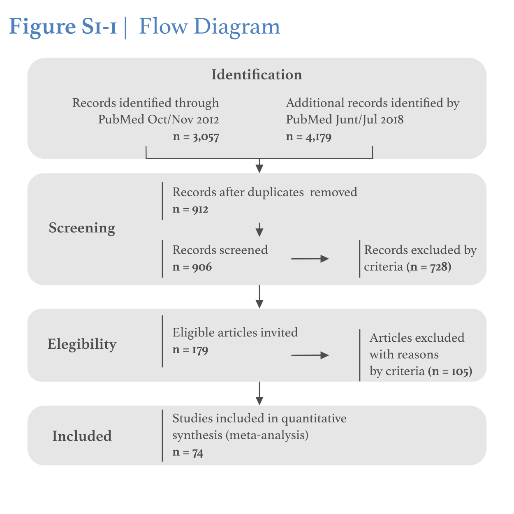

```{r setup, include=FALSE}
knitr::opts_chunk$set(echo = TRUE)
# https://bookdown.org/MathiasHarrer/Doing_Meta_Analysis_in_R/
```

```{r libs, echo=FALSE, message=FALSE, warnings=FALSE}
# Tables and Rmarkdown output
library(pander)
library(knitr)
library(kableExtra)
library(lubridate)
# General libraries
library(viridis)     # Colormaps
library(scales)      # Alpha function for color transparency
library(corrplot)    # Correlation plots
library(extrafont)   # Include extra fonts in plots
library(ggplot2)     # Ggplots functions for R
library(ggExtra)     # Marginal histogram/density/violin/boxplot in ggplots
library(gridExtra)   # Array for ggplots, equivalent of par(mfrow) 
library(esc)         # Effect size library, for Hedges'g calculation
# Libraries for meta-analysis
library(meta)
library(metafor)
library(rmeta)
library(forestplot)  # Forestplot for meta-regression visualization
```
  
Francis A. M. Manno DPhil, $PhD^{1,2}$^†, Raul Rodríguez-Cruces $MD, PhD^3*$, Rachit Kumar $BS^4*$, Yilai Shu $MD, PhD^5$, J. Tilak Ratnanather $DPhil^6$, Condon Lau $PhD^2$  
  
\small
**1.** School of Biomedical Engineering, Faculty of Engineering, University of Sydney, Sydney, New South Wales, Australia  
**2.** Department of Physics, City University of Hong Kong, Kowloon, Hong Kong SAR, China  
**3.** Montreal Neurological Institute, McGill University, Montreal, Canada  
**4.** Wallace H. Coulter Department of Biomedical Engineering, Georgia Institute of Technology and Emory University, Atlanta, GA, USA  
**5.** ENT Institute and Otorhinolaryngology Department of the Affiliated Eye and ENT Hospital, State Key Laboratory of Medical   Neurobiology, Institutes of Biomedcial Sciences, Fudan University, Shanghai, China  
**6.** Center for Imaging Science and Institute for Computational Medicine, Department of Biomedical Engineering, Johns Hopkins University, Baltimore, MD, USA  
\normalsize
\newline  
**Data availability statement:** The entire dataset, analyses and code used in this work can be downloaded by contacting the corresponding author and from the Open Science Framework: Manno, et al., 2018. “Profound Hearing Loss.” OSF. https://osf.io/7y59j/.  
\newline  
**Declaration of Interests:** The authors declare no competing financial interests and no non-financial competing interests.  
\newline  
**Author Contributions:** Conceptualization, FAMM JTR, CL; Methodology, FAMM, RRC; Formal Analysis, FAMM, RRC, RK; Visualization FAMM, RRC, RK; Investigation, FAMM, JTR; Writing, Editing, Funding FAMM, RRC, RK, YS, JTR, CL.  
\newline  
\newline  
**†Corresponding Author:**  
Francis A.M. Manno  
School of Biomedical Engineering  
Faculty of Engineering, The University of Sydney  
Sydney, New South Wales, Australia  
Email: Francis.Manno@Sydney.edu.au  
\newline  
**Keywords:** sensorineural hearing loss, structural MRI, bilateral hearing loss, unilateral hearing loss, deaf  

\newpage 
\tableofcontents 
\listoftables
\newpage

# Methods  
## Literature research  
\begin{itemize}
\setlength{\itemsep}{0pt}
\setlength{\parskip}{0pt}
\item Literature Search Methodology (eFigure PRISMA)
  \begin{enumerate}
  \setlength{\itemsep}{0pt}
  \setlength{\parskip}{0pt}
  \item PubMed searches were performed to acquire the requisite background information for this review. The searches had the purpose of identifying all sources concerning structural MRI assessments of unilateral or bilateral hearing loss. All studies must have utilized MRI as a structural assessment for hearing loss.  
  \item Search Terminology: \textit{"Unilateral hearing loss OR single-sided deafness, "Bilateral hearing loss OR deafness", "AND MRI OR magnetic resonance imaging"}  
  \end{enumerate}
\item First Search Oct/Nov 2012
\begin{enumerate}
  \setlength{\itemsep}{0pt}
  \setlength{\parskip}{0pt}
    \item A literature search in PubMed using MeSH and truncated (wildcard) terms was performed for studies pertaining to “unilateral hearing loss” or “bilateral hearing loss on Wed October 10, 2012 through Thurs November 1, 2012. The literature search returned precisely 3,057 results. All abstracts returned were read for descriptions of congenital unilateral/bilateral hearing loss using MRI. Approximately, 905 studies meet the following inclusion criteria. These studies were surveyed to ascertain whether they were relevant for inclusion based on the ‘Review inclusion criteria.’
    \item The primary inclusion and exclusion criteria were predetermined by following recommendations on meta-analysis (Sutton, et al., 2000)
\end{enumerate}
\item Inclusion criteria
\begin{enumerate}
  \setlength{\itemsep}{0pt}
  \setlength{\parskip}{0pt}
    \item Structural MRI study of bilateral or unilateral hearing loss
    \item Study had at least one cohort of participants whom had congenital unilateral/bilateral hearing loss
    \item The study, with a cohort of hearing impaired participants, had an adequate hearing control
    \item The normal hearing controls were sufficiently matched to the hearing impaired cohort (i.e age, gender, education, etc.)
    \item An experiment comparing the two cohorts was performed consisting of, but not limited to, MRI structural assessment
\end{enumerate}
\item Exclusion criteria
\begin{enumerate}
  \setlength{\itemsep}{0pt}
  \setlength{\parskip}{0pt}
    \item All studies were first included in the review and then given an asterisk if deemed inappropriate for inclusion. 
    \item Case studies (i.e., reports with only one patient)
    \item Manuscripts with insufficient power of replication (i.e., manuscript with 2 patients)
    \item Manuscripts with an inadequate or absent normal hearing control cohort (i.e., no control cohort was reported) – indicated in table.
    \item Normal hearing control cohort lacked matching demographic characteristics (i.e. the study had a group of hearing loss pediatric children and the normal hearing control group was adults)
    \item Manuscripts without an experiment comparing the hearing loss and normal cohort (i.e., bilateral hearing loss was not compared to hearing controls).
\end{enumerate}
\item Second Search June/July 2018
  \begin{enumerate}
  \setlength{\itemsep}{0pt}
  \setlength{\parskip}{0pt}
  \item Searches from first search and second search were combined along with personal correspondences of articles from JTR.
  \item Pubmed; (deafness OR "hearing loss" OR "bilateral hearing loss" OR “unilateral hearing loss” OR “conductive hearing loss” OR “sensorineural hearing Loss”) AND ("magnetic resonance imaging" OR MRI OR DTI OR "diffusion tensor imaging") NOT (Review[Filter] OR Editorial[Filter] OR Comment[Filter])
  \item Returned 4,179 articles. Articles were checked again throughout June/July 2018. Final article list was checked through Scopus.
  \item All references we checked at date indicated in table.
  \item Approximately 911 studies meet inclusion criteria
  \item Approximately 178 studies were screened from both periods and invited 
  \item Approximately 118 were excluded based on exclusion criteria or not pertaining to inclusion criteria
  \item A total of 51 studies were analyzed 
  \end{enumerate}
\item Controls 
\item Our requirements for duplicated studies were studies which used the identical participants but had different methodology, participants age was identical, or it was stated participants were used by authors in two studies
\item Only included original statistics here from the studies. All derived effect sizes were from study information. Asymmetry statistics were created if a study included a left and a right side for an identical ROI. Statistics from our analysis could be derived from, example asymmetry as indicated above.
\item Asymmetry if included was converted to: only for asymmetry (check asymmetry) (L - R) /[(L+R)/2], where positive result = LEFT, negative result = RIGHT
\item If studies included acquired and congenital we only used congenital metrics.
\end{itemize}

### Figure SI.1 Flow diagram


## Eligibility Criteria for the meta-regression  
We included peer-review publications in English, involving patients with bilateral congenital and mixed hearing loss and controls with structural Magnetic Resonance Imaging. We included cross-sectional studies with control groups, that investigated the structural relation between MRI changes and the hearing loss. The most common MRI measures were **volume, FA, VBM and thickness.** Each measure was assignated to a specific ROI and to a big brain area. (eg. HG and superior temporal lobe belong to **temporal lobe**).
A total of 59 studies were included, 6 of them contained incomplete information. A total of 2778 patients and 4214 controls.  
Notes for inclusion:  
\begin{enumerate}
\item Xia et al. Chin J Rad, 2008 was excluded because it appears to be the same data as Xia et al. Chin J Med Img Tech, 2008.  
\item  Kim et al. Hear Res 2014 used two groups \textit{prelingual deaf} and \textit{post lingual deaf}, we used the average for the main table. 
\item  Xia et al. Chin J Med Img Tech, 2008 had 40 patients in total, in two groups 9-12 years and 19-22 years.  
\item  For some studies (eg. 2017, Ritgers et al. Front. Aging Neurosci) it was not possible to calculate the Hegdes'G variance and were not include in some specific meta-regressions.  
\item Studies with \textit{Mixed etiology} were excluded, due to a non representative low number (n=3).
\item  Zheng et al. Sci Rep, 2017 this variables change; Con rangeLow	Con rangeHigh.    
\end{enumerate}  


## Tables of included studies  
A total of **64** unique bilateral studies were included (19 acquires, 42 congenital and 3 mixed etiologies).
\scriptsize
```{r datos, echo=FALSE, size = 'scriptsize'}
# set working directory
setwd("~/git_here/MetaHearingLoss/")
# Upload  functions and libraries
source("meta_functions.R")

# table size \tiny, \scriptsize, \footnotesize, \small, \normalsize, \large, \Large, \LARGE, \huge, and \Huge
# Upload database
meta <- read.csv("databases/meta_sideDeaf_full.csv")

# Source of studies, "author + year"
meta$Source <- paste0(meta$year,", ",meta$study)
meta$yrAu <- paste0(meta$year,"-",sapply(strsplit(as.character(meta$study)," "), `[`, 1))

# Total N
meta$N.total <- meta$Number.Hearing.loss + meta$Number.Control

# Cohen's D with direction
meta$cohenD <- meta$Cohen.s.d*ifelse(meta$effect=="decrease",-1,1)

# Calculate Cohen's D
meta$cohen.cal <- cohen.d(meta$MeanControl, meta$MeanHL, meta$SDControl, meta$SDHL, meta$Number.Control, meta$Number.Hearing.loss)
  
# hedges_g
meta$hedgesG <- hedges_g(d = meta$cohenD, totaln = meta$N.total)

# Cohen's D Variance
meta$varDe <- varDe(meta$Number.Hearing.loss, meta$Number.Control, meta$cohenD)

# Cohen's D Variance
meta$varG <- varDe(meta$Number.Hearing.loss, meta$Number.Control, meta$hedgesG)

# odds ratio
#meta$or <- odds_ratio(d = meta$Cohen.s.d)
meta$Big.area <- as.character(meta$Big.area)
meta$Big.area <- ifelse(meta$Big.area=="frontal lobe", "frontal" , meta$Big.area)
meta$Big.area <- ifelse(meta$Big.area=="thalmus", "Thalamus" , meta$Big.area)
meta$Big.area <- ifelse(meta$Big.area=="temporal lobe", "temporal" , meta$Big.area)
meta$Big.area <- ifelse(meta$Big.area=="parietal lobe", "parietal" , meta$Big.area)
meta$Big.area <- ifelse(meta$Big.area=="cingulate cortex", "cingulate" , meta$Big.area)
meta$Big.area <- as.factor(meta$Big.area)

# Unique studies
studies <- meta[,c("study","year","Etiology","Side.deaf","Severeity","Number.Hearing.loss",
                   "HL.Male","HL.Female","HL.age","HL.Age.sd","SIGN","Number.Control","Con.Male",
                   "Con.Female","Con.Age","Con.Age.sd","MRI.Tesla", "Source","Avg.dB.HL.mean","hedgesG")]
studies <- studies[!duplicated(studies$Source),]

# I excluded Xia et al. Chin J Rad, 2008 because I don't understand chinese and it appears to be the same data as Xia et al. Chin J Med Img Tech, 2008
    studies <- studies[!studies$Source=="2008, Xia et al. Chin J Rad",]
    meta <- meta[!meta$Source=="2008, Xia et al. Chin J Rad",]
# Kim et al. Hear Res 2014 used two groups prelingual deaf and post lingual deaf, used the average for the main table.
    indx <- which(studies$Source=="2014, Kim et al. Hear Res")
# Number.Hearing.loss - HL.Male - HL.Female
    studies <- rbind(studies,c(studies[indx[1],1:5],colSums(studies[indx,6:8]), apply(studies[indx,9:10],2,mean), studies[indx[1],11:20]))
    studies <- studies[-indx,]
# Xia et al. Chin J Med Img Tech, 2008 had 40 patients in total two groups 9-12 years and 19-22 years
    indx <- which(studies$Source=="2008, Xia et al. Chin J Med Img Tech")
    studies <- rbind(studies,c(studies[indx[1],1:5],colSums(studies[indx,6:8]),studies[indx[1],9:20]))
    studies <- studies[-indx,]
# Zheng et al. Sci Rep, 2017 this variables change, why? Con rangeLow	Con rangeHigh, i didn't find them on the orignal paper

# Percentage of females
studies$Female.Patients <- studies$HL.Female*100/studies$Number.Hearing.loss
studies$Female.Control <- studies$Con.Female*100/studies$Number.Control

# Order by year and author
studies <- studies[order(studies$Source),]

# --------------------------------------------------- #
# TABLE 1. INCLUDED STUDIES TOTAL SUBJECTS
# Reorder columns for table
include.studies <- studies[,c("Source","Etiology","Severeity","Number.Hearing.loss","Female.Patients","HL.age","Number.Control","Female.Control","Con.Age", "MRI.Tesla") ]
colnames(include.studies) <- c("Source","Etiology","Severity","No.Patients","% Female Patients","Age.Patients","No.Control","% Female Control","Age.Control", "MRI Tesla") 

# Print table
print.data <- function(include.studies, Title) {
  Total <- matrix(c(sum(include.studies$No.Patients),sum(na.omit(include.studies$No.Control)),
                    mean(include.studies$No.Patients),mean(na.omit(include.studies$No.Control)),
                    sd(include.studies$No.Patients),sd(na.omit(include.studies$No.Control)),
                    mean(na.omit(include.studies$Age.Patients)),mean(na.omit(include.studies$Age.Control)),
                    sd(na.omit(include.studies$Age.Patients)),sd(na.omit(include.studies$Age.Control)), 
                    mean(na.omit(include.studies$`% Female Patients`)),mean(na.omit(include.studies$`% Female Control`)),
                    sd(na.omit(include.studies$`% Female Patients`)),sd(na.omit(include.studies$`% Female Control`))
  ), nrow = 7,ncol = 2,byrow = TRUE)
  rownames(Total) <- c("Total number of patients","Number mean","Number sd", "Age mean", "Age SD", "%Female mean", "%Female sd")
  colnames(Total) <- c("Hearing Loss", "Healthy")
  N.inc <- length(unique(include.studies$Source))
  obj <- pander(Total,caption = paste(Title, N.inc),split.table = Inf, graph.fontsize=3)
}

rownames(include.studies) <- c()
# All studies
pander(print.data(include.studies, 'Total unique studies'))
pander(print.data(include.studies[include.studies$Etiology=='acquired',], 'Acquired studies'))
pander(print.data(include.studies[include.studies$Etiology=='congenital',], 'Congenital studies'))
pander(print.data(include.studies[include.studies$Etiology=='mixed',], 'Mixed studies'))


# --------------------------------------------------- #
# TABLE 2. ALL INCLUDED STUDIES 
# Including Techniques and measurements per unique study
include.studies$all.techniques <- include.studies$all.measures <- c()
for (i in include.studies$Source) { 
  tech <- sort(unique(as.vector(meta$Technique[meta$Source==i])))
  measure <- sort(unique(as.vector(meta$measure[meta$Source==i])))
  include.studies$all.techniques[include.studies$Source==i] <- paste(tech, collapse = ", ")
  include.studies$all.measures[include.studies$Source==i] <- paste(measure, collapse = ", ")
  }

# Approximate number of data points
#sum(apply(meta[,c(12,14,15:20,23:24,32:36,42,55, 58:67, 70,71, 76)], 2, function(x) length(which(!is.na(x)))) )

# --------------------------------------------------- #
ref <- meta[!duplicated(meta$Source),c("authors", "title", "publication", "doi", "email")]
# EXCLUSIONS
# REMUVE NA values from Hedges'G
meta <- meta[!is.na(meta$hedgesG),]
# REMOVE mixed Etiology
meta <- meta[meta$Etiology!="mixed",]
```
  
\footnotesize

```{r lista, echo=FALSE, size = 'scriptsize'}
# Table 2.1
#panderOptions('table.alignment.default', c('left',rep('center',8)))
#pander(include.studies[,1:9],caption = "Included studies",split.table = Inf, graph.fontsize=3)

# Table: studies with incomplete cases
# pander(include.studies[!complete.cases(include.studies),c("Source", "MRI Tesla", "all.techniques", "all.measures")],caption = "Studies with incomplete cases (NA)",split.table = Inf, graph.fontsize=6)

# TABLE: Studies without Hedges'G
panderOptions('table.alignment.default', 'left')
noHedges <- studies[is.na(studies$hedgesG),c("Source", "Etiology", "Number.Control")]
rownames(noHedges) <- 1:7
pander(noHedges,caption = "Studies without Hedges'G (n=7). These studies do not have control population (NA)",split.table = Inf, graph.fontsize=6)

# Included studies: WITH Hedges'G
noHedges <- include.studies[!include.studies$Source %in% noHedges$Source, c("Source", "Etiology", "all.techniques","all.measures")]
noHedges <- noHedges[order(noHedges$all.techniques, noHedges$Source),]
rownames(noHedges) <- 1:dim(noHedges)[1]
pander(noHedges,caption = "Studies with Hedges'G (n=57, mixed etiology=3)",split.table = Inf, graph.fontsize=6)

```    
  
\normalsize  

## Unusual cases  
The measurement of Fractional anisotropy is rather unsual for quantifiying gray matter tissue. However, some studies have used this parameter.  

  
## Formulas
Effect size direction was directly include in the Cohen's D value by mutipliying by -1 if the effect was decrease and by 1 if it was none of increased.
The value of $Cohen's D$  $r_{Y1}$, was calculated using the means and standard deviations of two groups ($M_1$=treatment and $M_2$=control):  
$$Cohen's\ D = \frac{M_1 - M_2 }{S_{pooled}}$$ where $$S_{pooled}=\sqrt\frac{(n_1-1)\times s_1^2+ (n_2-1)\times s_2^2}{n_1+n_2-2}$$ 
and the effect-size correlation is:
$$r_{Y1}=\frac{d}{\sqrt{d^2+4}}$$

We calculate the value of Cohen's d and the effect size correlation, $r_{Y1}$, using the t test value for a between subjects $t-test$ and the degrees of freedom, the following formula was used:  
$$Cohen's\ D = \frac{2t}{\sqrt{df}}\ and\ r_{Y1} = \sqrt{\frac{t^2}{t^2 + df}}$$  
  
Effects were summarized across studies using the generic inverse-variance weighting method with DerSimonian and Laird random effects. Studies were weighted by $1/SE²$ (where SE is the standard error). For the effect size we used Hedges'G, wich takes into account the sample size.

$$Hedges'G=\frac{X_1 - X_2}{\sqrt{\frac{(n_1-1)s_1^2+(n_2-1)s_2^2}{n_1+n_2-2}}}$$

Finally, the variance was estimated using the cohen's D and sample size of each study. Our estimated variance was used for all meta-regressions, therefore we could have and additional bias in-between studies variance and heterogeneity calculations. We should have calculated the effect size from the mean and standard deviation from each study. Variance was estimated using the following formula:  
$$Variance=\frac{n1+n2}{n1\times n2}+\frac{Hedges'G^2}{2\times(n1+n2-2)}$$  
  
## Estimatimation of heterogeneity per model  
We estimated heterogeneity in results using the $\tau$ statistic, which represents the standard deviation in the meta-regression models, we used the heterogeneity test $x2$ and $I2$.   
We performed a multi-level meta-analytic model, over our multiple effect size estimates nested withing variables: Etiology, side and Big brain area. We expected that the underlying true effects are more similar for the same level of the grouping variables than thrue effects arising from different levels.  
We can account for the correlation in the true effects by adding a random effect to the model at the level corresponding to the grouping variable.  
The dataset contains the result from 54 studies, each comparing different measurements between patients and controls. The diference of between groups was quantified in terms of Hedges'G and Cohen's D.
  
## References (64 bilateral studies)  

\footnotesize  

```{r ref, echo=FALSE, warning=FALSE, message=FALSE, results='asis'}
rownames(ref) <- NULL
ref <- paste0(apply(ref, 1 , paste , collapse = ", " ))
print(ref)
```  

## Unilateral hearing loss (total n=8)
\begin{itemize}
\setlength{\itemsep}{0pt}
\setlength{\parskip}{0pt}
\item	VBM studies
\begin{enumerate}
\setlength{\itemsep}{0pt}
\setlength{\parskip}{0pt}
\item	Fan et al. Otol Neurotol. 2015 Dec;36(10):1622-7. (Unilateral SNHL adult mixed cause) –VBM –SPM
\item	Yang et al. Hear Res. 2014 Oct;316:37-43. (Right unilateral SHNL adult) –SPM – VBM
\item	Wang et al. Sci Rep. 2016 May 13;6:25811.(Adult acquired unilateral) SPM -VBM
\end{enumerate}
\item	DTI
\begin{enumerate}
\setlength{\itemsep}{0pt}
\setlength{\parskip}{0pt}
\item	Wu et al. AJNR Am J Neuroradiol. 2009 Oct;30(9):1773-7. (Congenital Unilateral deaf children) - DTI-Studio
\item	Lin et al. J Magn Reson Imaging. 2008 Sep;28(3):598-603. (Bilateral and unilateral SNHL Adult) - DTI-Studio
\item	Rachakonda et al. Front Syst Neurosci. 2014 May 26;8:87. (Unilateral left and right, adolescent) – Not indicated
\item	Wu et al. Audiol Neurootol. 2009;14(4):248-53. (Unilateral mixed left/right SNHL mixed congenital/unknown adult)-DTI Studio
\item	Vos et al. Hear Res. 2015 May;323:1-8. (Unilateral mixed left and right SNHL adult) – DTI Tractography - ExploreDTI
\end{enumerate}
\end{itemize}

\normalsize 
## Signed differential mapping (SDM)  
Seed-based d Mapping (formerly "Signed Differential Mapping"):  
> https://www.sdmproject.com/  
  
1. Radua J, Mataix-Cols D. Voxel-wise meta-analysis of grey matter changes in obsessive-compulsive disorder. Br J Psychiatry. 2009; 195:393--402.  
1. Radua J, van den Heuvel OA, Surguladze S, Mataix-Cols D. Meta-analytical comparison of voxel based morphometry studies in obsessive-compulsive disorder vs other anxiety disorders. Arch Gen Psychiatry. 2010; 67:701--711.  
  
\scriptsize  
  
```{r sdm, echo=FALSE, warning=FALSE, message=FALSE, results='asis'}  
sdm <- read.csv(file = "databases/SDM_table.csv")
rownames(sdm) <- NULL
#pandoc.header(paste("SDM: congenital"), level = 4)
  print(kable(sdm[sdm$group=="congenital",1:6][1:59,], "latex", booktabs = T,row.names = FALSE, caption = "SDM: congenital") %>%
  kable_styling(latex_options = c("striped", "scale_down", "condensed")))
  
  print(kable(sdm[sdm$group=="congenital",1:6][60:81,], "latex", booktabs = T,row.names = FALSE, caption = "SDM: congenital... continuation") %>%
  kable_styling(latex_options = c("striped", "scale_down", "condensed")))
  
for (i in c("acquired", "pediatric", "adult", "AgedAdult","GM", "WM")) {
  #pandoc.header(paste("SDM:",i), level = 4)
  print(kable(sdm[sdm$group==i,1:6], "latex", booktabs = T,row.names = FALSE, caption = paste("SDM:",i)) %>%
  kable_styling(latex_options = c("striped", "scale_down", "condensed")))
}
```
    
\newpage  

\normalsize  
## Anatomic Likelihood Estimation  
Fox PT, Lancaster JL. Mapping context and content: the BrainMap model. Nat Rev Neurosci. 2002 Apr;3(4):319-21.  
> http://www.brainmap.org/ale/  
> http://www.brainmap.org/scribe/  
  
*Table 15. ALE report of first 10 clusters:* WC: weighted center.  

    
```{r ale.tab, echo=FALSE, warning=FALSE, message=FALSE, results='asis'}  
ale.tab <- read.csv(file = "databases/Table_SI-1.csv",row.names = NULL, na.strings = ' ')
colnames(ale.tab) <- c('Cluster Number', '$Volume mm^3$', 'WC.x', 'WC.y', 'WC.z', 'Extrema value', 'x', 'y', 'z', 'Label')
# pandoc.header(paste("ALE report of first 10 clusters"), level = 3)
  print(kable(ale.tab, "latex", booktabs = T,row.names = FALSE, caption = 'ALE report of first 10 clusters') %>%
  kable_styling(latex_options = c("striped", "scale_down", "condensed")))
```

\normalsize      
    
## Multi-Level Kernel Density Analysis (mKDA): Wager Methods  
https://github.com/canlab/Canlab MKDA MetaAnalysis  

### Definitions for mKDA  
\begin{enumerate}
\def\labelenumi{\arabic{enumi})}
  \item Cluster Definitions (KDA documentation of Wager's scripts)
  \item Clusters in yellow - these are the clusters that surpass the height-corrected threshold.
  \item Clusters in orange - these are incremental clusters that pass the most stringent extent-based threshold (p \textless{} .001) that are not within 10 mm of the clusters for the height-based threshold.
  \item Clusters in red - these are incremental clusters that pass the medium extent-based threshold (p \textless{} .01) that are not within 10 mm of the clusters for the height-corrected and stringent extent-corrected thresholds.
  \item Clusters in purple - these are incremental clusters that pass thelenient extent-based threshold (p \textless{} .05) that are not within10 mm of the clusters for the height-corrected, as well as the stringent and medium extent-corrected thresholds.
\end{enumerate}  
  
**Table mKDA report:** Color of clusters in images:	YELLOW,	ORANGE,	RED and	PURPLE  
  
  
```{r mkda, echo=FALSE, warning=FALSE, message=FALSE, results='asis'}  
mkda.tab <- read.csv(file = "databases/Table_SI-2.csv",row.names = NULL, na.strings = ' ')
colnames(mkda.tab) <- c("Contrasts", "Folder", "Height threshold clusters", "p<0.001 clusters", "p<0.01 clusters", "p<0.05 clusters", "Description")
# pandoc.header(paste("mKDA report"), level = 3)
  print(kable(mkda.tab, "latex", booktabs = T,row.names = FALSE, caption = "mKDA report") %>%
  kable_styling(latex_options = c("striped", "scale_down", "condensed")))
```
  
  
The following cluster definitions used by Wager's scripts are briefly summarized (see SI for extended analysis). Yellow indicates clusters surpass the height-corrected threshold and orange, red and purple clusters are not within 10 mm of the clusters for the height-corrected. Further, orange indicates clusters pass the most stringent extent-based threshold (p \textless{} .001), red indicates clusters that pass the medium extent-based threshold (p \textless{} .01) and purple indicates clusters pass the lenient extent-based threshold (p \textless{} .05). The primary mKDA analyses were done for acquired and congenital separately and combined. Additional analyses are found in the SI.  
  
### Cluster comparisons list  
  
The following mKDA specific analyses were conducted. If no significant clusters were found, no image map was produced.  
  
\begin{enumerate}
\setlength{\itemsep}{0pt}
\setlength{\parskip}{0pt}
\item Cluster: Specific ROI cluster analysis
\item Cluster: All MNI Coordinate mapping
\item Cluster: Increase (all increase)
      \begin{enumerate}
      \setlength{\itemsep}{0pt}
      \setlength{\parskip}{0pt}
      \item Cluster: Increase left (all left)
          \begin{enumerate}
          \setlength{\itemsep}{0pt}
          \setlength{\parskip}{0pt}
          \item Cluster: Increase left GM
          \item Cluster: Increase left WM
          \end{enumerate}
      \item Cluster: Increase right (all right)
          \begin{enumerate}
          \setlength{\itemsep}{0pt}
          \setlength{\parskip}{0pt}
          \item Cluster: Increase right GM
          \item Cluster: Increase right WM)
          \end{enumerate}
      \end{enumerate} 
\item Cluster: Decrease (all decrease)
      \begin{enumerate}
      \setlength{\itemsep}{0pt}
      \setlength{\parskip}{0pt}
      \item Cluster: Decrease left (all left)
          \begin{enumerate}
          \setlength{\itemsep}{0pt}
          \setlength{\parskip}{0pt}
          \item Cluster: Decrease left GM
          \item Cluster: Decrease left WM)
          \end{enumerate}
      \item Cluster: Decrease right (all right)
          \begin{enumerate}
          \setlength{\itemsep}{0pt}
          \setlength{\parskip}{0pt}
          \item Cluster: Decrease right GM
          \item Cluster: Decrease right WM
          \end{enumerate}
      \end{enumerate}
\item Cluster: All VBM (only VBM)
\item Cluster: ALL DTI (Only DTI)
\item Cluster: ALL GM (irrespective of increase or decrease)
      \begin{enumerate}
      \setlength{\itemsep}{0pt}
      \setlength{\parskip}{0pt}
      \item Cluster: GM increase
      \item Cluster: GM decrease
      \end{enumerate}
\item Cluster: All WM (irrespective of increase or decrease)
      \begin{enumerate}
      \setlength{\itemsep}{0pt}
      \setlength{\parskip}{0pt}
      \item Cluster: WM increase
      \item Cluster: WM decrease
      \end{enumerate}
\item Cluster: All Left
      \begin{enumerate}
      \setlength{\itemsep}{0pt}
      \setlength{\parskip}{0pt}
      \item Cluster: All left GM (to match regression figure panel)
      \item Cluster: All left WM (to match regression figure panel)
      \end{enumerate}
\item Cluster: All right
      \begin{enumerate}
      \setlength{\itemsep}{0pt}
      \setlength{\parskip}{0pt}
      \item Cluster: All right GM (to match regression figure panel)
      \item Cluster: All right WM (to match regression figure panel)
      \end{enumerate}
\end{enumerate}  
  
The important information for results is contained in the cl variable in the Activation\_clusters.mat file. This gives you a variable with 4 fields or cells, and within a cell is information about the regions (clusters/brain blobs) that pass the height threshold (referred to as cl\{1\}), the p \textless{} .001 threshold (referred to as cl\{2\}), the p \textless{} .01 threshold (referred to as cl\{3\}), and the p \textless{} .05 threshold (referred to as cl\{4\}), respectively.  
  
#### Cluster mKDA: Specific ROI cluster analysis (currAnalysis study contrast)  
  **Axial**    
\includegraphics[width=4.45in,height=2.5in]{./media/media/image1.png}
   
  **Coronal**  
\includegraphics[width=4.45in,height=2.5in]{./media/media/image2.png}

#### Cluster mKDA: All MNI Coordinate mapping (currAnalysis\_uniform\_contrast)  
  **Axial**    
\includegraphics[width=4.45in,height=2.5in]{./media/media/image3.png}
   
  **Coronal**  
\includegraphics[width=4.45in,height=2.5in]{./media/media/image4.png}
  
#### Cluster mKDA: Increase (all increase)  
  **Axial**    
\includegraphics[width=4.45in,height=2.5in]{./media/media/image5.png}
   
  **Coronal**  
\includegraphics[width=4.45in,height=2.5in]{./media/media/image6.png}

#### Cluster mKDA: Increase left (all left)  
  **Axial**    
\includegraphics[width=4.45in,height=2.5in]{./media/media/image7.png}
   
  **Coronal**  
\includegraphics[width=4.45in,height=2.5in]{./media/media/image8.png}

#### Cluster mKDA: Increase left GM  
No significant clusters found. No image map produced.

#### Cluster mKDA: Increase left WM  
  **Axial**    
\includegraphics[width=4.45in,height=2.5in]{./media/media/image9.png}
   
  **Coronal**  
\includegraphics[width=4.45in,height=2.5in]{./media/media/image10.png}

#### Cluster mKDA: Decrease (all decrease)  
  **Axial**    
\includegraphics[width=4.45in,height=2.5in]{./media/media/image11.png}
   
  **Coronal**  
\includegraphics[width=4.45in,height=2.5in]{./media/media/image12.png}

#### Cluster mKDA: Decrease left (all left)  
No significant clusters found. No image map produced.

#### Cluster mKDA: Decrease left GM  
  **Axial**    
\includegraphics[width=4.45in,height=2.5in]{./media/media/image5.png}
   
  **Coronal**  
\includegraphics[width=4.45in,height=2.5in]{./media/media/image13.png}

#### Cluster mKDA: Decrease left WM  
  **Axial**    
\includegraphics[width=4.45in,height=2.5in]{./media/media/image14.png}
   
  **Coronal**  
\includegraphics[width=4.45in,height=2.5in]{./media/media/image15.png}

#### Cluster mKDA: Decrease right (all right)  
  **Axial**    
\includegraphics[width=4.45in,height=2.5in]{./media/media/image16.png}
   
  **Coronal**   
\includegraphics[width=4.45in,height=2.5in]{./media/media/image17.png}

#### Cluster mKDA: Decrease right GM  
No significant clusters found. No image map produced.  

#### Cluster mKDA: Decrease right WM  
  **Axial**    
\includegraphics[width=4.45in,height=2.5in]{./media/media/image18.png}
   
  **Coronal**  
\includegraphics[width=4.45in,height=2.5in]{./media/media/image19.png}

#### Cluster mKDA: All VBM (only VBM)  
  **Axial**    
\includegraphics[width=4.45in,height=2.5in]{./media/media/image20.png}
   
  **Coronal**    
\includegraphics[width=4.45in,height=2.5in]{./media/media/image21.png}

#### Cluster mKDA: ALL DTI (Only DTI)  
  **Axial**    
\includegraphics[width=4.45in,height=2.5in]{./media/media/image22.png}
   
  **Coronal**  
\includegraphics[width=4.45in,height=2.5in]{./media/media/image23.png}

#### Cluster mKDA: ALL GM (irrespective of increase or decrease)  
No significant clusters found. No image map produced.  

#### Cluster mKDA: GM increase  
No significant clusters found. No image map produced.  

#### Cluster mKDA: GM decrease  
No significant clusters found. No image map produced.

#### Cluster mKDA: All WM (irrespective of increase or decrease)  
  **Axial**    
\includegraphics[width=4.45in,height=2.5in]{./media/media/image24.png}
   
  **Coronal**  
\includegraphics[width=4.45in,height=2.5in]{./media/media/image25.png}

#### Cluster mKDA: WM increase  
  **Axial**    
\includegraphics[width=4.45in,height=2.5in]{./media/media/image26.png}
   
  **Coronal**  
\includegraphics[width=4.45in,height=2.5in]{./media/media/image27.png}

#### Cluster mKDA: WM decrease  
  **Axial**    
\includegraphics[width=4.45in,height=2.5in]{./media/media/image28.png}
   
  **Coronal**  
\includegraphics[width=4.45in,height=2.5in]{./media/media/image29.png}

#### Cluster mKDA: All Left
  **Axial**    
\includegraphics[width=4.45in,height=2.5in]{./media/media/image30.png}
   
  **Coronal**  
\includegraphics[width=4.45in,height=2.5in]{./media/media/image31.png}

#### Cluster mKDA: All left GM (match - regression figure panel)  
No significant clusters found. No image map produced.  

#### Cluster mKDA: All left WM (match - regression figure panel)  
  **Axial**    
\includegraphics[width=4.45in,height=2.5in]{./media/media/image32.png}  
   
  **Coronal**  
 \includegraphics[width=4.45in,height=2.5in]{./media/media/image33.png}  

#### Cluster mKDA: All Right  
  **Axial**    
\includegraphics[width=4.45in,height=2.5in]{./media/media/image34.png}
   
  **Coronal**  
\includegraphics[width=4.45in,height=2.5in]{./media/media/image35.png}

#### Cluster mKDA: All right GM (match - regression figure panel)  
No significant clusters found. No image map produced.

#### Cluster mKDA: All right WM (match - regression figure panel)  
  **Axial**    
\includegraphics[width=4.45in,height=2.5in]{./media/media/image36.png}  
   
  **Coronal**  
\includegraphics[width=4.45in,height=2.5in]{./media/media/image37.png}  
  
\newpage
  
# Studies characteristics
## Relation between hearing loss (dB)  and age (Figure 2.D)  
```{r avgdB, echo=FALSE, warning=FALSE, message=FALSE,fig.height=5,fig.width=7}
studies <- studies[studies$Etiology!="mixed",]
gg=ggplot(studies, mapping =aes(x=HL.age, y=Avg.dB.HL.mean)) +
  geom_point(mapping = aes(x = HL.age, y = Avg.dB.HL.mean, color=Etiology, size=Number.Hearing.loss), alpha = 50 / 100, position = "jitter") +
  geom_smooth(mapping = aes(x = HL.age, y = Avg.dB.HL.mean), method = lm, color="gray45") +
  ggtitle("Hearing loss vs Age - Fig.2.D") +
  labs(y='Decibels (dB) ',x='Age')

# with marginal histogram
ggMarginal(gg, type="histogram")
```  
  
  
## Studies characteristics (Figure 2.E, 2.F)  
```{r lollip1, echo=FALSE, warning=FALSE, message=FALSE, fig.height=4, fig.width=8}
# Lollipop graphs
grid.arrange(
lollipop(table(meta$measure),"MRI Measures",c(0,300)),
lollipop(table(meta$Big.area)[order(table(meta$Big.area),decreasing = TRUE)][1:12],"Main Brain Areas\n frecuency>5",c(0,300))
, ncol=2, nrow = 1)
```
  
```{r lollip2, echo=FALSE, warning=FALSE, message=FALSE, fig.height=5.5, fig.width=8}
lollipop(table(meta$ROI)[order(table(meta$ROI),decreasing = TRUE)][1:35],"Region of interest: frecuency>5",c(0,80))
```
  
```{r bar1, echo=FALSE, warning=FALSE, message=FALSE, fig.height=3, fig.width=10}
par(mfrow=c(1,2))
# Bar graph of frecuency
bargraph(table(meta$Side)[order(table(meta$Side),decreasing = FALSE)][2:5],"Side of the Lesion", Lab=0.75)
bargraph(table(meta$matter)[order(table(meta$matter),decreasing = FALSE)], "Area of Analysis", Lab=0.75)
```
  
```{r bar2, echo=FALSE, warning=FALSE, message=FALSE, fig.height=4, fig.width=10}
# Etiology by SEVERITY
par(mfrow=c(1,2))
Col <- c("#F8766D", "#00BFC4")
barplot(table(studies$Etiology, studies$Severeity)[1:2,], main = "Fig.2.E - Severity", beside = FALSE, col=alpha(Col,0.6), border = Col, xlab='Number of studies', horiz = TRUE, las=2, cex.names=0.75)

# Etiology by EFFECT DIRECTION
barplot(prop.table(table(meta$Etiology, meta$effect), 1)[,3:5],  main = "Fig.2.F - Effect direction", beside = TRUE, col=alpha(Col,0.6), xlab='Relative percentage', border = Col, horiz = TRUE, las=2, cex.names=0.75)
# add legend
```
  

## Brain structure (GM, WM) and MRI measures  
**Highlights**  
a. Most of the studies that measured Gray matter focus on cortical changes (volume, thicknes and VBM).  
b. White matter studies are more heterogeneous in their measurements.  
c. Diffusion tensor (DT) derived mesurements are the most frequent in white matter, followed by volume.  
  c.1 It is harder to interpret a meta-analysis of multiple white matter measurements because its effect varies widely in different directions. The measurements derived from DT have the most differences.  
    
We conduct our meta-analysis using the **TWO** most frequent measurements for gray and white matter. We use *volume* for GM and *fractional anysotropy* for WM.   
  
Further meta regressions can be found in the supplementary material.  
**Gray Matter**  
- thickness  
- VBM  

**White Matter integrity**  
- mean diffusivity MD  
- radial diffusivity RD  
- axial diffusivity AD  
- mean kurtosis  

**White Matter volume**  
- thickness (I am unsure how they did this)  
- VBM  
- volume

**Biletareal**
- GM volume  
- WM volume  
- WM fractional anisotropy  
  
\footnotesize

## Frequency table: Brain structure (GM, WM) and MRI measures    
```{r tab1,  echo=FALSE, warning=FALSE, message=FALSE, results='asis', fig.height=3}
# Table: Matter vs Measure 
pander(table(meta$matter,meta$measure)[c(2,5),],caption = "Matter vs measure")
# Bar graph of frecuencies
tablas <- table(meta$matter,meta$measure)

# Table: Matter vs Side 
pander(table(meta$matter,meta$Side)[c(2,5),],caption = "Matter vs Side")

# Indexing only gray and white matter
G <- which(rownames(tablas)=="GM")
W <- which(rownames(tablas)=="WM")

# ------------------------------------------------------
pandoc.header("Brain structure (GM, WM) and side",3)
# Table: Matter vs Side 
barplot(table(meta$matter,meta$Side)[c(2,5),], beside = TRUE, main="Matter vs Side", col = c("gray35", "gray85"), border = c("gray35", "gray85"))
legend(12,160,c("GM", "WM") ,fill = c("gray35", "gray85"), border = c("gray35", "gray85"), bty = 'n' )

# Contingensy table measure vs Big Area
freq.table2 <- table(meta$Big.area,meta$measure)
Ind <- order(apply(as.matrix(freq.table2),1,sum),decreasing = TRUE)
# Slices the first nine more frequent
#pander(freq.table2[Ind[1:9],],caption = "Table: Measure vs Big area")

# Contingensy table measure vs ROI
freq.table <- table(meta$ROI,meta$measure)
Indx <- order(apply(as.matrix(freq.table),1,sum),decreasing = TRUE)
#pander(freq.table[Indx[1:16],],caption = "Table: Measure vs ROI")
```

\normalsize
\newpage

## Studies characteristics (Figure 2.A, 2.B): Brain structure (GM, WM) by MRI measure (volume and FA) 
```{r fig1a, echo=FALSE, warning=FALSE, message=FALSE, fig.width=10,fig.height=2}
# FRECUENCY BY MRI MEASURE
tablas <- table(meta$matter,meta$measure)
grid.arrange(
# GRAY MATTER MEASUREMENTS 400w 175h  greater than 0= 1:14
lollipop(tablas[G,order(tablas[G,],decreasing = T)[1:5]],"GM measures",c(0,200),Color = c("#008000",rep('#808080',4)), Order = FALSE),
# WHITE MATTER MEASUREMENTS 400w 300h
lollipop(tablas[W,order(tablas[W,],decreasing = T)[1:10]],"WM measures",c(0,200), Color = c("#000080","royalblue3", rep('#808080',8)), Order = FALSE),
nrow=1, ncol = 2)

grid.arrange(
# Frequency table: Gray matter volume Big areas: > 5 studies
lollipop(table(meta$Big.area[meta$matter=="GM" & meta$measure=="volume"])[table(meta$Big.area[meta$matter=="GM" & meta$measure=="volume"])>=4],
         "GM-volume & Big areas",c(0,60), Color='#008000'),
# Frequency table: White matter FA Big areas: >5 studies
lollipop(table(meta$Big.area[meta$matter=="WM" & meta$measure=="FA"])[table(meta$Big.area[meta$matter=="WM" & meta$measure=="FA"])>=4],
         "WM-FA & Big areas",c(0,60), Color='#000080'),
# Frequency table: White matter FA Big areas: >5 studies
lollipop(table(meta$Big.area[meta$matter=="WM" & meta$measure=="volume"])[table(meta$Big.area[meta$matter=="WM" & meta$measure=="volume"])>=4],
         "WM-volume & Big areas",c(0,60), Color = "royalblue3"),
nrow=1, ncol = 3)

# Insersect data by GM+WM and volume+FA
meta.GWm <- meta[
  intersect(which(!is.na(factor(meta$measure, levels=c("volume","FA")))),
            which(!is.na(factor(meta$matter, levels=c("WM","GM")))) ),]
meta.GWm$matter <- droplevels(meta.GWm$matter)
meta.GWm$measure <- droplevels(meta.GWm$measure) 
meta.GWm$class <- factor(paste0(meta.GWm$matter,"-",meta.GWm$measure), levels = c("WM-volume","WM-FA","GM-volume","GM-FA"))
# REMUVES GM-FA Gray matter FA
meta.GWm <- meta.GWm[meta.GWm$class!="GM-FA",]

# get the names of the most common ROIs
#table of common measures
tab.com <- table(meta.GWm$matter,meta.GWm$ROI)[,order(table(meta.GWm$matter,meta.GWm$ROI)[1,],decreasing = T)]
tab.com <- tab.com[,order(colSums(tab.com),decreasing = T)]
# Gets the ROIs with more than 6 studies
tab.com <- tab.com[,which(colSums(tab.com)>=6)]

noms <- colnames(table(meta.GWm$class,meta.GWm$ROI)[,order(colSums(table(meta.GWm$class,meta.GWm$ROI)),decreasing = T)][,1:20])
noms <- colnames(tab.com)
# Slice data by our variables of interest
meta.GWm <- meta.GWm[which(!is.na(factor(meta.GWm$ROI, levels=noms))),]
# Reorder levels
meta.GWm$ROI <- droplevels(meta.GWm$ROI)
meta.GWm$ROI <- factor(meta.GWm$ROI,levels = rev(noms))

# remove NA from class
meta.GWm <- meta.GWm[!is.na(meta.GWm$class),]
```

## MRI measures by ROI (Figure 2.C)
```{r fig1a-stack, echo=FALSE, warning=FALSE, message=FALSE, fig.width=8,fig.height=4}
# PLot the stacked plto  600 x 250 px
ggplot(meta.GWm, aes(ROI)) + 
  geom_bar(aes(fill=class), width = 0.85, alpha=0.8, colour="white") +
  coord_flip() +
  theme(legend.position = "top") +
  scale_fill_manual(values=rev(c("#008000","#000080","royalblue3")))

```


## Relations of all MRI measurements of GM and WM with age
```{r GM.WM-age,  echo=FALSE, warning=FALSE, message=FALSE, fig.height=7, results='asis'}
meta.side <- meta[ meta$Side=="right" |meta$Side=="left" | meta$Side=="bilateral",]
WM <- meta.side[meta.side$matter=="WM",]
GM <- meta.side[meta.side$matter=="GM",]

# GRAY MATTER
grid.arrange(
  # Gray matter vs age
    ggplot(data = GM) + 
      geom_point(mapping = aes(x = HL.age, y = cohenD, size=N.total, alpha=0.4, color=Etiology, shape=Side)) +
      geom_smooth(mapping = aes(x = HL.age, y = cohenD), method = lm, color="gray45") +
      ggtitle("All GM MRI measures vs Age") +
      labs(y='Hedge\'s G',x='Age') +
      scale_y_continuous(limits = c(-6, 3)),
# White matter vs age
    ggplot(data = WM) + 
      geom_point(mapping = aes(x = HL.age, y = cohenD, size=N.total, alpha=0.4, color=Etiology, shape=Side)) +
      geom_smooth(mapping = aes(x = HL.age, y = cohenD), method = lm, color="gray45") +
      ggtitle("All WM MRI measures vs Age") +
      labs(y='Hedge\'s G',x='Age') +
      scale_y_continuous(limits = c(-6, 3)),
ncol=1, nrow = 2)
```
  
## Gray matter relation with Age by volume (Figures 3.A and 3.B)
```{r corr.GM,  echo=FALSE, warning=FALSE, message=FALSE, results='asis', fig.height=5, fig.width=9}
# GRAY AND WHITE MATTER BY SIDE
WM.R <- WM[WM$Side=="right",]
WM.L <- WM[WM$Side=="left",]
GM.R <- GM[GM$Side=="right",]
GM.L <- GM[GM$Side=="left",]

# GRAY AND WHITE MATTER BY SIDE AND MRI MEASURE
GM.vol.R <- GM[GM$measure=="volume" & GM$Side=="right",]
GM.vol.L <- GM[GM$measure=="volume" & GM$Side=="left",]

WM.vol.R <- WM[WM$measure=="volume" & WM$Side=="right",]
WM.vol.L <- WM[WM$measure=="volume" & WM$Side=="left",]
WM.fa.R <- WM[WM$measure=="FA" & WM$Side=="right",]
WM.fa.L <- WM[WM$measure=="FA" & WM$Side=="left",]

#   FA & ASSYMMETRIES
GM.A <-  meta[meta$Side=="asymmetry",]
WM.A <-  meta[meta$Side=="asymmetry",]

# ----------------------------------------------------------------------------
# GRAY MATTER, LEFT & RIGHT
grid.arrange(
# GRAY MATTER LEFT 
ggplot(data = GM.L) + 
  geom_point(mapping = aes(x = HL.age, y = hedgesG, size=N.total, alpha=0.4, color=Etiology)) +
  geom_smooth(mapping = aes(x = HL.age, y = hedgesG), method = lm, color="gray45") +
  ggtitle("Left Gray Matter vs Age") +
  labs(y='Hedge\'s G',x='Age') +
  scale_x_continuous(limits = c(0, 75)) +
  scale_y_continuous(limits = c(-6, 3)),

# GRAY MATTER RIGHT
ggplot(data = GM.R) + 
  geom_point(mapping = aes(x = HL.age, y = hedgesG, size=N.total, alpha=0.4, color=Etiology)) +
  geom_smooth(mapping = aes(x = HL.age, y = hedgesG), method = lm, color="gray45") +
  ggtitle("Right Gray Matter vs Age") +
  labs(y='Hedge\'s G',x='Age') +
  scale_x_continuous(limits = c(0, 75)) +
  scale_y_continuous(limits = c(-6, 3)),

# GRAY MATTER LEFT
ggplot(data = GM.vol.L) + 
  geom_point(mapping = aes(x = HL.age, y = hedgesG, size=N.total, alpha=0.4, color=Etiology)) +
  geom_smooth(mapping = aes(x = HL.age, y = hedgesG), method = lm, color="gray45") +
  ggtitle("Fig. 3.A - Left-GM volume vs Age") +
  labs(y='Hedge\'s G',x='Age') +
  scale_x_continuous(limits = c(0, 75)) +
  scale_y_continuous(limits = c(-6, 3)),  

# GRAY MATTER RIGHT
ggplot(data = GM.vol.R) + 
  geom_point(mapping = aes(x = HL.age, y = hedgesG, size=N.total, alpha=0.4, color=Etiology)) +
  geom_smooth(mapping = aes(x = HL.age, y = hedgesG), method = lm, color="gray45") +
  ggtitle("Fig. 3.B - Right-GM volume vs Age") +
  labs(y='Hedge\'s G',x='Age') +
  scale_x_continuous(limits = c(0, 75)) +
  scale_y_continuous(limits = c(-6, 3)),
ncol=2, nrow = 2)
```
  
  
## White matter relation with Age by volume and FA (Figures 3.C, 3.D and 3.F)
```{r corr.FA,  echo=FALSE, warning=FALSE, message=FALSE, results='asis', fig.height=7.5, fig.width=9}
# ----------------------------------------------------------------------------
# WHITE MATTER, LEFT & RIGHT
grid.arrange(
  # WHITE MATTER LEFT
ggplot(data = WM.L) + 
  geom_point(mapping = aes(x = HL.age, y = hedgesG, size=N.total, alpha=0.4, color=Etiology)) +
  geom_smooth(mapping = aes(x = HL.age, y = hedgesG), method = lm, color="gray45") +
  ggtitle("Left White Matter vs Age") +
  labs(y='Hedge\'s G',x='Age') +
  scale_x_continuous(limits = c(0, 65)) +
  scale_y_continuous(limits = c(-5, 3)),

# WHITE MATTER right
ggplot(data = WM.R) + 
  geom_point(mapping = aes(x = HL.age, y = hedgesG, size=N.total, alpha=0.4, color=Etiology)) +
  geom_smooth(mapping = aes(x = HL.age, y = hedgesG), method = lm, color="gray45") +
  ggtitle("Right White Matter vs Age") +
  labs(y='Hedge\'s G',x='Age') +
  scale_x_continuous(limits = c(0, 65)) +
  scale_y_continuous(limits = c(-5, 3)),

# WHITE MATTER LEFT - VOLUME
ggplot(data = WM.vol.L) + 
  geom_point(mapping = aes(x = HL.age, y = hedgesG, size=N.total, alpha=0.4, color=Etiology)) +
  geom_smooth(mapping = aes(x = HL.age, y = hedgesG), method = lm, color="gray45") +
  ggtitle("Fig. 3.C - Left-WM Volume vs Age") +
  labs(y='Hedge\'s G',x='Age') +
  scale_colour_manual(values=c("#00BFC4","#F8766D")) +
  scale_x_continuous(limits = c(0, 65)) +
  scale_y_continuous(limits = c(-5, 3)),

# WHITE MATTER right - VOLUME
ggplot(data = WM.vol.R) + 
  geom_point(mapping = aes(x = HL.age, y = hedgesG, size=N.total, alpha=0.4, color=Etiology)) +
  geom_smooth(mapping = aes(x = HL.age, y = hedgesG), method = lm, color="gray45") +
  ggtitle("Fig. 3.D - Right-WM Volume vs Age") +
  labs(y='Hedge\'s G',x='Age') +
  scale_colour_manual(values=c("#00BFC4","#F8766D")) +
  scale_x_continuous(limits = c(0, 65)) +
  scale_y_continuous(limits = c(-5, 3)),

  # WHITE MATTER LEFT - FA -Fractional Anisotropy
ggplot(data = WM.fa.L) + 
  geom_point(mapping = aes(x = HL.age, y = hedgesG, size=N.total, alpha=0.4, color=Etiology)) +
  geom_smooth(mapping = aes(x = HL.age, y = hedgesG), method = lm, color="gray45",fullrange=T, se = TRUE,level=.95) +
  ggtitle("Fig. 3.E - Left-WM FA vs Age") +
  labs(y='Hedge\'s G',x='Age') +
  scale_colour_manual(values=c("#00BFC4","#F8766D")) +
  scale_x_continuous(limits = c(0, 65)) +
  scale_y_continuous(limits = c(-5, 3)),

# WHITE MATTER right - FA -Fractional Anisotropy
ggplot(data = WM.fa.R) + 
  geom_point(mapping = aes(x = HL.age, y = hedgesG, size=N.total, alpha=0.4, color=Etiology, shape=)) +
  geom_smooth(mapping = aes(x = HL.age, y = hedgesG), method = lm, color="gray45",fullrange=T, se = TRUE,level=.95) +
  ggtitle("Fig. 3.F - Right-WM FA vs Age") +
  labs(y='Hedge\'s G',x='Age') +
  scale_x_continuous(limits = c(0, 65)) +
  scale_y_continuous(limits = c(-5, 3)),
ncol=2, nrow = 3)
```
  
  
## Gray and White matter relation with Age by asymmetry
```{r corr.asy,  echo=FALSE, warning=FALSE, message=FALSE, results='asis', fig.height=2.5, fig.width=9}
# ----------------------------------------------------------------------------
grid.arrange(
# ASSYMMETRIES GRAY MATTER
ggplot(data = GM.A) + 
  geom_point(mapping = aes(x = HL.age, y = hedgesG, size=N.total, alpha=0.4, color=Etiology)) +
  geom_smooth(mapping = aes(x = HL.age, y = hedgesG), method = lm, color="gray45") +
  ggtitle("Gray Matter Asymmetry vs Age") +
  labs(y='Hedge\'s G',x='Age') +
  scale_colour_manual(values=c("#00BFC4","#F8766D")) +
  scale_x_continuous(limits = c(20, 30)) +
  scale_y_continuous(limits = c(-2, 2)),
# ASSYMMETRIES WHITE MATTER
ggplot(data = WM.A) + 
  geom_point(mapping = aes(x = HL.age, y = hedgesG, size=N.total, alpha=0.4, color=Etiology)) +
  geom_smooth(mapping = aes(x = HL.age, y = hedgesG), method = lm, color="gray45") +
  ggtitle("White Matter Asymmetry vs Age") +
  labs(y='Hedge\'s G',x='Age') +
  scale_colour_manual(values=c("#00BFC4","#F8766D")) +
  scale_x_continuous(limits = c(20, 30)) +
  scale_y_continuous(limits = c(-2, 2)),
ncol=2, nrow = 1)
```    
  
## Table of estimates and meta-regression: WM and GM relation with age by MRI measures (volume and FA)
```{r corr,  echo=FALSE, warning=FALSE, message=FALSE, results='asis', fig.height=5, fig.width=9}
# Model Correlation values
struct.Age <- data.frame(rbind(
    t(cor.test(GM.vol.L$hedgesG, GM.vol.L$HL.age,use = 'pairwise.complete.obs')[c(4:3,1:2)]),
    t(cor.test(WM.vol.L$hedgesG, WM.vol.L$HL.age,use = 'pairwise.complete.obs')[c(4:3,1:2)]),
    t(cor.test(WM.fa.L$hedgesG, WM.fa.L$HL.age,use = 'pairwise.complete.obs')[c(4:3,1:2)]),
    t(cor.test(GM.vol.R$hedgesG, GM.vol.R$HL.age, use = 'pairwise.complete.obs')[c(4:3,1:2)]),
    t(cor.test(WM.vol.R$hedgesG, WM.vol.R$HL.age, use = 'pairwise.complete.obs')[c(4:3,1:2)]),
    t(cor.test(WM.fa.R$hedgesG, WM.fa.R$HL.age, use = 'pairwise.complete.obs')[c(4:3,1:2)]) ))
struct.Age$model <- c("GM.vol.L","WM.vol.L","WM.fa.L", "GM.vol.R",  "WM.vol.R",  "WM.fa.R")
struct.Age <- struct.Age[,c(5,1:4)]
struct.Age$estimate <- round(unlist(struct.Age$estimate),2)
struct.Age$p.value <- round(unlist(struct.Age$p.value),4)
struct.Age$statistic <- round(unlist(struct.Age$statistic),2)
colnames(struct.Age) <- c("Model", 'r', 'p-value', 't.stat', 'df')
pander(struct.Age)

# Meta-regression for HedgesG by age
metareg.plot <- function(Data, Title) {
m.hkj <- metagen(hedgesG,
                  varG,
                  data = Data,
                  studlab = yrAu,
                  comb.fixed = FALSE,
                  comb.random = TRUE,
                  method.tau = "SJ",
                  hakn = TRUE,
                  prediction = TRUE,
                  sm = "SMD")
output.metareg <- metareg(m.hkj, HL.age)
bubble(output.metareg, main=Title, pty='n',
       xlab = "Age",
       col.line = "blue",
       studlab = TRUE, min.cex = 0.5, max.cex = 2) 
#return(output.metareg)
}
par(mfrow=c(1,2))
metareg.plot(WM.fa.R, 'WM FA right and Age')
metareg.plot(GM.vol.L, 'GM vol left and Age')
```  
  
\newpage
# Meta-regression  
  
## Included variables by Etiology, Brain matter and MRI measure   
```{r Meta.all,  echo=FALSE, warning=FALSE, message=FALSE, results='asis', fig.height=7.5, fig.width=7}
# Dropin' levels
meta.side$Side <- droplevels(meta.side$Side)
meta.side$Etiology <- droplevels(meta.side$Etiology)

# Indexing only WM and GM
meta.mri <- meta.side[meta.side$matter=="WM" | meta.side$matter=="GM" | meta.side$matter=="GM+WM",]
meta.mri <- meta.mri[meta.mri$measure=="FA" | meta.mri$measure=="volume", ]
meta.mri$matter <- droplevels(meta.mri$matter)
meta.mri$measure <- droplevels(meta.mri$measure)
meta.mri$model <- paste0(meta.mri$matter, "-",meta.mri$measure)
meta.mri$Etiology <- relevel(meta.mri$Etiology, "congenital")
meta.mri$Side <- factor(meta.mri$Side, levels = c("left", "right", "bilateral"))
mod1 <- table(meta.mri$Side, meta.mri$Etiology,  meta.mri$model)

# Variables per brain matter MRI measure
# lollipop(table(meta.mri$model), "Variables per brain matter MRI measure", Ylim = c(0,200))

# Sliced only surface data
surf <- c("cingulate", "frontal", "insular cortex", "occipital", "parietal", "temporal")
meta.surf <- meta.mri[meta.mri$Big.area %in% surf,]
meta.surf <- meta.surf[meta.surf$Side!='bilateral',]
meta.surf$Big.area <- droplevels(meta.surf$Big.area)
meta.surf$Side <- droplevels(meta.surf$Side)
meta.surf$areas <- factor(paste0(meta.surf$Side,'.',meta.surf$Big.area))
tab1 <- table(meta.surf$areas, meta.surf$Etiology,  meta.surf$model)
# bar plot Left and right per model
par(mfrow=c(3,2))
Col <- rep(c("darkolivegreen3", "gold2"), each=6)
for (k in unique(meta.surf$model)){
  obj <- barplot(tab1[,,k], beside = TRUE, main = k, col=rep(c("darkolivegreen3", "gold2"), each=6), border = 'white', ylim = c(0,20), names  = c("",""))
  axis(side = 1,at = c(obj[,1], obj[,2]), labels = rep(surf,4),las=2, tick = FALSE, pos = -0.1)
  legend(20,15,c("Left", "Right") ,fill = c("darkolivegreen3", "gold2"), border = c("darkolivegreen3", "gold2"), bty = 'n')
  mtext("Congenital", 3,at = obj[6,1])
  mtext("Acquired", 3,at = obj[6,2])
}
```
  
  
```{r Meta.mod,  echo=FALSE, warning=FALSE, message=FALSE, results='asis', fig.height=7.5, fig.width=7}
# Number of variables by SIDE, ETIOLOGY and MRI-measure
Col <- c("darkolivegreen3", "gold2", "gray65")
ColB <- c("darkolivegreen4", "gold3", "gray65")
par(mfrow=c(3,2))
barplot(mod1[,,"GM-volume"], beside = TRUE, main = "GM-volume", col=Col, border = ColB , ylim = c(0,65))
legend(5,70,levels(meta.mri$Side) ,fill = Col, border = ColB, bty = 'n')

for (i in c("WM-volume", "GM-FA", "WM-FA", "GM+WM-volume")) {
  barplot(mod1[,,i], beside = TRUE, main = i, col=Col, border = ColB, ylim = c(0,65))
  legend(5,70,levels(meta.mri$Side) ,fill = Col, border = ColB, bty = 'n')
}
```

\newpage
## Acquired - Meta-regressions of Gray Matter Volume  
Random effects model no intercept covariated by Big area  
```{r congenital.GM,  echo=FALSE, warning=FALSE, message=FALSE, results='asis',fig.width=11,fig.height=15}
# CONGENITAL, GRAY MATTER AND VOLUME sliced data
meta.sliced <- meta.side[meta.side$measure=="volume" & meta.side$matter=="GM" & meta.side$Etiology=="congenital",]
meta.sliced$Side <- droplevels(meta.sliced$Side) 
meta.sliced$big.side <- paste0(meta.sliced$Side," ",meta.sliced$Big.area)

### fit random-effects model
meta.reml <- meta.sliced[meta.sliced$Side=="left" | meta.sliced$Side=="right",]
result.rd <- rma(yi=hedgesG, vi=varG, slab = study, mods=~factor(big.side)-1, measure = "MD",method = "REML",data = meta.reml)

# table for surface ploting
df <- data.frame(HedgeG=result.rd$beta,se=result.rd$se,zval=result.rd$zval,ci.lo=result.rd$ci.lb,ci.up=result.rd$ci.ub, pval=result.rd$pval, N=as.numeric(table(meta.reml$big.side)) )
rownames(df) <- gsub(pattern = "factor[:(:]big.side)",replacement = "",x = rownames(df))
print(kable(df, "latex", booktabs = T,row.names = TRUE, caption = "REM by big area- Congenital - Gray Matter Volume") %>%
          kable_styling(latex_options = c("striped", "scale_down", "condensed","hold_position"), font_size = 6))

# print model estimates
kable.reml(result.rd, "Congenital - Gray Matter Volume")

# Forest plot
sub.forest(meta.reml,Title = "Congenital - Gray Matter Volume")

# estimates 
hedgeG <- data.frame(id=rownames(df), GM.vol.C=df$HedgeG)
pvals <- data.frame(id=rownames(df), GM.vol.C=df$pval)
# Confidence intervals of the heterogeneity
#print(result.rd)
#pander(confint(result.rd))
```
  
```{r congenital.GM.het,  echo=FALSE, warning=FALSE, message=FALSE, results='asis',fig.width=8,fig.height=8}
# Heterogeneity plots: Funnel, Radial (Galbraith), Baujat and Quantiles Q-Q
plot.meta(result.rd,Title = "Congenital - GM Volume")
```
  
\newpage 
## Acquired - Meta-regressions of Gray Matter by Volume  
Random effects model no intercept covariated by Big area  
```{r acquire.GM,  echo=FALSE, warning=FALSE, message=FALSE, results='asis',fig.width=11,fig.height=10}
# GRAY MATTER AND VOLUME sliced data
meta.sliced <- meta.side[meta.side$measure=="volume" & meta.side$matter=="GM" & meta.side$Etiology=="acquired",]
meta.sliced$Side <- droplevels(meta.sliced$Side) 
meta.sliced$big.side <- paste0(meta.sliced$Side," ",meta.sliced$Big.area)

### fit random-effects model
meta.reml <- meta.sliced[meta.sliced$Side=="left" | meta.sliced$Side=="right",]
result.rd <- rma(yi=hedgesG, vi=varG, slab = study, mods=~factor(big.side)-1, measure = "MD",method = "REML",
                 data = meta.reml)

# table for surface ploting
df <- data.frame(HedgeG=result.rd$beta,se=result.rd$se,zval=result.rd$zval,ci.lo=result.rd$ci.lb,ci.up=result.rd$ci.ub,pval=result.rd$pval, N=as.numeric(table(meta.reml$big.side) ))
rownames(df) <- gsub(pattern = "factor[:(:]big.side)",replacement = "",x = rownames(df))
print(kable(df, "latex", booktabs = T,row.names = TRUE, caption = "REM by big area - Acquired - Gray Matter Volume") %>%
          kable_styling(latex_options = c("striped", "scale_down", "condensed","hold_position"), font_size = 6))

# print model estimates
kable.reml(result.rd, "Acquired - Gray Matter Volume")

# Forest plot
sub.forest(meta.reml,Title = "Acquired - Gray Matter Volume")

# Estimates
hedgeG <- merge(hedgeG, data.frame(id=rownames(df), GM.vol.A=df$HedgeG), by="id",all = T)
pvals <- merge(pvals,  data.frame(id=rownames(df), GM.vol.A=df$pval), by="id",all = T)

# Confidence intervals of the heterogeneity
#print(result.rd)
#pander(confint(result.rd))
```
  
```{r acquire.GM.het,  echo=FALSE, warning=FALSE, message=FALSE, results='asis',fig.width=8,fig.height=8}
# Heterogeneity plots: Funnel, Radial (Galbraith), Baujat and Quantiles Q-Q
plot.meta(result.rd,Title = "Acquired - GM Volume")
```
  
\newpage
## Congenital - White Matter by VOLUME  
Random effects model no intercept covariated by Big area  
```{r f3.WMvol-meta,  echo=FALSE, warning=FALSE, message=FALSE, results='asis',fig.width=11,fig.height=15}
# WHITE MATTER AND VOLUME sliced data
meta.sliced <- meta[meta$measure=="volume" & meta$matter=="WM" & meta$Etiology=="congenital",]
meta.sliced$Side <- droplevels(meta.sliced$Side) 
meta.sliced$big.side <- paste0(meta.sliced$Side," ",meta.sliced$Big.area)

### fit random-effects model
meta.reml <- meta.sliced[meta.sliced$Side=="left" | meta.sliced$Side=="right",]
result.rd <- rma(yi=hedgesG, vi=varG, slab = study, mods=~factor(big.side)-1, measure = "MD",method = "REML",data = meta.reml)

# table for surface ploting
df <- data.frame(HedgeG=result.rd$beta,se=result.rd$se,zval=result.rd$zval,ci.lo=result.rd$ci.lb,ci.up=result.rd$ci.u, pval=result.rd$pval, N=as.numeric(table(meta.reml$big.side) ) )
rownames(df) <- gsub(pattern = "factor[:(:]big.side)",replacement = "",x = rownames(df))
print(kable(df, "latex", booktabs = T,row.names = TRUE, caption = "REM by big area - Congenital - White Matter Volume") %>%           kable_styling(latex_options = c("striped", "scale_down", "condensed","hold_position"), font_size = 6))

# print model estimates
kable.reml(result.rd, "Congenital White Matter Volume")

# Estimates
hedgeG <- merge(hedgeG, data.frame(id=rownames(df), WM.vol.C=df$HedgeG), by="id",all = T)
pvals <- merge(pvals,  data.frame(id=rownames(df), WM.vol.C=df$pval), by="id",all = T)

# Forest plot
sub.forest(meta.reml,Title = "Congenital White Matter Volume")
```
  
```{r f3.WMvol-plot,  echo=FALSE, warning=FALSE, message=FALSE, results='asis',fig.width=8,fig.height=8}
# Heterogeneity plots: Funnel, Radial (Galbraith), Baujat and Quantiles Q-Q
plot.meta(result.rd,Title = "Congenital - WM Volume")
```

\newpage
## Acquired - White Matter by VOLUME (ONLY BILATERAL)  
Not enough values for the Random effects model no intercept covariated by Big area and Side (left or right)  
  
```{r f3.WMfa-meta,  echo=FALSE, warning=FALSE, message=FALSE, results='asis',fig.width=11,fig.height=6}
# WHITE MATTER AND VOLUME sliced data 
meta.sliced <- meta[meta$measure=="volume" & meta$matter=="WM" & meta$Etiology=="acquired",]
meta.sliced$Side <- droplevels(meta.sliced$Side) 
meta.sliced$big.side <- paste0(meta.sliced$Side," ",meta.sliced$Big.area)

meta.reml <- meta.sliced[meta.sliced$Side=="bilateral",]
result.rd <- rma(yi=hedgesG, vi=varG, slab = study, mods=~factor(big.side)-1, measure = "MD",method = "REML", data = meta.reml)

# Table of results
df <- data.frame(HedgeG=result.rd$beta,se=result.rd$se,zval=result.rd$zval,ci.lo=result.rd$ci.lb,ci.up=result.rd$ci.u, pval=result.rd$pval, N=as.numeric(table(meta.reml$big.side) ) )
rownames(df) <- gsub(pattern = "factor[:(:]big.side)",replacement = "",x = rownames(df))
print(kable(df, "latex", booktabs = T,row.names = TRUE, caption = "REM by big area - Acquired White Matter Volume") %>%           kable_styling(latex_options = c("striped", "scale_down", "condensed","hold_position"), font_size = 6))

# print model estimates
kable.reml(result.rd, "acquired White Matter Volume")


# Forest plot
sub.forest(meta.sliced,Title = "Acquired White Matter Volume")

```
  
Nothing is significant
  
```{r f3.WMfa-plot,  echo=FALSE, warning=FALSE, message=FALSE, results='asis',fig.width=8,fig.height=8}
# Heterogeneity plots: Funnel, Radial (Galbraith), Baujat and Quantiles Q-Q
#plot.meta(result.rd,Title = "acquired BILATERAL \nWhite Matter Volume")
```

\newpage
## Congenital - White Matter by FA fractional anisotropy  
Random effects model no intercept covariated by Big area  
```{r WMfa.congenital,  echo=FALSE, warning=FALSE, message=FALSE, results='asis',fig.width=11,fig.height=15}
# WHITE MATTER AND VOLUME sliced data
meta.sliced <- meta[meta$measure=="FA" & meta$matter=="WM" & meta$Etiology=="congenital",]
meta.sliced$Side <- droplevels(meta.sliced$Side) 
meta.sliced$big.side <- paste0(meta.sliced$Side," ",meta.sliced$Big.area)

### fit random-effects model
meta.reml <- meta.sliced[meta.sliced$Side=="left" | meta.sliced$Side=="right" ,]
result.rd <- rma(yi=hedgesG, vi=varG, slab = study, mods=~factor(big.side)-1, measure = "MD",method = "REML",data = meta.reml)

# table
df <- data.frame(HedgeG=result.rd$beta,se=result.rd$se,zval=result.rd$zval,ci.lo=result.rd$ci.lb,ci.up=result.rd$ci.ub, pval=result.rd$pval, N=as.numeric(table(meta.reml$big.side) ) )
rownames(df) <- gsub(pattern = "factor[:(:]big.side)",replacement = "",x = rownames(df))
print(kable(df, "latex", booktabs = T,row.names = TRUE, caption = "REM by big area - Congenital White Matter FA") %>%           kable_styling(latex_options = c("striped", "scale_down", "condensed","hold_position"), font_size = 6))

# print model estimates
kable.reml(result.rd, "Congenital White Matter FA")

# Estimates
hedgeG <- merge(hedgeG, data.frame(id=rownames(df), WM.fa.C=df$HedgeG), by="id",all = T)
pvals <- merge(pvals, data.frame(id=rownames(df), WM.fa.C=df$pval), by="id",all = T)

# Forest plot
sub.forest(meta.reml,Title = "Congenital White Matter FA")
```
  
```{r WMfa.congenital.plot,  echo=FALSE, warning=FALSE, message=FALSE, results='asis',fig.width=8,fig.height=8}
# Heterogeneity plots: Funnel, Radial (Galbraith), Baujat and Quantiles Q-Q
#plot.meta(rma(yi=hedgesG, vi=varG, data = meta.reml, measure = "MD",method="REML",slab=yrAu),Title = "Congenital White Matter FA")
plot.meta(result.rd,Title = "Congenital White Matter FA")
```
  
\newpage
## Acquired - White Matter by FA fractional anisotropy (ONLY RIGHT)  
Random effects model no intercept covariated by Big area  
```{r WMfa.acquired,  echo=FALSE, warning=FALSE, message=FALSE, results='asis',fig.width=11,fig.height=8}
# WHITE MATTER AND VOLUME sliced data
meta.sliced <- meta[meta$measure=="FA" & meta$matter=="WM" & meta$Etiology=="acquired",]
meta.sliced$Side <- droplevels(meta.sliced$Side) 
meta.sliced$big.side <- paste0(meta.sliced$Side," ",meta.sliced$Big.area)

### fit random-effects model
meta.reml <- meta.sliced[meta.sliced$Side=="left" | meta.sliced$Side=="right",]
result.rd <- rma(yi=hedgesG, vi=varG, slab = study, mods=~factor(big.side)-1, measure = "MD",method = "REML",
                 data = meta.reml)

# table for estimates
df <- data.frame(HedgeG=result.rd$beta,se=result.rd$se,zval=result.rd$zval,ci.lo=result.rd$ci.lb,ci.up=result.rd$ci.ub,p.val=result.rd$pval, N=as.numeric(table(meta.reml$big.side)) )
rownames(df) <- gsub(pattern = "factor[:(:]big.side)",replacement = "",x = rownames(df))
print(kable(df, "latex", booktabs = T,row.names = TRUE, caption = "REM by big area - Acquired White Matter FA") %>%           kable_styling(latex_options = c("striped", "scale_down", "condensed","hold_position"), font_size = 6))

# print model estimates
kable.reml(result.rd, "acquired White Matter FA")


# Estimates
hedgeG <- merge(hedgeG, data.frame(id=rownames(df), WM.fa.A=df$HedgeG), by="id",all = T)
pvals <- merge(pvals, data.frame(id=rownames(df), WM.fa.A=df$p.val), by="id",all = T)

# order tables
pvals$side <- hedgeG$side <- apply(as.matrix(hedgeG$id),1, function(x) strsplit(as.character(x), " ")[[1]][1])
 
for (i in 1:dim(hedgeG)[1]) {hedgeG$area[i] <- gsub(hedgeG$side[i],replacement = "",x = hedgeG$id[i])}
colnames(pvals)[2:6] <- paste0(colnames(pvals)[2:6], ".Pval")
hedgeG <- merge(hedgeG, pvals[,1:6], by='id')

lut.lab <- c('left temporal', 'left frontal', 'left parietal', 'left occipital', 'left insular cortex','left corpuscallosum','left cingulate'
,'right temporal', 'right frontal', 'right parietal', 'right occipital', 'right insular cortex', 'right corpuscallosum','right cingulate')
lut.num <- c(1:7, 11:17)
N <- c()
for (i in 1:dim(hedgeG)[1]) {
  if (hedgeG$id[i] %in% lut.lab) {N <- c(N, lut.num[match(hedgeG$id[i], lut.lab)])}
  else {N <- c(N, 0) }
}
hedgeG$N <- N

# Forest plot
sub.forest(meta.reml,Title = "acquired White Matter FA")
```
  
```{r WMfa.acquired.plot,  echo=FALSE, warning=FALSE, message=FALSE, results='asis',fig.width=8,fig.height=8}
# Heterogeneity plots: Funnel, Radial (Galbraith), Baujat and Quantiles Q-Q
plot.meta(result.rd,Title = "acquired White Matter FA")
```
  
\newpage 

# Supplementary material:  heterogeneity per model
```{r f3.meta.plot, echo=FALSE, warning=FALSE, message=FALSE, results='asis',fig.width=6, fig.height=6}
# Insersect data by GM+WM and volume+FA
meta.GWm <- meta[
  intersect(which(!is.na(factor(meta$measure, levels=c("volume","FA")))),
            which(!is.na(factor(meta$matter, levels=c("WM","GM")))) ),]
meta.GWm$matter <- droplevels(meta.GWm$matter)
meta.GWm$measure <- droplevels(meta.GWm$measure) 
meta.GWm$class <- factor(paste0(meta.GWm$matter,"-",meta.GWm$measure), levels = c("WM-volume","WM-FA","GM-volume"))

# Funtion to slice data
meta.slice <- function(Data, Side, Matter, Measure){
  Data <- Data[Data$Side==Side & Data$matter==Matter & Data$measure==Measure,]
  return(Data)
}

# Right-Left structures - GM volume
pandoc.header("Heterogeney: GM volume Right", level = 2)
plot.meta(rma(yi=hedgesG, vi=varDe, data = meta.slice(meta.GWm,"right","GM","volume"),slab = yrAu, measure = "MD",method = "REML"),"GM volume Right")
cat("\n")
pandoc.header("Heterogeney: GM volume Left", level = 2)
plot.meta(rma(yi=hedgesG, vi=varDe, data = meta.slice(meta.GWm,"left","GM","volume"),slab = yrAu, measure = "MD",method = "REML"),"GM volume Left")
cat("\n")
# Right-Left structures - WM FA
pandoc.header("Heterogeney: WM FA Right", level = 2)
plot.meta(rma(yi=hedgesG, vi=varDe, data = meta.slice(meta.GWm,"right","WM","FA"),slab = yrAu, measure = "MD",method = "REML"),"WM FA Right")
cat("\n")
pandoc.header("Heterogeney: WM FA Left", level = 2)
plot.meta(rma(yi=hedgesG, vi=varDe, data = meta.slice(meta.GWm,"left","WM","FA"),slab = yrAu, measure = "MD",method = "REML"),"WM FA Left")
cat("\n")
# Right-Left structures - WM volume
pandoc.header("Heterogeney: WM volume Right", level = 2)
plot.meta(rma(yi=hedgesG, vi=varDe, data = meta.slice(meta.GWm,"right","WM","volume"),slab = yrAu, measure = "MD",method = "REML"),"WM volume Right")
cat("\n")
pandoc.header("Heterogeney: WM volume Left", level = 2)
plot.meta(rma(yi=hedgesG, vi=varDe, data = meta.slice(meta.GWm,"left","WM","volume"),slab = yrAu, measure = "MD",method = "REML"),"WM volume Left")
cat("\n")

```

# Meta-regressions of Gray Matter Volume & Brain Areas: Random effects model no intercept covariated by Side   
```{r fig4,  echo=FALSE, warning=FALSE, message=FALSE, results='asis',fig.width=10, fig.height=7}
### Sliced the featured data
Big.area <- c("temporal", "parietal", "frontal", "cerebellum", "occipital", "insular cortex")
meta.sliced <- meta[meta$measure=="volume" & meta$matter=="GM",]
meta.sliced <- meta.sliced[meta.sliced$Big.area %in% Big.area,]
meta.sliced$Big.area <- droplevels(meta.sliced$Big.area)
# Plot forest plot of each subset
for ( i in Big.area) {sub.forest(meta.sliced[meta.sliced$Big.area==i,], paste0("Gray matter Volume - ",i))
  result.rd <- rma(yi=cohenD, vi=varDe, data = meta.sliced[meta.sliced$Big.area==i,], slab = study, 
                  measure = "MD",method = "REML")
  plot.meta(result.rd,Title = paste0("Gray matter Volume - ",i))}
```

# Meta-regressions of White Matter FA & Brain Areas: Random effects model no intercept covariated by Side   
```{r fig5,  echo=FALSE, warning=FALSE, message=FALSE, results='asis',fig.width=10, fig.height=6}
### Sliced the featured data
Big.area <- c("tract","temporal", "brainstem","Thalamus","frontal","cingulate","parietal","occipital")
meta.sliced <- meta[meta$measure=="FA" & meta$matter=="WM",]
meta.sliced <- meta.sliced[meta.sliced$Big.area %in% Big.area,]
meta.sliced$Big.area <- droplevels(meta.sliced$Big.area)
# Plot forest plot of each subset
for ( i in Big.area) {sub.forest(meta.sliced[meta.sliced$Big.area==i,], paste0("White matter FA - ",i)) 
    result.rd <- rma(yi=cohenD, vi=varDe, data = meta.sliced[meta.sliced$Big.area==i,], slab = study, 
                  measure = "MD",method = "REML")
  plot.meta(result.rd,Title = paste0("White matter FA - ",i))}
```

# Meta-regressions of White Matter Volume & Brain Areas: Random effects model no intercept covariated by Side   
```{r fig6,  echo=FALSE, warning=FALSE, message=FALSE, results='asis',fig.width=10, fig.height=6}
### Sliced the featured data
Big.area <- c("temporal", "insular cortex", "frontal", "occipital", "occipital", "corpus callosum")
meta.sliced <- meta[meta$measure=="volume" & meta$matter=="WM",]
meta.sliced <- meta.sliced[meta.sliced$Big.area %in% Big.area,]
meta.sliced$Big.area <- droplevels(meta.sliced$Big.area)
# Plot forest plot of each subset
for ( i in Big.area) {sub.forest(meta.sliced[meta.sliced$Big.area==i,], paste0("White matter Volume - ",i)) 
      result.rd <- rma(yi=cohenD, vi=varDe, data = meta.sliced[meta.sliced$Big.area==i,], slab = study, 
                  measure = "MD",method = "REML")
  plot.meta(result.rd,Title = paste0("White matter Volume - ",i))}
```

# Supplementary material: Forest-plots of other Measures  
```{r forest,  echo=FALSE, warning=FALSE, message=FALSE, results='asis',fig.width=10, fig.height=8}
pandoc.header("Hesch gyrus FA  white matter", level = 2)
sub.forest(meta[meta$measure=="FA" & meta$ROI=="HG",],"White matter FA and HG")
cat("  
  ")

pandoc.header("STG Volume White matter", level = 2)
sub.forest(meta[meta$measure=="FA" & meta$ROI=="STG" & meta$matter=="WM",],"White matter FA and STG")
cat("  
  ")

pandoc.header("Measures of White matter Integrity", level = 1)
for (i in c("RD","MD","Mean Kurtosis","AD")){
    pandoc.header(paste("White matter:",i), level = 2)
  try(sub.forest(meta[meta$measure==i & meta$matter=="WM",],paste("WM &",i)))
cat("  
  ")
}
pandoc.header("Other Measures of White Matter", level = 1)
for (i in c("Thickness", "VBM")){
    pandoc.header(paste("White matter:",i), level = 2)
    sub.forest(meta[meta$measure==i & meta$matter=="WM",],paste("WM &",i))
cat("  
  ")
}
```  
  
\newpage


\newpage
  
# Meta plots information  

## The L’Abbé plot 
In a L'Abbé plot (based on L'Abbé, Detsky, & O'Rourke, 1987), the arm-level outcomes for two experimental groups (e.g., treatment and control group) are plotted against each other. is treatment versus effect, since you have the cohen’s d this should be relatively simple.  
  
## Baujat plot to identify studies contributing to heterogeneity  
The plot shows the contribution of each study to the overall Q-test statistic for heterogeneity on the horizontal axis versus the influence of each study (defined as the standardized squared difference between the overall estimate based on a fixed-effects model with and without the ith study included in the model) on the vertical axis
2.17. Funnel plot to illustrate publication bias  

## Galbraith plot  
Radial plot (radial) of variables and cohen’s d - Galbraith, Rex (1988). "Graphical display of estimates having differing standard errors". Technometrics. Technometrics, Vol. 30, No. 3. 30 (3): 271–281.  
2.18.2. We want to see this type of error plot over time for our patient cohorts by age. we want this for each measure WM and GM versus age on the x-axis so we can see GM and WM over time! Do a monte carlo simulation to connect different age population and create the error.  
For a fixed-effects model, the plot shows the inverse of the standard errors on the horizontal axis against the individual observed effect sizes or outcomes standardized by their corresponding standard errors on the vertical axis. On the right hand side of the plot, an arc is drawn corresponding to the individual observed effect sizes or outcomes. A line projected from (0,0) through a particular point within the plot onto this arc indicates the value of the individual observed effect size or outcome for that point.
  
### Further resources  
We are following Preferred Reporting Items for Systematic Reviews and Meta-Analyses guidelines: Moher, D., Liberati, A., Tetzlaff, J., Altman, D. G., and Prisma Group. (2009). Preferred reporting items for systematic reviews and meta-analyses: the PRISMA statement. PLoS Med. 6:e1000097. doi: 10.1371/journal.pmed.1000097 AND https://www.bmj.com/content/339/bmj.b2535
- https://stackoverflow.com/questions/14426637/how-to-do-bubble-plot  
- https://www.researchgate.net/publication/296680807_Menstrual_hygiene_management_among_adolescent_girls_in_India_A_Systematic_review_and_meta-analysis/figures?lo=1  
  
### Good explanation of some of the plots:  
- https://ora.ox.ac.uk/objects/uuid:ff78831d-6f82-4187-97cc-349058e9abde/download_file?file_format=pdf&safe_filename=Rahimi%2Bet%2Bal%252C%2BData%2Bvisualisation%2Bfor%2Bmeta-analysis.pdf&type_of_work=Journal+article  


  
  